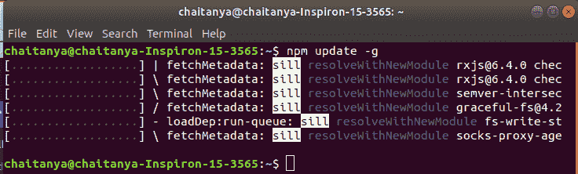
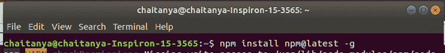
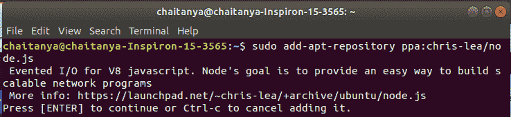
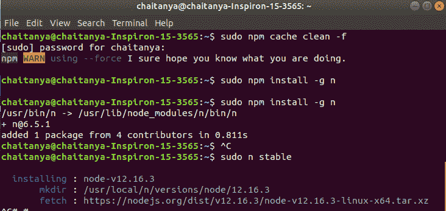
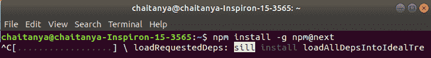

# 如何更新 NPM？

> 原文:[https://www.geeksforgeeks.org/how-to-update-npm/](https://www.geeksforgeeks.org/how-to-update-npm/)

[NPM(节点包管理器)](https://www.geeksforgeeks.org/node-js-npm-node-package-manager/)是 Node.js 的默认包管理器，完全用 JavaScript 编写。它管理 Node.js 的所有包和模块，并由命令行客户端 npm 组成。它通过安装 Node.js 安装到系统中。Node 项目中所需的包和模块是使用 NPM 安装的。

NPM 的更新意味着将节点包管理器更新到最新版本。NPM 的更新将 Node.js 和模块更新到最新版本。

**语法:**

```html
npm update [-g] [<pkg>...]
```

这里，-g 指全局，pkg 指包。

**方法 1:** 使用`npm update`命令更新节点包管理器。

```html
npm update -g
```



**方法 2:** 使用`npm@latest`命令更新节点包管理器。

```html
npm install npm@latest -g
```



**方法 3:** 使用 PPA 存储库(仅适用于 Linux)。

```html
sudo add-apt-repository ppa:chris-lea/node.js
sudo apt-get update
sudo apt-get install nodejs npm
```



**方法 4:** 使用缓存清理&稳定安装(仅适用于 Linux)。

```html
sudo npm cache clean -f
sudo npm install -g n
sudo n stable
```



**方法 5:** 使用`npm@next`更新节点包管理器。

```html
npm install -g npm@next
```

