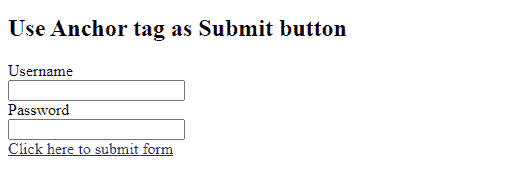
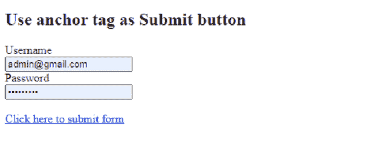
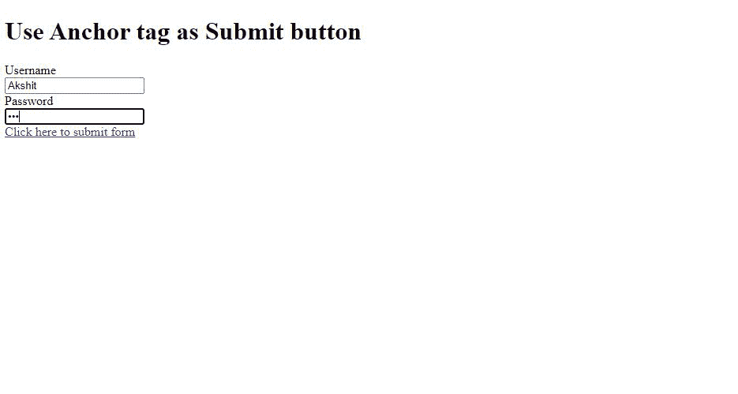
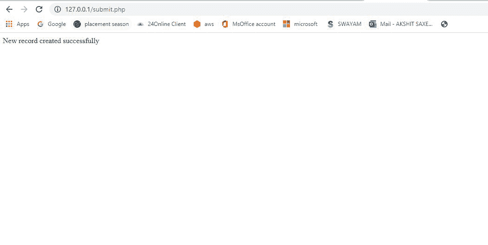
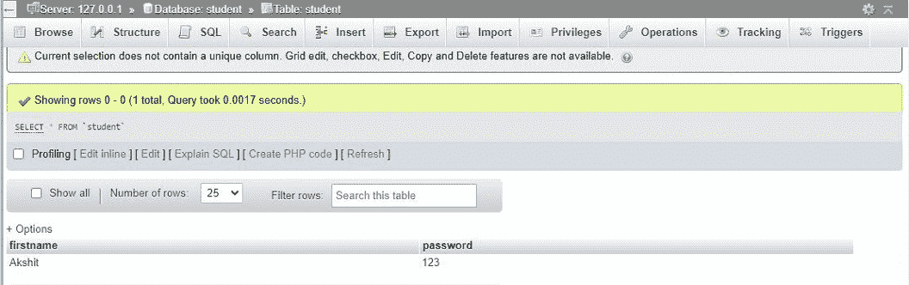

# 如何使用锚点标签作为提交按钮？

> 原文:[https://www . geeksforgeeks . org/如何使用-锚点-标签-as-submit-button/](https://www.geeksforgeeks.org/how-to-use-anchor-tag-as-submit-button/)

HTML 中的  [(锚点标签)](https://www.geeksforgeeks.org/html-a-tag/)用于在网页上创建超链接。此超链接用于将网页链接到其他网页。它或者用于提供绝对参考，或者作为其“*href”*值的相对参考。

**语法:**

```htmlhtml
<a href = "link"> Link Name </a>
```

[*href*](https://www.geeksforgeeks.org/html-link-href-attribute/) 属性指定链接指向的页面的网址。如果不存在 *href* 属性，则< a >标记将不是超链接。您可以使用 *href="#top"* 或 *href="#"* 链接到当前页面的顶部。

要使用锚点标签作为提交按钮，我们需要 [JavaScript](https://www.geeksforgeeks.org/javascript-tutorial/) 的帮助。 *T* o 提交表单，我们使用 JavaScript ***。提交()*** 功能。该函数提交表单。

**语法:**

```htmlhtml
document.getElementById("GFG").submit();
```

**注:**“GFG”是形式元素中提到的‘id’。

**例 1:**

## index.html

```htmlhtml
<!DOCTYPE html>
<html>
    <body>
        <h2>Use Anchor tag as Submit button</h2>
        <form id="GFG" action="submit.php" method="POST">
            Username
            <br />
            <input type="text" name="UserName" id="UserName" />
            <br />
            Password
            <br />
            <input type="password" name="Password" id="Password" />
            <br />
            <a href="#" onclick="myFunction()">
              Click here to submit form
            </a>
        </form>

        <script>
            function myFunction() {
                document.getElementById("GFG").submit();
            }
        </script>
    </body>
</html>
```

**Output:**


**注:**我们也可以称之为 ***。submit()*** 功能，通过编写 JavaScript 作为

```htmlhtml
<a href="javascript:$('GFG').submit();" >Click here to submit form</a>
```

**例 2:**

**HTML 代码:**

## index.html

```htmlhtml
<!DOCTYPE html>
<html>
    <body>
        <h1>Use Anchor tag as Submit button</h1>
        <form id="GFG" action="submit.php" method="POST">
            Username
            <br />
            <input type="text" name="UserName" id="UserName" />
            <br />
            Password
            <br />
            <input type="password" name="Password" id="Password" />
            <br />

            <a href="javascript:$('GFG').submit();">
              Click here to submit form
            </a>
        </form>
    </body>
</html>
```

**输出:**



锚标签

**PHP 代码:**以下代码是上述 HTML 代码中使用的“submit.php”的内容。我们必须添加一些 PHP 代码来发送数据到数据库(使用本地服务器 XAMPP 来测试下面的代码)。

## submit.php

```htmlhtml
<?php
$servername = "localhost";
$username = "root";
$password = "";
$dbname = "student";

// Create connection
$conn = mysqli_connect($servername, $username, $password, $dbname);
// Check connection
if (!$conn) {
  die("Connection failed: " . mysqli_connect_error());
}
$name= $_POST['UserName'];
$pwd= $_POST['Password'];

$sql = "INSERT INTO student (firstname, password) VALUES ('$name','$pwd')";

if (mysqli_query($conn, $sql)) {
  echo "New record created successfully";
} else {
  echo "Error: " . $sql . "<br>" . mysqli_error($conn);
}

mysqli_close($conn);
?>
```

**输出:**

*   现在，在表单中添加一些数据。假设用户名为“Akshit”，密码为“123”

    

*   现在点击超链接*“点击这里提交表格*”。

    

*   让我们看看*‘学生’*数据库。

    

    数据表