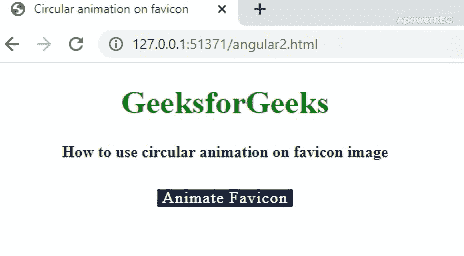
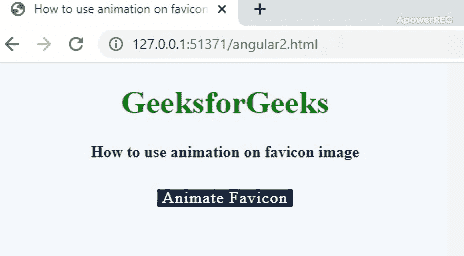

# 如何在 favicon 图像上使用动画？

> 原文:[https://www . geesforgeks . org/如何使用-动画-on-favicon-image/](https://www.geeksforgeeks.org/how-to-use-animation-on-favicon-image/)

一个 **[图标](https://www.geeksforgeeks.org/how-to-add-icon-logo-in-title-bar-using-html/)** 是一个特殊的图标，出现在靠近网址栏的左上角。文件类型可以是任何 jpg、png、gif 或图标(。ico)图像。默认的 favicon 名称是 **favicon.ico** 。收藏夹图标通常也称为快捷图标、书签图标或网站图标。它们为用户定位您的网页提供了便利。favicons 是一个品牌化的专业外观，带有特定的标志，在网站的所有页面上保持一致。图标有助于网站的在线品牌推广。动画 favicon 是从动画图像创建的。通过**链接**标签设置。它基本上是一组在特定时间范围内一个接一个运行的图像。

**语法:**

*   要将 gif 添加为收藏夹图标:

    ```htmlhtml
    <link rel="icon" href="geeksforgeeks.org/favicon.gif" type="image/gif" />
    ```

*   将普通图像添加为收藏夹图标:

    ```htmlhtml
    <link rel="icon" href="favicon.ico" type="image/x-icon"/>
    <link rel="shortcut icon" href="favicon.ico" type="image/x-icon"/>
    ```

**注意:**GIF 类型的动画图像将在 Firefox 浏览器中工作。**。ico** 是标准格式，适用于所有浏览器，但许多网站更喜欢 **PNG** 类型的图像。

**方法:**在下面的示例代码中，采用的方法是借助 HTML 画布、javascript 和数学几何来显示正在进行的动画。在网页中添加了一个**动画图标**按钮，这有助于在点击事件中启动动画效果。一旦在画布中完成绘制，它将被转换为 PNG 图像，然后被指定为 favicon。

*   **示例 1:** 下面的示例代码将展示圆形动画在 favicon 图像上的实现。

    ```htmlhtml
    <!DOCTYPE html>
    <html lang="en">

    <head>

        <meta charset="UTF-8">
        <title>Circular animation on favicon</title>
        <link rel="shortcut icon" href="gfgFavicon.png" width=32px>
        <script language="javascript">
            onload = function() {
                canvas = document.querySelector('#canvasId'),
                    context = canvas.getContext('2d');
                if (!!context) {

                    // The start position for drawing circle
                    C3qpi = 1.5 * Math.PI,
                        tc = pct = 0,
                        btn = document.querySelector('#animateBtn'),
                        faviconLnk = document.querySelector('link[rel*="icon"]');
                    context.lineWidth = 3;
                    context.strokeStyle = 'green';

                    // On page refresh, enable the button 
                    if (btn.disabled) btn.removeAttribute('disabled');
                    btn.addEventListener('click', function() {
                        tc = setInterval(drawcircularLoader, 60);
                        this.textContent = 'Animating';
                        this.style.backgroundColor = '#99999';
                        this.setAttribute('disabled', '');
                    });
                }
            };

            function drawcircularLoader() {
                with(context) {
                    clearRect(0, 0, 32, 32);
                    beginPath();
                    arc(8, 8, 6, C3qpi, (pct * 2 * Math.PI / 100 + C3qpi));
                    stroke();
                }

                // Update favicon to PNG image
                faviconLnk.href = canvas.toDataURL('image/png');
                if (pct === 100) {
                    clearInterval(tc);
                    btn.textContent = 'Animated';
                    btn.style.backgroundColor = 'green';
                    return;
                }
                pct++;
            }
        </script>
        <style>
            body {
                width: 450px;
                height: 300px;
                margin: 10px;
                text-align: center;
            }

            h1 {
                color: green;
            }

            #animateBtn {
                background-color: #1c2e46;
                border-radius: 2px;
                border: none;
                color: white;
                font-family: inherit;
                font-size: inherit;
                padding: 0px 5px;
                letter-spacing: 1px;
                cursor: pointer;
            }

            #animateBtn:focus {
                outline: none;
            }

            #animateBtn[disabled] {
                cursor: default;
            }

            .height {
                height: 10px;
            }
        </style>
    </head>

    <body>
        <h1>GeeksforGeeks</h1>
        <b>How to use circular animation on favicon image</b>
        <div class="height"> </div>
        <br>

        <!-- Canvas nad button for animation -->
        <button id="animateBtn">Animate Favicon </button>
        <br>
        <br>
        <canvas id="canvasId" width=32 height=32></canvas>
    </body>

    </html>
    ```

    *   **输出:** 

    *   **示例 2:** 在此示例中，绘制一个正方形的实现将 favicon 转换为动画图像。

        ```htmlhtml
        <!DOCTYPE html>
        <html lang="en">

        <head>
            <meta charset="UTF-8">
            <link rel="shortcut icon" href="gfgFavicon.png" width=32px>
            <script language="javascript">
                onload = () => {

                    var canvas = document.getElementById("canvas");
                    context = canvas.getContext('2d');

                    if (!!context) {
                        var animateBtn = document.getElementById("animateBtn");
                        faviconVar = document.querySelector('link[rel*="icon"]');

                        // The styles used for the square which will 
                        // be animated in place of favicon 
                        let linerGradient = context.createLinearGradient(0, 0, 32, 32);
                        linerGradient.addColorStop(0, '#8be8a7');
                        linerGradient.addColorStop(1, '#297d4c');
                        context.strokeStyle = linerGradient;
                        context.lineWidth = 10;

                        // On page refresh , the button is enabled
                        if (animateBtn.disabled) animateBtn.removeAttribute('disabled');
                        animateBtn.addEventListener('click', function() 
                        {

                            // Variable used for drawing incrementation
                            n = 0,

                                // Speed interval for animation 
                                loadingInterval = setInterval(drawSquareLoader, 80);

                            this.textContent = 'Animating...';
                            this.style.backgroundColor = '#297d4c';

                            //Once the drawing is done, the button is again disabled
                            this.setAttribute('disabled', '');
                        });
                    }
                };

                // Function for drawing square in canvas in a incrementing way
                function drawSquareLoader() {
                    with(context) {
                            clearRect(0, 0, 32, 32);
                            beginPath();

                            // One fourth time taken to draw
                            if (n <= 25) {

                                moveTo(0, 0);
                                lineTo((32 / 25) * n, 0);
                            }

                            // Between second quarter of drawing
                            else if (n > 25 && n <= 50) {

                                moveTo(0, 0);
                                lineTo(32, 0);
                                moveTo(32, 0);
                                lineTo(32, (32 / 25) * (n - 25));
                            }

                            // Between third quarter of drawing
                            else if (n > 50 && n <= 75) {

                                moveTo(0, 0);
                                lineTo(32, 0);
                                moveTo(32, 0);
                                lineTo(32, 32);
                                moveTo(32, 32);
                                lineTo(-((32 / 25) * (n - 75)), 32);
                            }

                            // Between  last quarter
                            else if (n > 75 && n <= 100) {

                                moveTo(0, 0);
                                lineTo(32, 0);
                                moveTo(32, 0);
                                lineTo(32, 32);
                                moveTo(32, 32);
                                lineTo(0, 32);
                                moveTo(0, 32);
                                lineTo(0, -((32 / 25) * (n - 100)));
                            }

                            //Function to draw the path
                            stroke();
                        }

                        // Assigning the drawing to favicon after 
                        // converting into PNG image
                    faviconVar.href = canvas.toDataURL('image/png');

                    // After the drawing is finished 
                    if (n === 100) {
                        clearInterval(loadingInterval);
                        animateBtn.textContent = 'Favicon Loaded';
                        animateBtn.style.backgroundColor = '#bbbbbb';
                        return;
                    }

                    // Increment the variable used to keep
                    // track of drawing intervals
                    n++;
                }
            </script>

            <title>Animation on favicon image</title>
            <style>
                body {
                    width: 450px;
                    height: 300px;
                    margin: 10px;
                    text-align: center;
                }
                h1 {
                    color: green;
                }
                html {
                    background: #f4f6fa;
                }

                #animateBtn {
                    background: #1c2e46;
                    color: white;
                    font: inherit;
                    border: none;
                    padding: 0px 5px;
                    letter-spacing: 1px;
                    cursor: pointer;
                    border-radius: 2px;
                }

                canvas {
                    margin: auto;
                    display: block;
                }

                .height {
                    height: 10px;
                }
            </style>
        </head>

        <body>
            <h1>GeeksforGeeks</h1>
            <b>How to use animation on favicon image</b>
            <div class="height"> </div>
            <br>
            <button id="animateBtn">Animate Favicon</button>
            <br>
            <br>
            <canvas id="canvas" width=32 height=32></canvas>

        </body>

        </html>
        ```

    *   **输出:**
        