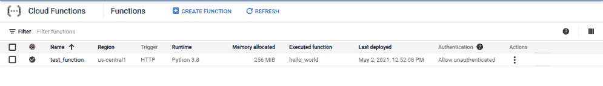
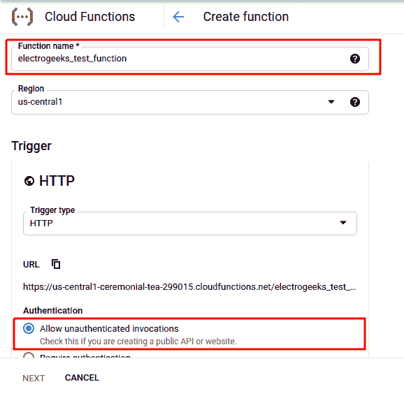
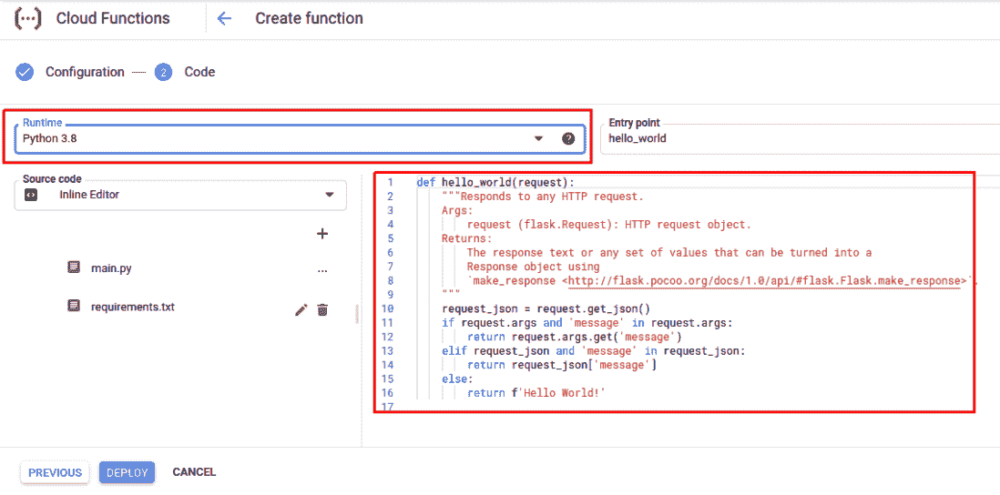
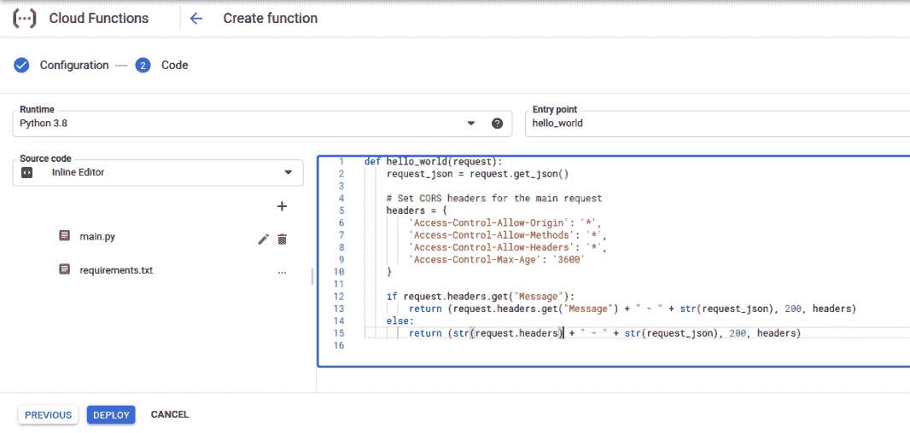
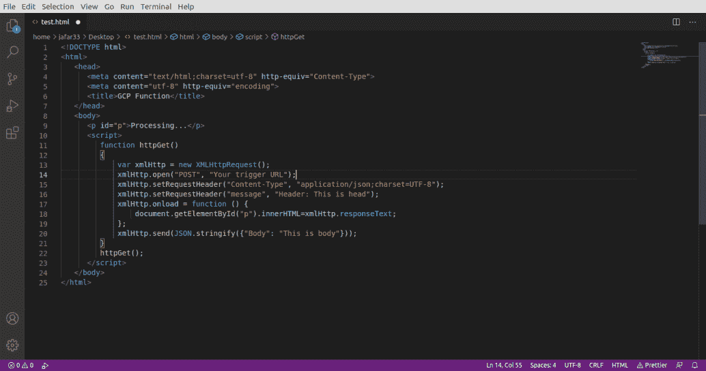
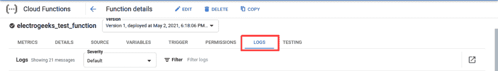

# 如何用 Python 使用谷歌云功能？

> 原文:[https://www . geesforgeks . org/如何使用-Google-cloud-function-with-python/](https://www.geeksforgeeks.org/how-to-use-google-cloud-function-with-python/)

在本文中，我们将研究如何在任何网站上使用 python 的谷歌云功能。

为此，请遵循以下步骤:

**第一步:**我们先前往谷歌云平台(GCP)上的[功能管理器站点](https://console.cloud.google.com/functions/list)。它应该如下所示:



功能管理器站点

**第二步:**现在让我们创建我们的函数。单击顶部的“**创建功能”**。



创建函数

**第三步:**接下来应该会出现这样的窗口。在函数名中，给出任何名称。如果您不打算使用任何身份验证，请选择“**允许未经身份验证的调用**”。至少对于这个特定的例子，我们将选择“**允许未经验证的调用**”。其他选项不需要更改。现在点击**下一步**按钮。


允许未经验证的调用

**第四步:**现在你会得到一个**触发网址**。把这个网址复制到某个地方，因为这是我们用来调用函数的网址。然后点击“ **NEXT** ”。



URL 触发器

**第五步:**现在在**运行时**下，选择一个 **Python 版本**。我们选择了“Python 3.8”。现在主要部分来了，函数的源代码。现在，如果您部署该功能，它很可能不会工作，因为在源代码中，没有“**访问控制**”头。这意味着当你从火狐或 Chrome 这样的浏览器调用这个函数时，它将不起作用。所以还是用我们自己的[源码](https://drive.google.com/file/d/1BokVM_P7uvBA4OCTjzkR_qd1mx9ZEUho/view?usp=sharing)吧。



运行时间

**request _ json = request . get _ JSON()**提取客户端发送的 JSON 对象。下一个代码指定了用户的访问范围。下一个代码行检查标题中是否有“消息”标题。如果是，则将其值和检索到的 JSON 作为响应发送给客户端。如果没有，则将整个头内容连同检索到的任何 JSON 一起发送回客户端。源代码到此为止。

但是在我们测试这个函数之前，这里有几件事。“T2”运行时旁边的“**入口点**显示了当收到请求时将调用的方法。在源代码部分，你还会看到 **requirements.txt** 文件。该文件用于为您的函数指定附加依赖项。关于 **requirements.txt** 的其他疑问，可以参考[这个](https://cloud.google.com/functions/docs/writing/specifying-dependencies-python)文档。

**第六步:**现在点击**部署**部署功能。现在，您将再次被重定向到函数管理器站点。部署该功能大约需要 1-2 分钟。


部署

现在，让我们测试一下我们的功能。

**第 7 步:**让我们创建一个**test.html**文件，从这里我们可以使用 JavaScript 调用我们的函数。



test.html

在第 14 行的“您的触发网址”中，粘贴您之前复制的触发网址。我们设置了一个标题“内容类型”来告诉我们的函数，我们发送了什么样的数据。在我们的例子中，它是 JSON。接下来，我们设置一个名为“Message”的头，只是为了测试。然后我们指定收到响应后该做什么。最后，发送一些虚拟数据作为 JSON。现在让我们在浏览器中运行下面给定的 HTML 文件。

## 超文本标记语言

```htmlhtml
<!DOCTYPE html>
<html>
   <head>
      <meta content="text/html;charset=utf-8" http-equiv="Content-Type">
      <meta content="utf-8" http-equiv="encoding">
      <title>GCP Function</title>
   </head>
   <body>
      <p id="p">Processing...</p>

      <script>
         function httpGet()
         {
             var xmlHttp = new XMLHttpRequest();
             xmlHttp.open("POST", "Your trigger URL");
             xmlHttp.setRequestHeader("Content-Type", "application/json;charset=UTF-8");
             xmlHttp.setRequestHeader("message", "Header: This is head");
             xmlHttp.onload = function () {
                 document.getElementById("p").innerHTML=xmlHttp.responseText;
             };
             xmlHttp.send(JSON.stringify({"Body": "This is body"}));
         }
         httpGet();
      </script>
   </body>
</html>
```


页眉

太棒了。以下是回应！一切正常。但是如果你在函数的源代码中写错了会发生什么呢？谷歌是来拯救的。


拯救错误的代码

单击您创建的函数。在下一个窗口中，选择“**日志**”选项卡查看您的功能日志。



日志