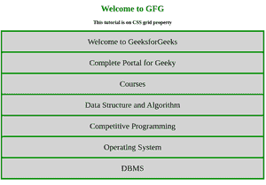

# 如何使用网格自动放置规则来使用网格元素？

> 原文:[https://www . geesforgeks . org/如何使用网格-元素-使用网格-自动放置-规则/](https://www.geeksforgeeks.org/how-to-use-grid-element-using-the-grid-auto-placement-rules/)

在本文中，您将学习使用网格自动放置规则来使用网格元素。您可以在网格上使用 auto 作为属性值，因为 auto 使容器能够根据行或列中项目的内容自定义其大小。

**语法:**

```
grid-template-rows : auto
grid-template-columns: auto
```

**属性值:**

*   **auto :** 行或列的大小取决于容器的大小，以及行或列中项目的内容大小。

**示例 1:** 对行和列使用**自动**。

## 超文本标记语言

```
<!DOCTYPE html>
<html>

<head>
    <title>
        CSS | grid Property
    </title>
    <style>
    h1{
    color: green;
    }

        .main {
            display: grid;
            grid-template-columns: auto;
            grid-template-rows:  auto;
            grid-gap: 5px;
            background-color: green;
            padding: 5px;
        }

        .gfg {
            background-color: lightgrey;
            text-align: center;
            padding: 20px 0;
            font-size: 30px;
        }
    </style>
</head>

<body>
    <center>
    <h1>Welcome to GFG </h1>
    <h3>This tutorial is on CSS grid property</h3>

    <div class="main">
        <div class="gfg">Welcome to GeeksforGeeks</div>
        <div class="gfg">Complete Portal for Geeky</div>
        <div class="gfg">Courses</div>
        <div class="gfg">Data Structure and Algorithm</div>
        <div class="gfg">Competitive Programming</div>
        <div class="gfg">Operating System</div>
        <div class="gfg">DBMS</div>
    </div>
    </center>

</body>
```

**输出:**



**例 2:**

## 超文本标记语言

```
<!DOCTYPE html>
<html>

<head>
    <title>
        CSS | grid Property
    </title>
    <style>
    h1{
    color: green;
    }
 .main {
            display: grid;
            grid-template-columns: 400px 400px;
            grid-template-rows: 60px auto 60px;
            grid-gap: 5px;
            background-color: green;
            padding: 5px;
        }

        .gfg {
            background-color: lightgrey;
            text-align: center;
            padding: 20px 0;
            font-size: 30px;
        }

    </style>
</head>

<body>
    <center>
    <h1>Welcome to GeekdforGeeks</h1>
    <h3>This tutorial is on CSS grid property</h3>

    <div class="main">
        <div class="gfg">Complete Portal for Geeky </div>
        <div class="gfg">Courses</div>
        <div class="gfg">Data Structure and Algorithm</div>
        <div class="gfg">Competitive Programming, 
If you are looking to conquer your coding skills,
 we are here with our Competitive Programming Live Course. 
      </div>
        <div class="gfg">Operating System</div>
        <div class="gfg">DBMS, Database management system (DBMS) is a 
collection of interrelated data and a set of
 programs to access those data</div>
    </div>
    </center>

</body>

</html>
```

**输出:**


在上面的示例中，网格的第一行和第三行大小是固定的，第二行大小是自动的。因此，由于大小固定，文本从第三行溢出，但由于 auto 属性值，它没有出现在第二行。

**支持的浏览器:**CSS |网格自动属性支持的浏览器如下:

*   谷歌 Chrome 57
*   Mozilla Firefox 52
*   边缘 16
*   Safari 10
*   歌剧 44