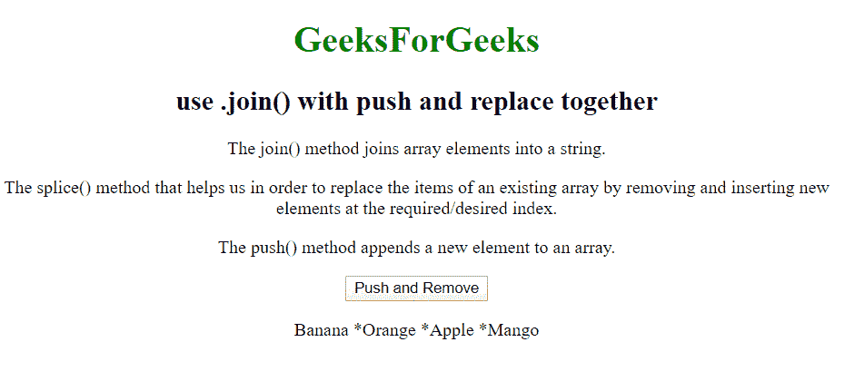
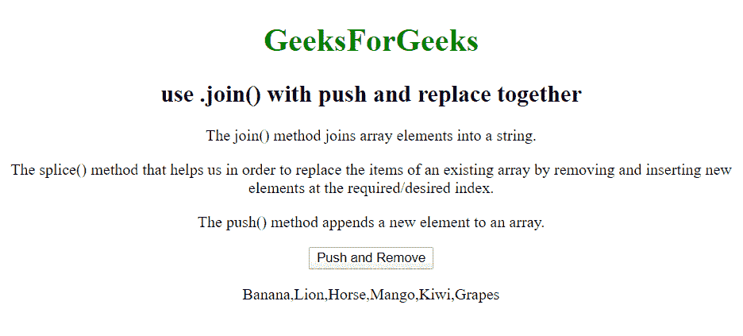

# 如何使用。将()与 push 和 replace 连接在一起？

> 原文:[https://www . geeksforgeeks . org/如何使用推加替换连接/](https://www.geeksforgeeks.org/how-to-use-join-with-push-and-replace-together/)

*   **Array.join()方法**
    array . join()方法是 JavaScript 中的一个内置函数，用于将数组的元素连接成字符串。字符串的元素将由指定的分隔符分隔，其默认值为逗号(，)。

    **语法:**

    ```html
    array.join(separator)

    ```

*   **Array.push()方法**

    array.push()函数用于推送数组中的一个或多个值。该函数通过添加到数组中的元素数量来改变数组的长度。该函数的语法如下:

    **语法:**

    ```html
    arr.push(element1[, ...[, elementN]])

    ```

    **参数:**这个函数可以包含与要插入数组的元素数量一样多的参数。

    **返回值:** 这个函数在数组中插入参数后，用新的值返回新的数组。

*   **Array.splice()方法**
    JavaScript 中的数组类型为我们提供了 splice()方法，该方法通过在所需/期望的索引处移除和插入新元素来替换现有数组的项。

    **语法:**

    ```html
    array.splice(start_index, delete_count, value1, value2, value3, ...)

    ```

**注意:** Splice()方法从 *start_index* 元素开始删除数组中的零个或多个元素，并用参数列表中指定的零个或多个元素替换这些元素。

**示例:**下面是说明使用的示例。将()方法与 push()方法和 splice()方法连接在一起:

```html
<!DOCTYPE html>
<html>
    <body>
        <center>
            <h1 style="color: green;">
              GeeksForGeeks
          </h1>

            <h2>use .join() with push and replace together</h2>
            <p>The join() method joins array elements into
              a string.</p>

            <p>The splice() method that helps us in order to
replace the items of an existing array by removing and inserting 
              new elements at the required/desired index.</p>

            <p>The push() method appends a new element to an 
              array.</p>
            <button onclick="myFunction()">Push</button>
            <p id="demo"></p>
            <br />
            <script>
                // Initializing the array
                var fruits = ["Banana", "Orange", "Apple", "Mango"];
                // joining the array elements using .join method
                document.getElementById(
                  "demo").innerHTML = fruits.join(" *");

                function myFunction() {
// splicing the array elements(delete_count=2, which will replace
//("Orange", "Apple" with "Lion", "Horse") using splice() method
                    fruits.splice(1, 2, "Lion", "Horse");
                    document.getElementById("demo").innerHTML = fruits;
// pushing the array elements("Kiwi, Grapes") using push() method
                    fruits.push("Kiwi, Grapes");
                    document.getElementById("demo").innerHTML = fruits;
// expected output [Banana, Lion, Horse, Mango, Kiwi, Grapes]
                }
            </script>
        </center>
    </body>
</html>
```

**输出:**

**在点击“按下并拼接”按钮之前:**



**点击【删除】按钮后输出:**

