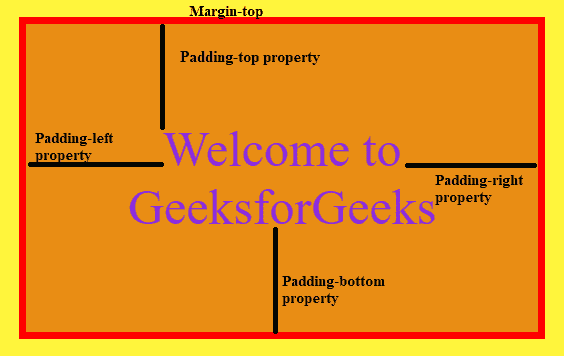
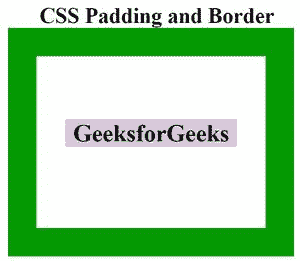
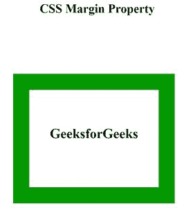

# 如何在盒子模型中使用边距、边框和填充来配合在一起？

> 原文:[https://www . geeksforgeeks . org/如何使用边距边框和填充框组合模型/](https://www.geeksforgeeks.org/how-to-use-margin-border-and-padding-to-fit-together-in-the-box-model/)

在本文中，我们将学习盒子的不同部分，即边距、边框、填充和内容如何组合在一起创建盒子。框模型指定了如何在浏览器引擎中组织和建模 HTML 元素，以及导出定义 HTML 元素维度的 CSS 属性。盒子模型可以描述为一个为构成文档树的 HTML 元素生成的矩形盒子。盒子模型有 4 个主要属性——边距、边框、填充和内容，它们有助于创建设计和确定网页布局。这些属性可以表示为:

*   **内容**:这是包含文本、图像、视频、链接等的盒子模型的主要部分之一，可以使用高度和宽度属性来调整大小。
*   **填充**:它是用于在有边框区域内的内容周围创建空间的属性。
*   **边框**:覆盖内容下的区域，包括内容周围的填充。
*   **边距**:该属性是指在元素 ie 周围创建空间。，边境一带。

一个简单的盒子模型包含内容、边框和盒子所需的边框外的外部空间。这个外部空间由边距给出，它将盒子与其他盒子分开。当我们创建一个盒子容器时，我们可以指定边框和内部内容之间的距离，这是由填充给出的。边框的宽度和颜色可以由边框属性给出。

**示例:**这个示例描述了 CSS 中 Box 模型的基础。

## 超文本标记语言

```html
<!DOCTYPE html>
<html>

<head>
    <title>Box</title>
    <style>
        .box {
            background-color: rgb(233, 141, 20);
            margin-top: 80px;
            margin-left: 5rem;
            width: 20rem;
            color: blueviolet;
            text-align: center;
            font-size: 50px;
            border: 7px solid red;
            padding: 6rem;
        }

        body {
            background-color: yellow;
        }
    </style>
</head>

<body>
    <div class="box">
        Welcome to GeeksforGeeks
    </div>
</body>

</html>
```

**输出:**



CSS 盒子模型

考虑下面设置元素的宽度和高度属性的代码示例:

```html
.box {
  margin: 100px 20px 50px 370px;
  width: 350px;
  height: 50px;
  font-size: 50px;
  border: 10px solid red;
  padding: 160px;
}
```

添加以下属性后，可以找到盒子的总高度和总宽度:

> 框宽=宽度+(左填充+右填充)+(左边框+右边框)+(左边距+右边距)
> 
> 框高=高度+(顶部填充+底部填充)+(顶部边框+底部边框)+(顶部边距+底部边距)

因此，**总宽度**= 350+(160+160)+(10+10)+(370+20)= 1080 px

和**总高度**= 50+(160+160)+(10+10)+(100+50)= 540 px

**填充属性:** CSS 填充用于在元素周围、任何定义的边框内创建空间。我们可以为各个侧面(顶部、右侧、底部、左侧)设置不同的填充。添加边框属性以实现填充属性非常重要。

**语法:**

```html
padding: "padding-top|padding-right|padding-bottom|padding-left";
```

它由 4 个组件组成:

*   **填充-顶部:**指定内容上方框中的填充宽度
*   **填充-右侧:**指定内容右侧框中的填充宽度
*   **填充-底部:**指定内容下方框中的填充宽度
*   **左填充:**指定内容左侧框中的填充宽度

**示例:**

```html
padding: 20px 30px 50px 70px;
```

我们也可以写作

```html
padding: 40px;
```

这将在框内的所有四个方向上设置 40px 的默认填充。

**边框属性:**它是三个属性的组合。

**语法:**

```html
border : "width style color | initial | inherit";
```

**属性值:**

*   **宽度**:指定边框的厚度
*   **样式**:指定边框的外观，可以是实线、虚线、虚线、双点、凹槽、插图等。
*   **颜色:**指定边框的颜色

默认值为初始值。

**示例:**

```html
border: 10px solid red;
```

**边距属性:**它有四个单独的边距属性:

**语法:**

```html
margin: "top-margin right-margin bottom-margin left-margin";
```

*   **上边距:**指定框顶部的边距宽度
*   **右边距:**指定框右侧的边距宽度
*   **底部边距:**指定框底部的边距宽度
*   **左边距:**指定框左侧的边距宽度

我们可以单独写，也可以单行写。

**示例:**

```html
margin: 100px 20px 50px 370px;
```

如果我们写作

```html
margin: 20px;
```

它在参考对象的所有 4 条边上设置 20px 的默认边距

我们可以从下面的例子来理解盒子模型:

**示例 1:** 本示例描述了填充和边框属性。

## 超文本标记语言

```html
<!DOCTYPE html>

<head>
    <title>Padding</title>
    <style>
    .main {
        font-size: 38px;
        font-weight: bold;
        Text-align: center;
    }

    .box {
        margin-left: 500px;
        border: 50px solid #059900;
        width: 300px;
        height: 200px;
        text-align: center;
        padding: 50px;

    }

    .box1 {
        font-size: 42px;
        font-weight: bold;
        color: #000000;
        margin-top: 60px;
        background-color: #d9c5db;
    }
    </style>
</head>

<body>
    <div class="main">CSS Padding and Border</div>
    <div class="box">
        <div class="box1">GeeksforGeeks</div>
    </div>
</body>

</html>
```

**输出:**



内容区域周围的绿色边框和白色填充

**示例 2:** 下面的代码说明了 box 模型的 Margin 属性。

## 超文本标记语言

```html
<!DOCTYPE html>

<head>
    <title>Padding</title>
    <style>
    .main {
        font-size: 38px;
        font-weight: bold;
        Text-align: center;
    }

    .box {
        margin-left: 500px;
        border: 50px solid #059900;
        width: 300px;
        height: 200px;
        text-align: center;
        padding: 50px;
        margin-top: 180px;    
    }

    .box1 {
        font-size: 42px;
        font-weight: bold;
        color: #000000;
        margin-top: 60px;
    }
    </style>
</head>

<body>
    <div class="main">CSS Margin Property</div>
    <div class="box">
        <div class="box1">GeeksforGeeks</div>
    </div>
</body>

</html>
```

**输出:**



应用于箱式模型顶部的边距