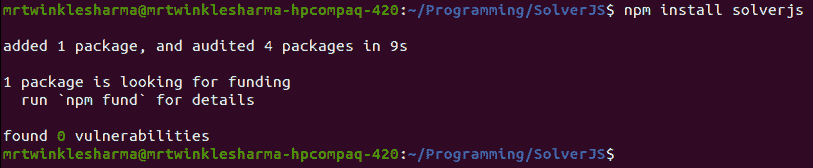
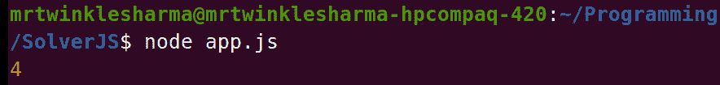
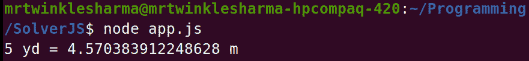
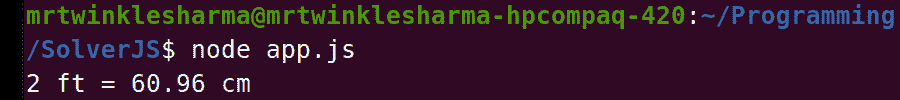
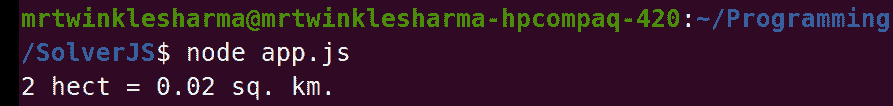
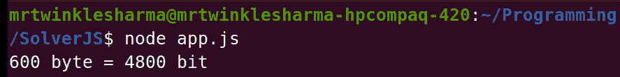
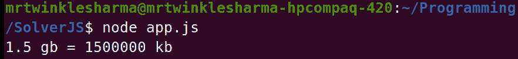
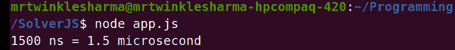
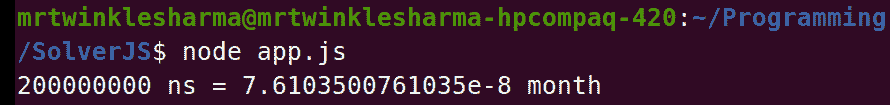

# 如何使用 SolverJS？

> 原文:[https://www.geeksforgeeks.org/how-to-use-solverjs/](https://www.geeksforgeeks.org/how-to-use-solverjs/)

SolverJS 是一个 JavaScript 库，它包含了很多数学和基本的逻辑函数，在任何应用程序中都使用得非常频繁。它旨在通过对某些函数的简单调用轻松解决逻辑问题，并且所有函数都是时间和空间高效的。它有各种各样的用例，例如，与转换相关的，矩阵运算，基本的字符串运算，以及像 gcd，power，质数检查等数学工具。在本文中，我们将讨论使用该库的**方法**以及稍后我们可以使用它的一些**问题陈述**。

让我们看一步一步的实现来了解如何使用这个库，在文章的最后，您将会对它在您的项目中的使用感到非常舒服。

**步骤 1:** 创建节点应用程序。因为我们将使用一个在 node.js 上工作的库，所以首先必须创建一个节点项目，所以在您的终端中键入这个命令来创建一个节点应用程序。

**语法:**

```
npm init 
```

这个命令会询问一些关于项目的配置，您可以很容易地填充它们，如果您错误地按下了某个字段的回车键，或者如果您想要更改某些内容，您总是可以选择稍后从 **package.json** 文件更改这些配置。

**步骤 2:** 使用 npm 安装库。在您的终端中运行此命令，使用节点包管理器安装库，如果您正在使用纱线包管理器，则使用“纱线添加”而不是“npm 安装”。

**语法:**

```
npm install solverjs 
```



**第三步:**导入你的申请文件。创建一个 javascript 文件，命名为 **app.js** 、**T5】并在使用前将库导入代码中。下面给出了在节点应用程序中导入库的语法。我们在 require 关键字的括号内提供库的名称，然后将结果存储在一个 const 变量中。**

```
const solverjs = require('solverjs');
```

**项目结构:**这将是我们的文件夹结构，在整篇文章中，我们将使用这个 app.js。


**第四步:**调用相关功能并使用。现在我们将创建一个函数，并开始在我们的项目中使用这个库。

**注意:**在第 1 步和第 2 步之后，您可以调用库中任何可用的函数，并提供所需的参数，该函数将返回适当的结果。

例如，如果您想计算一个数组的平均值，那么只需调用函数 avg([array])，它就会返回平均值。

## app.js

```
//Import the library
const solverjs = require('solverjs');

const myArray = [5,2,1,8,4];

//Call function
const calculatedAverage = solverjs.avg(myArray);
console.log(calculatedAverage);
```

**运行应用程序的步骤:**打开终端，键入以下命令。

```
node app.js
```

**输出:**这是上面代码的输出。



现在让我们看看在示例的帮助下我们可以使用这个库的使用领域。

**1。转换:**库包含许多与从一个物理单元到另一个物理单元的转换相关的函数，在各种情况下，我们的应用程序都需要这些转换，因此我们只需简单的函数调用就可以实现我们的目标。该类别中每个函数的基本结构如下:

```
Name: someUnitToAnotherRequiredUnit()
Argument: valueInGivenUnit
Return Value: valueInRequiredUnit
```

**1.1 长度相关转换:**

*   **示例 1:** 这里我们将码转换为米，函数 ydToMe()接收以码为单位的长度，并返回以米为单位的长度。得到结果后，我们简单地用 console.log 和模板文字打印它。
    注意:-如果你不知道模板文字，我告诉你，它是用来在 ES6 中生成动态字符串的，你可以在 **${}** 里面注入一个 javascript 表达式。

    ## app.js

    ```
    const solverjs = require('solverjs');

    const lengthInYard = 5;
    const lengthInMetre = solverjs.ydToMe(lengthInYard);
    console.log(`${lengthInYard} yd = ${lengthInMetre} m`);
    ```

    **输出:**

    

*   **示例 2:** 这里我们将英尺转换为厘米，函数 ftToCm()接收以英尺为单位的长度，并返回以厘米为单位的长度。

    ## app.js

    ```
    const solverjs = require('solverjs');

    const lengthInFeet = 2;
    const lengthInCentimetre = solverjs.ftToCm(lengthInFeet);
    console.log(`${lengthInFeet} ft = ${lengthInCentimetre} cm`);
    ```

    **输出:**

    

**1.2 区域相关转换:**

*   **示例 1:** 这里我们将平方米转换为平方英寸，函数 sqMeToSqIn()接收以平方米为单位的面积，并返回以平方英寸为单位的面积。

    ## app.js

    ```
    const solverjs = require('solverjs');

    const areaInSquareMetre  = 25;
    const areaInSquareInch = solverjs.sqMeToSqIn(areaInSquareMetre);
    console.log(`${areaInSquareMetre} sq. m. = ${areaInSquareInch} sq. in.`);
    ```

    **输出:**

    

*   **示例 2:** 这里我们将公顷转换为平方公里，函数 hectToSqKm()接收以公顷为单位的面积，并返回以平方公里为单位的面积。

    ## app.js

    ```
    const solverjs = require('solverjs');

    const areaInHectare = 2;
    const areaInSquareKilometre = solverjs.hectToSqKm(areaInHectare);
    console.log(`${areaInHectare} hect = ${areaInSquareKilometre} sq. km.`);
    ```

    **输出:**

    

**1.3 数字存储相关转换:**

*   **示例 1:** 这里我们将字节转换为位，函数 byteToBit()接收以字节为单位的内存，并返回以位为单位的内存。

    ## app.js

    ```
    const solverjs = require('solverjs');

    const storageInByte = 600;
    const storageInBit  = solverjs.byteToBit(storageInByte);
    console.log(`${storageInByte} byte = ${storageInBit} bit`);
    ```

    **输出:**

    

*   **示例 2:** 这里我们将千兆字节转换为千字节，函数 gbToKb()接收千兆字节的内存，并返回千字节的内存。

    ## app.js

    ```
    const solverjs = require('solverjs');

    const storageInGigaByte = 1.5;
    const storageInKiloByte  = solverjs.gbToKb(storageInGigaByte);
    console.log(`${storageInGigaByte} gb = ${storageInKiloByte} kb`);
    ```

    **输出:**

    

**1.4 时间相关转换:**

*   **示例 1:** 这里我们将纳秒转换为微秒，函数 nsToUs()以纳秒为单位接收时间，以微秒为单位返回时间。

    ## app.js

    ```
    const solverjs = require('solverjs');

    const timeInNanoSecond = 1500;
    const timeInMicroSecond  = solverjs.nsToUs(timeInNanoSecond);
    console.log(`${timeInNanoSecond} ns = ${timeInMicroSecond} microsecond`);
    ```

    **输出:**

    

*   **示例 2:** 这里我们将纳秒转换为月，函数 nsToMm()以纳秒为单位接收时间，以月为单位返回时间。

    ## app.js

    ```
    const solverjs = require('solverjs');

    const timeInNanoSecond = 200000000;
    const timeInMonth  = solverjs.nsToMm(timeInNanoSecond);
    console.log(`${timeInNanoSecond} ns = ${timeInMonth} month`);
    ```

    **输出:**

    

**1.5 与温度相关的转换:**

*   **示例 1:** 这里我们将摄氏度转换为开尔文，函数 celToKel()接收以摄氏度为单位的温度，并返回以开尔文为单位的温度。

    ## app.js

    ```
    const solverjs = require('solverjs');

    const temperatureInCelsius = 4;
    const temperatureInKelvin  = solverjs.celToKel(temperatureInCelsius);
    console.log(`${temperatureInCelsius} celsius = ${temperatureInKelvin} kelvin`);
    ```