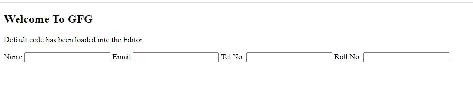

# 如何用表格构造表单？

> 原文:[https://www . geesforgeks . org/如何使用表到结构表单/](https://www.geeksforgeeks.org/how-to-use-tables-to-structure-forms/)

创建一个 HTML 表单是创建网站的一个重要方面。表单是与网站用户交互的一种方法。因此，当在网站上实现时，表单必须适当对齐并具有吸引力，这是非常必要的。简单地将 HTML 表单添加到网页的过程如下。

**示例:**

## 超文本标记语言

```html
<!DOCTYPE html>
<html>

<body>
    <h2>Welcome To GFG</h2>
    <p>Default code has been loaded into the Editor.</p>

    <form>
        <label for="name">Name</label>
        <input type="text" id="name" />
        <label for="email">Email</label>
        <input type="email" id="email" />
        <label for="telnum">Tel No.</label>
        <input type="telnum" id="telnum" />
        <label for="Roll No.">Roll No.</label>
        <input type="number" id="rollno" />
    </form>
</body>

</html>
```

**输出:**通过这段代码，我们简单地在页面主体内创建了一个表单。在输出中，可以看到表单字段和标签都在一行中，看起来不太好。即使我们使用< br >标签将它们分成不同的行，它仍然不会正确对齐。



**使用 HTML 表格构造表单:**我们可以借助 HTML 表格来构造表单。 [<表格>标签](https://www.geeksforgeeks.org/html-tables/)不仅有助于创建所需的表格，还可以用于构建我们的内容，例如表单。下面的步骤展示了如何使用 HTML 表格来构造表单。

*   使用元素创建一个 HTML 表格。

*   现在在该表中添加 [<表单>](https://www.geeksforgeeks.org/html-form-tag/) 元素。
*   接下来，我们将创建表单域。
*   我们使用用于向表中添加行的[<>](https://www.geeksforgeeks.org/html-tr-tag/)元素向表单中添加所需的表单字段。
*   我们使用 [< td >](https://www.geeksforgeeks.org/html-td-tag/) 元素为单独的列添加标签和字段。
*   我们可以根据需要在表单中添加任意多个字段。

## 超文本标记语言

```html
<!DOCTYPE html>
<html>

<body>
    <h2>Welcome To GFG</h2>
    <p>Default code has been loaded into the Editor.</p>

    <table>
        <form>
            <tr>
                <td>
                    <label for="name">
                        Name
                    </label>
                </td>
                <td><input type="text" id="name" />
                </td>
            </tr>
            <tr>
                <td><label for="email">
                        Email
                    </label>
                </td>
                <td><input type="email" id="email" />
                </td>
            </tr>
            <tr>
                <td><label for="telnum">
                        Tel No.
                    </label>
                </td>
                <td><input type="telnum" id="telnum" />
                </td>
            </tr>
            <tr>
                <td><label for="Roll No.">
                        Roll No.
                    </label>
                </td>
                <td><input type="number" id="rollno" />
                </td>
            </tr>
        </form>
    </table>
</body>

</html>
```

**输出:**从输出中可以看出，表单字段被适当地添加到新行中，并且在 HTML 表的帮助下也正确地对齐。还可以看到，所有输入字段的宽度和长度都相同。因此，使用 CSS 来对齐表单域是没有用的。

