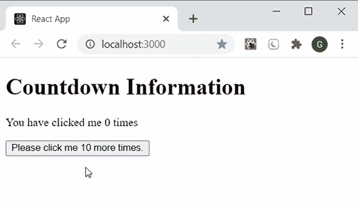
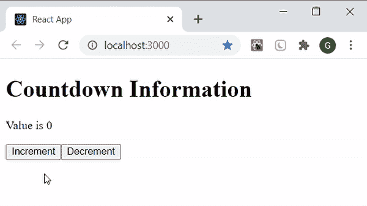

# 如何在箭头函数中使用 useState 代替 hook？

> 原文:[https://www . geeksforgeeks . org/使用方法-箭头中的使用状态-函数-替代钩子/](https://www.geeksforgeeks.org/how-to-use-usestate-in-arrow-function-instead-of-hook/)

[**使用状态挂钩**](https://www.geeksforgeeks.org/what-is-usestate-in-react/) 用于更新反应组件中的状态。它是一个钩子，将初始状态作为参数，并返回一个包含两个条目的数组。它可以用于基于类的组件**[**以及功能组件**](https://www.geeksforgeeks.org/reactjs-class-based-components/)**[](https://www.geeksforgeeks.org/reactjs-functional-components/)**(使用函数或 *const* 关键字声明)。函数组件在执行任何代码之前加载，而*常量*组件仅在解释器到达该行代码时加载。请始终记住，渲染使用函数语法创建的功能组件可以在代码中定义它之前完成，而如果使用 *const* 定义它，则需要在使用它之前声明它。******

*****const* 功能组件也称为 [**箭头功能**](https://www.geeksforgeeks.org/arrow-functions-in-javascript/) 。通过使用这些功能，我们可以 [**摆脱每次绑定**](https://www.geeksforgeeks.org/how-to-avoid-binding-by-using-arrow-functions-in-callbacks-in-reactjs/) 的烦人方法，并且可以非常轻松地访问钩子。****

******创建反应应用程序:******

*   ******步骤 1:** 使用以下命令创建一个反应应用程序:****

    ```html
    **npx create-react-app foldername**
    ```

*   ******步骤 2:** 创建项目文件夹(即文件夹名)后，使用以下命令移动到该文件夹:****

     ****```html
    cd foldername
    ```**** 

******项目结构:**如下图。****

****

项目结构**** 

******示例 1:** 我们创建了一个箭头函数 **App** ，其中我们设置了一个初始状态**计数**值为 10，以及一个函数**设置计数**用于更新状态值。我们将 [**onClick 事件**](https://www.geeksforgeeks.org/javascript-events/) 传递给我们的按钮组件，当我们点击它时，它会更新状态值。当状态变量需要更新时，它是通过直接在 setCount 内部更新状态变量来完成的(就像我们在按钮组件中所做的那样)。在下一个例子中，我们将学习如何使用更新函数来完成同样的工作。****

## ****App.js****

```html
**import React, { useState } from 'react'

const App = () => {
  const [count, setCount] = useState(10);

  return (
    <div>
     <h1>Countdown Information</h1>

<p>You have clicked me {10 - count} times</p>

     <button onClick={() => setCount(count - 1)}>
        Please click me {count} more times.
     </button>
     </div>
  )
}

export default App**
```

******运行应用程序的步骤:**从项目的根目录使用以下命令运行应用程序:****

```html
**npm start**
```

******输出:**现在打开浏览器，转到***http://localhost:3000/***，会看到如下输出:****

********

******示例 2:** 我们创建了两个函数**增加计数**和**减少计数**，它们分别将状态值增加和减少 1。两个功能均由 [**onClick 事件**](https://www.geeksforgeeks.org/javascript-events/) 触发，状态值更新。请注意，我们创建了两个更新函数，并将它们作为事件处理程序在按钮组件中传递，这只是表示我们可以如何以不同的方式在箭头函数中使用 useState。****

## ****App.js****

```html
**import React, { useState } from 'react'

const App = () => {
  const [count, setCount] = useState(0);

  const increaseCount = () => {
    setCount(count + 1);
  }
  const decreaseCount = () => {
    setCount(count - 1); 
  }

  return (
    <div>
     <h1>Countdown Information</h1>

<p>Value is {count}</p>

     <button onClick={increaseCount}>
        Increment 
     </button>

     <button onClick={decreaseCount}>
        Decrement
     </button>
     </div>
  )
}

export default App**
```

******运行应用程序的步骤:**从项目的根目录使用以下命令运行应用程序:****

```html
**npm start**
```

******输出:**现在打开浏览器，转到***http://localhost:3000/***，会看到如下输出:****

********