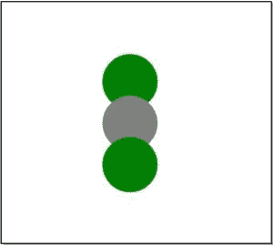
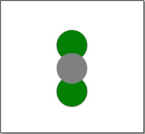
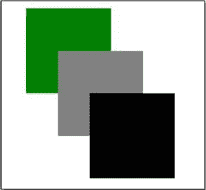

# 如何在 svg 元素中使用 z-index？

> 原文:[https://www . geeksforgeeks . org/如何使用-z-index-in-svg-elements/](https://www.geeksforgeeks.org/how-to-use-z-index-in-svg-elements/)

**z-index** 只对完整的内容起作用。这是因为呈现的 HTML 在切换到呈现的 SVG 以放置内部 SVG 内容之前控制了定位。所以，SVG 基本上没有 z 指标，它用的是**油漆工模型**。

**油漆工的模型:**根据这个模型，在连续的操作中，油漆被应用到输出设备的某个区域，覆盖了之前操作的油漆。这是因为，在每个对象被绘制之后，它成为下一个绘制操作的背景的一部分。总而言之，根据该模型，元素的绘制或显示顺序由元素在文档中出现的顺序来定义。因此，要更改元素的 **z 指数**，可以通过以下方式完成。

*   **Manually change the order of the element in the SVG document:
    **Example:**

    ```html
    <svg xmlns="http://www.w3.org/2000/svg" 
            viewBox="10 30 220 420">
        <g>
            <g id="one">
                <circle fill="green" cx="100" 
                        cy="85" r="20" />
            </g>

            <g id="two">
                <circle fill="grey" cx="100" 
                        cy="115" r="20" />
            </g>
            <g id="three">
                <circle fill="green" cx="100" 
                        cy="145" r="20" />
            </g>
        </g>
    </svg>
    ```

    **输出:**
    

    现在，我们的目标是增加“灰色”元素的 *z 指数*。如上所述，根据画家的模型，对于具有最高 *z 指数*的元素，应该将其放置为最新要绘制的对象。所以要增加“灰色”圆的 *z 指数*，我们只需将“灰色”圆元素的位置更改到最后。

    **示例:**

    ```html
    <svg xmlns="http://www.w3.org/2000/svg" 
            viewBox="10 30 220 420">
        <g>
            <g id="one">
                <circle fill="green" cx="100" 
                        cy="85" r="20" />
            </g>

            <g id="three">
                <circle fill="green" cx="100" 
                        cy="145" r="20" />
            </g>
            <g id="two">
                <circle fill="grey" cx="100" 
                        cy="115" r="20" />
            </g>
        </g>
    </svg>
    ```

    **输出:**
    ** *   ****Using use:** The **use** element takes elements from the SVG document and duplicates them at the place where you place it. So, basically instead of changing the order of the element in the document, we are duplicating the element to keep up the uniformity.

    **示例:**

    ```html
    <svg xmlns="http://www.w3.org/2000/svg" 
            viewBox="10 30 220 420">
        <g>
            <g id="one">
                <rect x="30" y="70" width="80" 
                    height="80" fill="green"></rect>
            </g>
            <g id="two">
                <rect x="60" y="110" width="80" 
                    height="80" fill="grey"></rect>
            </g>
            <g id="three">
                <rect x="90" y="150" width="80" 
                    height="80" fill="black"></rect>
            </g>
        </g>

    </svg>
    ```

    **输出:**
    

    要增加“绿色”元素的 *z 指数*，我们将使用**使用**功能。

    ```html
    <svg xmlns="http://www.w3.org/2000/svg" 
            viewBox="10 30 220 420">
        <g>
            <g id="one">
                <rect x="30" y="70" width="80" 
                    height="80" fill="green"></rect>
            </g>
            <g id="two">
                <rect x="60" y="110" width="80" 
                    height="80" fill="grey"></rect>
            </g>
            <g id="three">
                <rect x="90" y="150" width="80" 
                    height="80" fill="black"></rect>
            </g>
        </g>
        <use xlink:href="#one" />
    </svg>
    ```

    **输出:**
    **