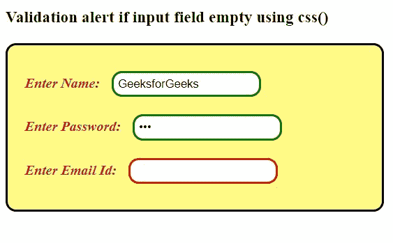
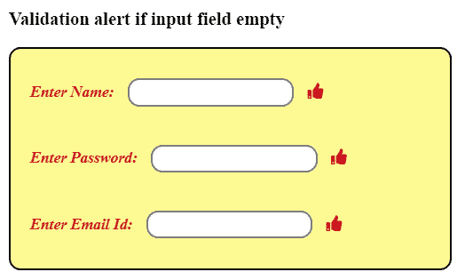

# 如何在聚焦输出的同时验证输入字段？

> 原文:[https://www . geesforgeks . org/如何验证输入字段同时聚焦输出/](https://www.geeksforgeeks.org/how-to-validate-input-field-while-focusout/)

jQuery 中的 focusout()方法用于从所选元素中移除焦点。现在我们将使用 focusout()方法来验证聚焦时的输入字段。此方法检查输入字段是否为空。此外，使用一些 CSS 属性来显示输入字段验证。如果输入字段为空，则显示红色边框输入字段，否则显示绿色边框输入字段。

**例 1:**

```
<!DOCTYPE html> 
<html> 

<head> 
    <script src=
"https://ajax.googleapis.com/ajax/libs/jquery/3.3.1/jquery.min.js"> 
    </script> 

    <style> 
        form { 
            border: 2px solid black;
            border-radius:12px;            
            width: 50%; 
            padding: 20px; 
            background-color:#fffa86;
        } 
        label {
            color:brown;
            font-weight:bold;
        }
        input { 
        border: 2px solid grey; 
        border-radius:12px;
            padding: 5px; 
            margin: 10px; 
            outline:none;
        }     
    </style> 
</head>

<body> 
    <h3>Validation if input field empty:</h3>

    <form>
        <label><em>Enter Name:</em></label> 
        <input type="text" name="name" required autocomplete="off">
        <br> 
        <label><em>Enter Password:</em></label> 
        <input type="password" name="pwd" required autocomplete="off">
        <br> 
        <label><em>Enter Email Id:</em></label> 
        <input type="email" name="eid" required autocomplete="off">
    </form> 

    <script> 
        $(document).ready(function() { 
            $("input").focusout(function() { 
                if($(this).val()=='') { 
                    $(this).css('border', 'solid 2px red'); 
                }
                else {

                    // If it is not blank.
                    $(this).css('border', 'solid 2px green');    
                }    
            }) .trigger("focusout");
        }); 
    </script> 
</body> 

</html> 
```

**输出:**


**示例 2:** 如果输入字段为空，请使用同胞()，addClass()方法发出验证警报。

```
<!DOCTYPE html> 
<html> 

<head> 
    <link rel="stylesheet" href=
"https://use.fontawesome.com/releases/v5.7.0/css/all.css" 
    integrity=
"sha384-lZN37f5QGtY3VHgisS14W3ExzMWZxybE1SJSEsQp9S+oqd12jhcu+A56Ebc1zFSJ"
    crossorigin="anonymous">

    <script src=
"https://ajax.googleapis.com/ajax/libs/jquery/3.3.1/jquery.min.js"> 
    </script> 

    <style> 
        form { 
            border: 2px solid black;
            border-radius:12px;            
            width: 50%; 
            padding: 20px; 
            background-color:#fffa86;
        } 
        label {
            color:brown;
            font-weight:bold;
        }
        input { 
            border: 2px solid grey; 
            border-radius:12px;
            padding: 5px; 
            margin: 10px; 
            outline:none;
        } 
        .myelement {
            visibility: hidden;
         }
        .isempty:after {
            content:"<i style='color:red;' class='fas fa-thumbs-down'></i>"
        }
        .emptynot:after {
            content:"<i style='color:green;' class='fas fa-thumbs-up'></i>"
        }
    </style> 
</head> 

<body> 
    <h3>
        Validation alert if input field empty
    </h3>

    <form> 
        <div id="input1">
            <label><em>Enter Name:</em></label> 
            <input type="text" name="name" required autocomplete="off">
                <i style='color:grey;' class='fas '></i>
        </div>

        <br> 

        <div id="input2">
            <label><em>Enter Password:</em></label> 
            <input type="password" name="pwd" required autocomplete="off">
            <i style='color:grey;' class='fas '></i>
        </div>

        <br> 

        <div id="input3">
            <label><em>Enter Email Id:</em></label> 
            <input type="email" name="eid" required autocomplete="off">
            <i style='color:grey;' class='fas '></i>
        </div>
    </form>

    <script> 
        $(document).ready(function() {
            $('div input').focusout(function() {                   
                if($(this).val()=='' ) {  
                    var error=$(this).siblings('i');
                    error.addClass("fa-thumbs-up").css('color', 'red');
                }
                else {
                    var correct=$(this).siblings('i');
                    correct.addClass("fa-thumbs-up").css('color', 'green');
                }
            }).trigger("focusout");
        });
    </script> 
</body> 

 </html> 
```

**输出:**
