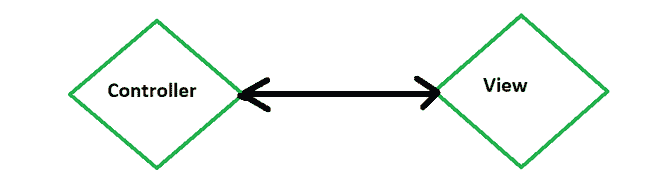
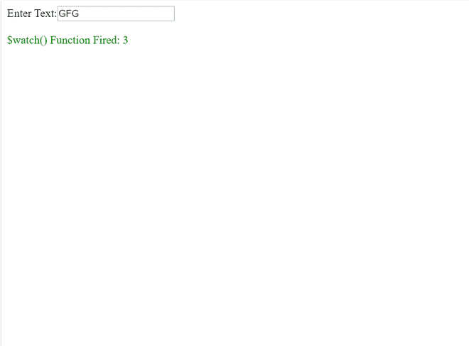
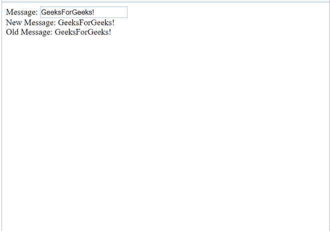
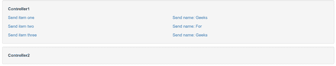

# 如何观察服务变量？

> 原文:[https://www . geesforgeks . org/如何观察服务变量/](https://www.geeksforgeeks.org/how-to-watch-service-variables/)

$scope 在 AngularJs 中充当内置对象。

它由应用程序数据和方法组成。$scope 是控制器和视图(HTML)之间的链接。



$scope 用于传输数据。

**$手表:**

AngularJs 对象中的作用域有$watch 事件，当模型属性被改变或更改时，这个事件就会出现在图片中。

当从视图中的某个程序点创建到$scope 对象上的变量的数据绑定时，会在 AngularJs 内部创建一个观察点。

当我们$watch()函数时，摘要会被多次调用。

每次绑定 UI 时，我们都会在$watch 列表中插入$watch。

```
User: <input type="text" ng-model="user" />
Password: <input type="password" ng-model="pass" />

```

**示例:**

```
<!DOCTYPE html>
<html>
    <head>
        <title>
            AngularJs $watch() Function with GFG
        </title>
        <script src=
"https://ajax.googleapis.com/ajax/libs/angularjs/1.4.8/angular.min.js">
      </script>
        <script type="text/javascript">
            var app = angular.module("watchApp", []);
            app.controller("watchCtrl", function ($scope) {
                $scope.count = -1;
                $scope.$watch(
                  "txtval", function (newval, oldval) {
                    $scope.count = $scope.count + 1;
                });
            });
        </script>
    </head>
    <body>
        <div ng-app="watchApp" 
             ng-controller="watchCtrl">
            Enter Text:<input type="text" 
                              ng-model="txtval" />
          <br />
            <br />
            <span style="color: Green;">
              $watch() Function Fired: {{count}}</span>
        </div>
    </body>
</html>
```



AngularJs 中的$watch 是一项服务。

它用于跟踪给定范围内特定属性的变化。它类似于事件侦听器。e 改变指定变量的值。

注册手表时，我们将两个函数作为参数传递给$watch()函数。这些功能是:

*   价值函数
*   监听器功能

示例:

```
$scope.$watch(function() {}, //value function
             function() {}  //listener function
             );
```

观察者可以在以下位置更改响应:

1.  超时设定
2.  用户界面
3.  由网络工作者执行的复杂异步计算
4.  Ajax 调用

**使用的方法:** *$scope。$watchGroup*

$watchGroup()是一个用相同回调设置观察器的快捷方式，传递一个 watchExpressions 数组。

> $scope。$watchGroup(['obj.a '，' obj.b.bb[4]'，' letters[8]']，function(newValues，oldValues，scope){
> /…
> })；

$scope。$watchCollection 是观察数组或对象的快捷方式。在数组中，当替换、删除或添加任何元素时，都会调用侦听器。

$watch 跟踪变量。这个函数有两个参数:

1.  新难度动作

    > $scope。$watch('expression '，function (newvalue，oldvalue) { //expression 参数
    > //Code
    > })；

2.  旧价值

    > $scope。$watch(function () {}，function (newvalue，old value){//Function Parameter
    > //Code
    > })；

**示例:**

```
<!DOCTYPE html>
<html>
<head>
    <script src=
"https://ajax.googleapis.com/ajax/libs/angularjs/1.3.16/angular.min.js">
   </script>
</head>
<body ng-app="myNgApp">

    <div ng-controller="myController">
        Message: <input type="text"
                        ng-model="message" /> 
        <br />
        New Message: {{newMessage}} <br />
        Old Message: {{oldMessage}} 
    </div>
    <script>
        var ngApp = angular.module('myNgApp', []);

        ngApp.controller('myController', function ($scope) {
            $scope.message = "GeeksForGeeks!";

            $scope.$watch(
'message', function (newValue, oldValue) {
                $scope.newMessage = newValue;
                $scope.oldMessage = oldValue;
            });
        });
    </script>
</body>
</html>
```



其他:

**$digest()**

当 AngularJS 认为有必要时，我们调用$digest()函数。

例如，在执行按钮点击处理程序之后，或者在 AJAX 调用返回之后。

**$apply():**

$scope。$apply()函数将函数作为参数来执行，并在$scope 之后。$digest()在内部调用。这有助于检查所有的手表

```
$scope.$apply(function() {
   $scope.data.myVar = "value";
});

```

**美元手表示例:**

```
<div class="container" data-ng-app="app">
    <div class="well" data-ng-controller="FooCtrl">
        <p><strong>Controller1</strong></p>
        <div class="row">
            <div class="col-sm-6">
                <p><a href="" 
                      ng-click=
   "setItems([ { name: 'I am single item' } ])">
                  Send item one </a></p>
                <p><a href="" 
                      ng-click=
               "setItems([ { name: 'Item 1 of 2' },
                  { name: 'Item 2 of 2' } ])">
                  Send item two </a></p>

                <p><a href=""
                      ng-click=
                      "setItems([ { name: 'Item 1 of 3' },
                  { name: 'Item 2 of 3' },
                  { name: 'Item 3 of 3' } ])">
                  Send item three </a></p>
            </div>
            <div class="col-sm-6">
                <p><a href="" 
                      ng-click="setName('Sheldon')">
                  Send name: Geeks</a></p>
                <p><a href="" 
                      ng-click="setName('Leonard')">
                  Send name: For</a></p>
                <p><a href="" 
                      ng-click="setName('Penny')">
                  Send name: Geeks</a></p>
            </div>
        </div>
    </div>

    <div class="well" 
         data-ng-controller="BarCtrl">
        <p><strong>Controller2</strong></p>
        <p ng-if="name">Name is: {{ name }}</p>
        <div ng-repeat="item in items">
          {{ item.name }}</div>
    </div>
</div>
```

```
var app = angular.module('app', []);

app.factory('PostmanService', function() {
  var Postman = {};
  Postman.set = function(key, val) {
    Postman[key] = val;
  };
  Postman.get = function(key) {
    return Postman[key];
  };
  Postman.watch = function($scope, key, onChange) {
    return $scope.$watch(

      function() {
        return Postman.get(key);
      },

      function(newValue, oldValue) {
        if (newValue !== oldValue) {
          // Only update if the value changed
          $scope[key] = newValue;
          // Run onChange if it is function
          if (angular.isFunction(onChange)) {
            onChange(newValue, oldValue);
          }
        }
      }
    );
  };
  return Postman;
});

app.controller('FooCtrl', ['$scope',
                           'PostmanService', 
             function($scope, PostmanService) {
  $scope.setItems = function(items) {
    PostmanService.set('items', items);
  };
  $scope.setName = function(name) {
    PostmanService.set('name', name);
  };
}]);

app.controller('BarCtrl', ['$scope',
                           'PostmanService',
           function($scope, PostmanService) {
  $scope.items = [];
  $scope.name = '';
  PostmanService.watch($scope, 'items');
  PostmanService.watch(
       $scope,'name', function(newVal, oldVal) {
    alert('Hi, ' + newVal + '!');
  });
}]);
```

CSS:

```
.well {
 margin-top: 10px;
 margin-bottom: 10px;
}

p:last-child {
 margin-bottom: 0;
}
```

