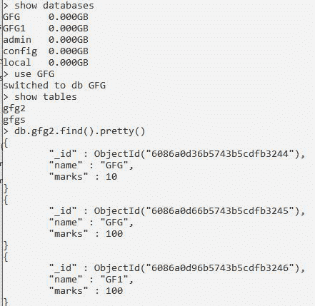
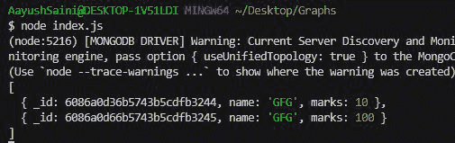

# 如何编写一个函数，有条件地按多列从数据库中获取行？

> 原文:[https://www . geeksforgeeks . org/如何编写函数-按多列从数据库中获取行-有条件/](https://www.geeksforgeeks.org/how-to-write-a-function-to-get-rows-from-database-by-multiple-columns-conditionally/)

**MongoDB** ，最受欢迎的 NoSQL 数据库，在***$或*** 或***$和*** 运算符的帮助下，我们可以使用 MongoDB*Collection . find()*函数，通过多列有条件地从 MongoDB Collection 中获取数据库中的行。 **mongodb** **模块**用于连接 mongodb 数据库，也用于操作 MongoDB 中的集合和数据库。

**collection.find()** 是 node.js 中 [](https://www.geeksforgeeks.org/what-are-the-advantages-of-using-mongoose-module/) MongoDB [](https://www.geeksforgeeks.org/what-are-the-advantages-of-using-mongoose-module/)模块的方法，用于从 MongoDB 数据库中存在的特定数据库的集合中选择行。

**语法:**

```
db.collection.find(query,projection)
```

**参数:**该方法取两个默认不需要的参数:

*   **查询:**选择查询，用于在选择运算符的帮助下从数据库中获取数据。
*   **投影:**投影用于指定集合的哪个字段返回或不返回。**T3】**

**返回类型:**这个函数的返回类型是一个 JSON 对象。

```
$or or $and operators are used to apply multiple condition on the collection. 
```

**安装模块:**您可以使用以下命令安装 *mongodb* 模块:

```
node install mongodb
```

**项目结构:**项目结构如下图。


**在本地 IP 上运行服务器:**在下面的命令中，*数据*是文件夹名称。

```
mongod --dbpath=data --bind_ip 127.0.0.1
```


**MongoDB 数据库:**我们的数据库名称和集合如下所示，并带有一些伪数据。

```
Database:GFG
Collection:gfg2
```



**文件名:index.js**

## java 描述语言

```
// Requiring module
const MongoClient = require("mongodb");

// Connection URL
const url='mongodb://localhost:27017/';

// Our database name
const databasename="GFG"; 

MongoClient.connect(url).then((client) => {

    const connect = client.db(databasename);

    // Connecting to collection
    const collection = connect.collection("gfg2"); 

    // Function call with $or operator
    collection.find({$or:[{"name":"GFG"},{"marks":"10"}]}).toArray().then((ans)=>{
        console.log(ans);
    });

}).catch((err) => {
  // Printing the error message
  console.log(err.Message);
})
```

使用以下命令运行 **index.js** 文件:

```
node index.js
```

**输出:**

