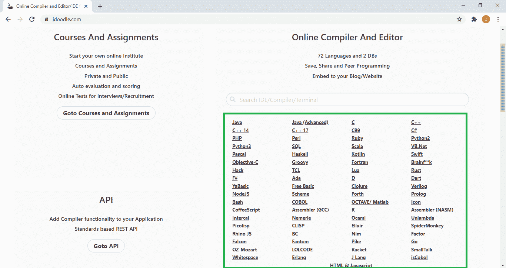
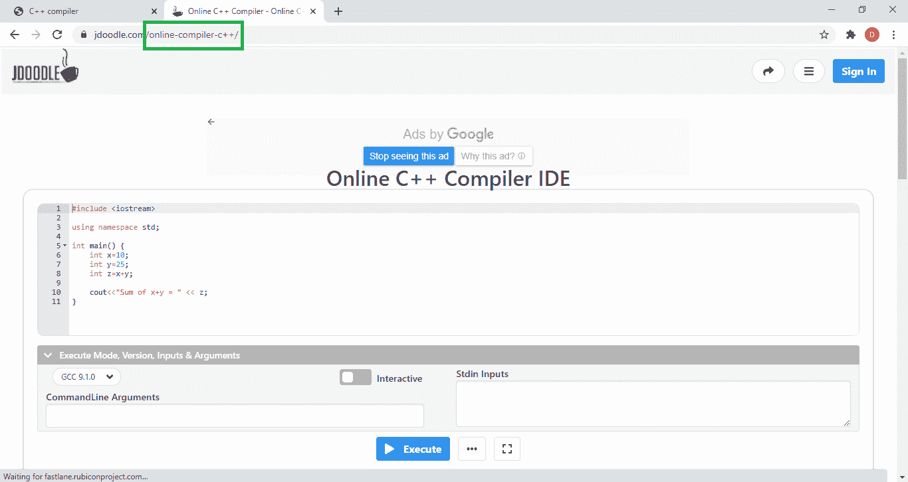
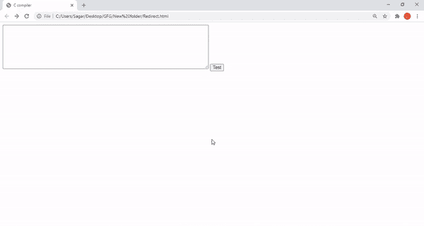
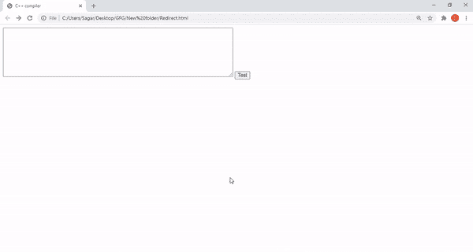

# 如何在你的网站中编写程序，并在 JDoodle 在线编译器中重定向？

> 原文:[https://www . geeksforgeeks . org/如何在您的网站中编写程序并重定向它-in-jdoodle-online-compiler/](https://www.geeksforgeeks.org/how-to-write-programs-in-your-website-and-redirect-it-in-jdoodle-online-compiler/)

在某些情况下，可能需要运行用户输入的一段代码。这可以通过使用 **JDoodle** 来完成。我们可以在我们的网站页面上用任何编程语言编写我们的程序，它可以被重定向到在那个网站上运行的 **JDoodle** 在线编译器。

**注意:**使用此方式不强制登录或注册 **JDoodle** 。

我们将使用一个*表单、*一个*文本区*和一个*提交*按钮来完成此操作。表单的*动作*属性可用于将页面重定向到所需的编程语言编译器。将使用*文本区*允许用户编写程序，并且*提交*按钮将重定向到相应的编程语言在线编译器。在重定向页面上，我们可以很容易地在 JDoodle 编译器中运行我们的程序。

**后续步骤:**

**第一步:**打开 [**jdoodle**](https://www.jdoodle.com/) 选择需要的编程语言。



**第二步:**复制打开的编译器页面的 URL 结尾。这将是我们用来重定向代码的编译器网址。



**步骤 3:** 使用下面包含重定向页面所需的所有元素的代码。*动作*属性是用 JDoodle 的重定向 API URL 定义的，从上面复制的 URL 的结尾也是用它来定义的。每当使用按钮提交表单时，这将导致重定向。

## 超文本标记语言

```html
<form method="post" action=
"https://www.jdoodle.com/api/redirect-to-post/compiler_URL">
    <textarea name="initScript" 
        rows="8" cols="80">
    </textarea>

    <input type="submit" value="Test">
</form>
```

以下示例演示了这种方法的实际应用:

**示例 1:** 使用 JDoodle 的 C 编译器

## 超文本标记语言

```html
<!DOCTYPE html>
<html>

<body>
    <!-- Form to redirect the page
        to C online compiler -->
    <form method="post" action=
"https://www.jdoodle.com/api/redirect-to-post/c-online-compiler">

        <textarea name="initScript" 
            rows="8" cols="80">
        </textarea>

        <input type="submit" value="Test">
    </form>
</body>

</html>
```

**输出:**



**示例 2:** 使用 JDoodle 的 C++编译器

## 超文本标记语言

```html
<!DOCTYPE html>
<html>

<body>

    <!-- form to redirect the page
        to C++ online compiler -->
    <form method="post" action=
"https://www.jdoodle.com/api/redirect-to-post/online-compiler-c++">

        <textarea name="initScript" 
            rows="8" cols="80">
        </textarea>

        <input type="submit" value="Test">
    </form>
</body>

</html>
```

**输出:**

