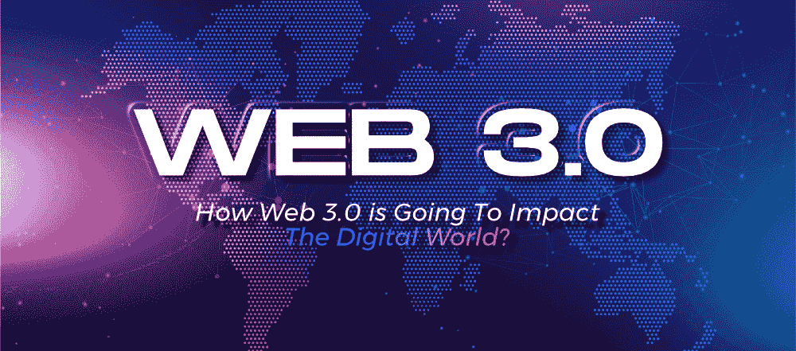

# Web 3.0 将如何冲击数字世界？

> 原文:[https://www . geesforgeks . org/how-web-3-0-即将冲击数字世界/](https://www.geeksforgeeks.org/how-web-3-0-is-going-to-impact-the-digital-world/)

互联网:一个熟悉的术语，它本身包含了整个宇宙。称之为自切片面包以来最伟大的人类发明不会错。这个由数十亿台相互连接的计算机和其他类似设备组成的全球网络独自对影响我们周围的日常世界负有责任。这也到了如此的程度，以至于今天互联网已经成为我们生活中不可分割、不可否认、也可能是最重要的一部分。可以毫不夸张地说，我们已经生活在一个**虚拟世界**中。互联网已经模糊了**现实和虚拟空间**之间的界限。与此同时，互联网自诞生以来经历了几次变化。从仅限于固定数量的计算机，到成为无处不在的虚拟实体，互联网在许多意义上真正进化了。它每天都在继续这样做。

**1.0 和 2.0 怎么样:**互联网最早的形式并不像 21 世纪那样互动、广泛和无所不知。在 60 年代和 70 年代，计算机网络作为一个概念仅限于研究目的，其商业应用实际上被禁止。

**Web 1.0:** 现代互联网的前身是一个叫做 **ARPANET** 的军用计算机网络。它的开发是由美国国防部的一个分支机构阿帕塔资助的，该分支机构成立于 20 世纪 60 年代后半期。阿帕网被称为现代互联网的第一个成熟的工作原型。阿帕网后来的发展更多的是学术性的。随着越来越多的学术机构连接到阿帕网，它披上了触手般的结构。即使在今天，互联网仍然保持着同样的形式，尽管规模要大得多。Web 1.0 是现代互联网第一次迭代的名称。Web 1.0 本质上是只读的。网页大多是通过超链接连接的，最终用户对此无能为力。

**Web 2.0:** 由于 web 1.0 是只读的，它上面的大部分内容都是离线编写的。web 1.0 的时代也被称为**静态网页**的时代。但互联网的本质是进化是不可避免的。网络 2.0 这个术语是由达西·迪努奇在 1999 年首次提出的。这就是我们今天使用的互联网的开始。Web 2.0 标志着今天的互联网。它速度快、范围广、互动性强，并且远远领先于 web 1.0。Web 2.0 鼓励用户走出被动，成为积极的内容提供者。在 21 世纪初，互联网繁荣已经指日可待。一些出版平台，如 **WordPress** 和像脸书这样的社交媒体网站已经在新一代互联网用户中变得流行起来。

如今，互联网几乎遍布这个星球的每一个偏远角落。它的内容比以往任何时候都更加丰富多彩和互动。

**互联网 Web 3.0 的假定未来:**互联网的当前迭代仍在日新月异地看到许多进步。随着现代技术逐渐为发展超智能机器和自主环境铺平道路，互联网也紧随其后。专家们假设下一个版本的互联网将比现在的更加复杂和智能。蒂姆·伯纳斯·李将网络 3.0 称为“T2”语义网“T3”。但这一切意味着什么？嗯，如果你关注现代科技领域的趋势，你会知道**人工智能和机器学习**是两个流行的话题。

Web 3.0 旨在将这两种技术以及其他一些先进技术结合起来。目标:变得聪明、自主和开放。

**网络 3.0 将如何影响数字世界:**关于互联网下一个进化阶段的预期性质，有许多假设。一些人说它将改变我们与网络互动的方式，而另一些人则认为这些改变更多的是意识形态上的，而不是功能上的。但不管任何人怎么说，有一点是肯定的。下一代互联网将从根本上:

1.  开放或透明
2.  不可靠的
3.  分散的

让我们分析这些术语来**更好地理解 web 3.0** 。

**1。开放还是透明:**网络 3.0 的一个主要定义特征是它将如何成为一个开放的网络。开放性确保程序是使用**开源软件**构建的。这意味着该代码可由互联网上的一个**开放开发者社区**访问。此外，开源程序的开发和部署也将以透明的方式进行。web 3.0 的开放性要求所有的开源程序基本上都是虚拟资源，因此任何想要利用它们的好处的人都应该可以使用。

**2。无信任:**无信任网络的概念并不新鲜。长期以来，将任何所谓的“可信”第三方排除在任何类型的虚拟交易或交互之外一直是一种受欢迎的意识形态。考虑到数据盗窃是全球互联网用户的一个突出问题，让第三方相信我们的数据似乎是不对的。无信任网络确保没有中间人干预任何在线交易或互动。真实的一个很好的例子是超级流行的 T2 区块链技术。区块链主要用于涉及加密货币的交易。它定义了一个协议，根据该协议，只有参与交易的个人才能以对等方式连接。不涉及中介。

**3。去中心化:**社交媒体如今享有巨大的人气。这是可以理解的，因为它让我们可以不受地理限制地与已知的人和陌生人联系和互动。但是拥有社交媒体平台的公司很少。这几家公司掌握着数百万人的信息。听起来很吓人，对吧？这只是公司如何拥有和利用我们的数据用于未知和不可想象的目的的例子之一。分散化是一个概念，旨在通过确保替代方案来取代网络的看门人，从而消除这种数据集中。专家表示，web 3.0 将全面推广权力下放的理念。数据将存储在互联网上的多个安全位置。这将消除任何**数据丢失威胁**，并打破保存我们数据的大规模数据孤岛。

**底线:** Web 3.0 是互联网**进化**的下一个阶段，其根基已经奠定。从理论上讲，web 3.0 是一个能够像人类一样理解信息的超智能网络，按照目前的标准，它将是网络技术的一次巨大飞跃。除了 web 3.0 承诺的技术奇迹之外，它还提议实施某些意识形态，这些意识形态将极大地改变当今网络的当前运作方式。作为最终用户，我们将迎来一个新的网络时代，这个时代将进一步模糊现实空间和数字空间之间的界限。