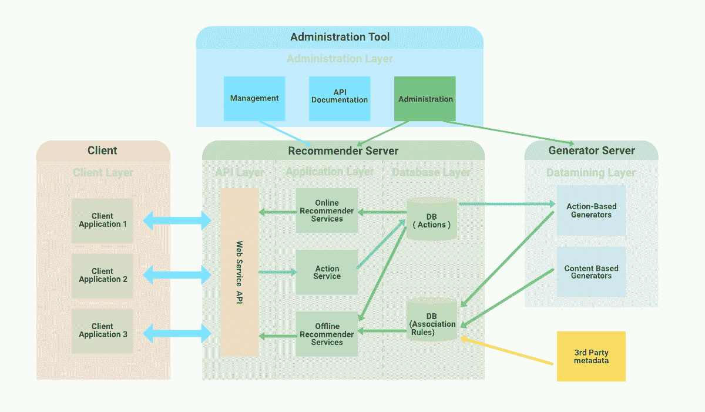
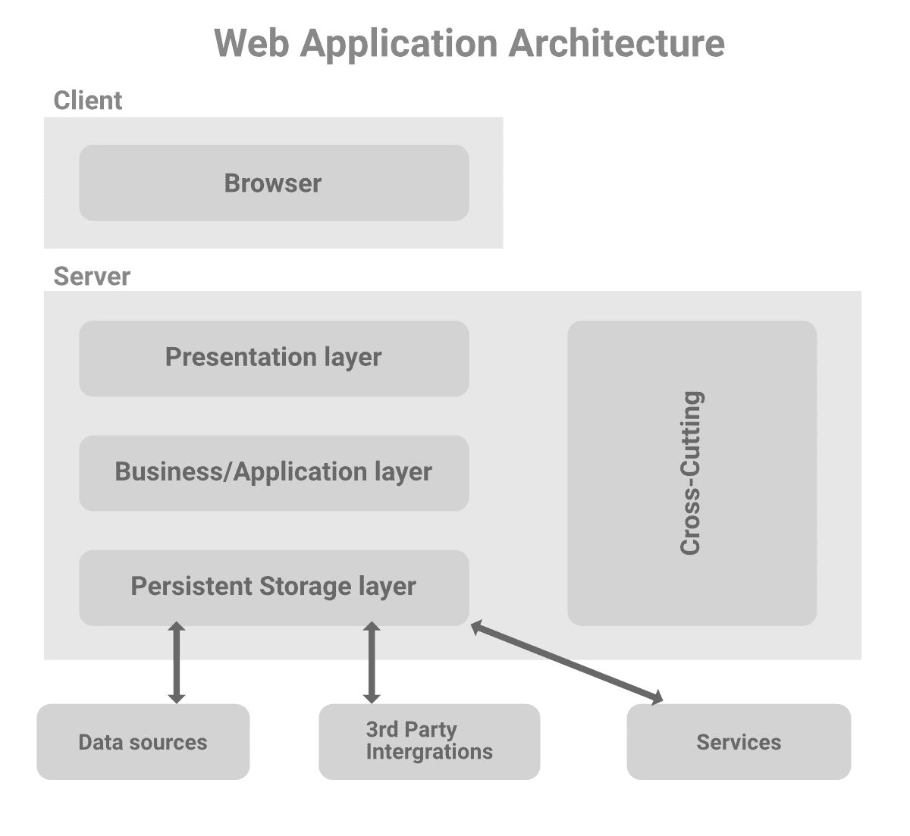

# Web 如何工作–面向初学者的 Web 应用架构

> 原文:[https://www . geesforgeks . org/how-web-works-web-application-architecture-for-初学者/](https://www.geeksforgeeks.org/how-web-works-web-application-architecture-for-beginners/)

几十年来，我们在互联网上浏览我们最喜欢的网站，并得到我们想要的任何快速响应……但是 ***你有没有试图知道应用程序的每个部分是如何协同工作的，以及请求是如何在幕后处理的？*** 如果你对技术稍微熟悉一点，那么你可能会有一个通用的答案:你的请求被发送到网络服务器，然后网络服务器处理请求并执行所有的后端逻辑。之后，它会将响应发送回网络浏览器，然后您会在屏幕前看到结果。

嗯，确实如此，但是如果你深入一层，你会发现你的 web 应用程序有一个由不同组件和层组成的复杂架构。您的请求通过这些不同的层和组件，然后从服务器端得到响应。这是一个相当长的过程，但是如果你的目标是成为一名优秀的 web 应用程序开发人员，理解 web 应用程序架构的基础是非常重要的。首先，让我们了解一些关于 web 应用程序的事情。

当您构建应用程序时，您需要记住三个原则…

*   从客户的角度来看，应用程序不应该是复杂的，应该是令人满意的，并且应该解决他们的大部分问题。
*   从业务角度来看，您的 web 应用程序应该与其[产品/市场契合度](https://www.altexsoft.com/blog/business/product-strategy-how-to-find-product-market-fit/)保持一致。
*   从工程师的角度来看，应用程序应该是可扩展的、功能性的，并且应该能够承受高流量负载。

我们将讨论 web 应用程序架构中的上述要点，并详细了解核心概念、架构如何工作、其组件和类型。

### 什么是网络应用架构？

***你知道网站和网络应用有区别吗？*** (你可能以为两者是一样的)。web 应用程序是在浏览器上运行的程序，它主要有三个形式特征。

*   解决一个特定的问题，即使只是简单地寻找一些信息
*   像桌面应用程序一样交互
*   与内容管理系统合作。

如果我们谈论网站，那么传统上它只是静态页面的组合。当一个网站由静态和动态页面组成时，它就变成了一个网络应用程序(*是的！！* *正是* *真* *所有现代网站都是 web 应用的* *例* *。*)

Web 应用程序架构是一种机制，它向我们阐明了如何在客户机和服务器之间建立连接。它决定了应用程序中的组件如何相互通信。应用程序的大小和复杂程度并不重要，它们都遵循相同的原则，只是细节可能不同。

用技术术语来说，当用户在网站上提出请求时，应用程序、用户界面、中间件系统、数据库、服务器和浏览器的各种组件相互作用。网络应用程序架构是一个将这种关系联系在一起并维护这些组件之间交互的框架。

当用户与网站交互并从服务器端得到响应时，整个过程会在几秒钟内执行。这里我们需要注意的最重要的事情是传递给浏览器的代码。这段代码可能有，也可能没有特定的指令告诉浏览器如何响应不同类型的用户输入。这就是为什么 web 应用程序架构包含了整个软件应用程序的所有子组件和外部应用程序交换。由于大量的全球网络流量，web 应用程序架构必须处理可靠性、可伸缩性、安全性和健壮性。

### 网络请求是如何工作的？

举个例子，你想去**Flipkart.com**。

*   **你在浏览器中输入 flipkart.com:**当你在网页浏览器中输入网址并点击输入时，网页浏览器需要知道网页所在服务器的地址。因此，它将请求发送到域名服务器，这是一个域名及其 IP 地址的仓库。之后，浏览器使用 HTTPS 协议将请求发送到找到的 IP 地址。如果您之前已经从同一个浏览器访问过 Flipkart.com，那么它会从缓存中提取地址。
*   **web 服务器处理请求:**在下一步中，web 服务器将请求发送到存储区域，以定位页面以及随后的所有数据。这里，业务逻辑(也称为领域逻辑和应用程序逻辑)出现在图片中。BL 负责路由，这意味着如何访问每条数据。它专门为每个应用程序管理这个工作流。当 BL 处理请求时，它会将请求发送到存储器，以定位要查找的数据。
*   **你得到回复:**当回复传回来时，它会显示在你的屏幕前。显示在屏幕上的任何网站的网页(图形界面)称为应用程序的*前端。*在这里你可以看到所有的 UI 和 UX 组件来访问信息。

### 网络应用架构是如何工作的？

所有的 web 应用程序都在客户端和服务器端运行。当用户发出请求时，双方主要运行两个程序。

*   在浏览器中运行并根据用户输入工作的代码。
*   服务器中响应 HTTP 请求的代码

在处理 web 应用程序时，web 开发人员决定服务器上代码的功能和浏览器上代码的功能。它们还定义了这两者如何相互作用。服务器端代码可以使用 Python、JavaScript、C#、PHP、Ruby on Rails 等语言编写。如果能够响应 HTTP 请求，任何代码都可以在服务器上运行。服务器端代码主要负责创建用户请求的页面。它还存储不同类型的数据，如用户档案、推文、页面等。最终用户看不到服务器端代码(除非出现罕见的故障)

客户端语言包括 HTML、CSS 和 JavaScript 的组合。该代码由浏览器解析，用户可以查看和编辑。只有通过 HTTP 请求，客户端代码才能与服务器通信。此外，它不能直接从服务器读取文件。

### 网络应用架构组件

Web 应用程序架构适用于各种组件。这些组件可以分为两个区域。

**1。用户界面应用组件:**顾名思义，这个类别与用户界面/体验的关系要大得多。在此类别中，网页的角色与显示、仪表板、日志、通知、统计信息、配置设置等相关，与 web 应用程序的功能或工作无关。

**2。结构组件:**这个类别主要关注用户交互的网络应用程序的功能、控件和数据库存储。顾名思义，它更多的是关于 web 应用程序的结构部分。这个结构部分包括…

*   网络浏览器或客户端
*   网络应用服务器
*   数据库服务器

### 网络应用三层架构层

Web 应用程序架构模式被分成许多不同的层，称为多层或三层架构。您可以轻松地独立替换和升级每一层。

**表示层:**客户端可以通过浏览器访问该层，包括用户界面组件和 UI 流程组件。正如我们已经讨论过的，这些用户界面组件是用 HTML、CSS 和 JavaScript(及其框架或库)构建的，其中每个组件在构建用户界面时都扮演着不同的角色。

**业务层:**也称为业务逻辑或领域逻辑或应用层。它接受来自浏览器的用户请求，对其进行处理，并规定访问数据的路线。整个工作流程都编码在这个层中。你可以举一个在网站上预订酒店的例子。旅行者将经历一系列事件来预订酒店房间，整个工作流程将由业务逻辑负责。

**持久层:**也称存储或数据访问层。该层收集所有数据调用，并提供对应用程序持久存储的访问。业务层与持久层紧密相连，因此逻辑知道与哪个数据库进行对话，并且检索数据的过程变得更加优化。服务器和数据库管理系统软件存在于数据存储基础结构中，用于与数据库本身、应用程序和用户界面进行通信，以检索数据并解析数据。您可以将数据存储在硬件服务器或云中。

web 应用程序中与架构中存在的主要层分离的一些其他部分是…

*   **交叉代码:**该部分处理通信、运营管理和安全。它会影响系统的所有部分，但绝不能与它们混淆。
*   **第三方集成:**利用第三方 API，我们可以集成支付网关、社交登录、旅游网站中的 GDSs 等。

### 网络应用架构的类型

**1。单页应用程序:**如今，许多现代网络应用程序都被设计为单页网络应用程序，只包含最需要的元素和信息，以生成直观和交互式的用户体验。在单页应用程序中，内容或信息在当前页面上更新，而不是为用户执行的每个操作从服务器加载新页面。

*   该应用程序只请求必要的内容细节，并防止用户体验中断。
*   AJAX、异步 JavaScript 和 XML 主要用于页面通信。
*   当页面上的内容更新时，用户可以继续与页面交互(更快的交互)。

**2。微服务:**这些是执行特定单一功能的小型轻量级服务。应用程序中的组件并不相互依赖，因此没有必要使用相同的编程语言开发每个组件。这为开发人员提供了选择他们自己选择的语言或技术堆栈的灵活性。它提高了开发人员的生产力，加快了开发过程。

**3。无服务器架构:**在这种方法中，开发人员将服务器和基础架构管理外包给第三方云基础架构服务提供商。这种方法的优势在于，它允许应用程序执行所需的或定制的逻辑，而不用担心与基础架构相关的任务。这种方法主要是那些不想管理或支持他们开发 web 应用程序的服务器和硬件的公司所喜欢的。

### 结论

希望这有助于理解 web 应用程序的完整体系结构。网络应用程序不断发展，许多现代网络开发应用程序已经取代了以前的遗留结构和基本组件。web 应用程序的许多特性，如健壮性、安全性、可伸缩性、可靠性、响应性，都取决于您选择使用的 web 应用程序架构。正确的 web 应用程序架构为未来的扩展和可伸缩性计划铺平了道路。因此，在有人开始应用程序的开发过程之前，探索需求和目标总是好的。