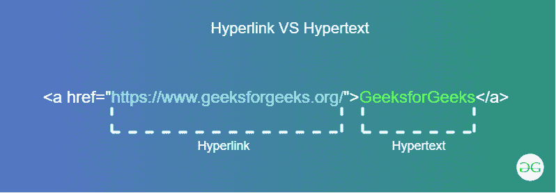

# 超链接 Vs 超文本

> 原文:[https://www.geeksforgeeks.org/hyperlink-vs-hypertext/](https://www.geeksforgeeks.org/hyperlink-vs-hypertext/)

两个名词都是彼此的双胞胎，互相表演基本上互相完成。但是我们很少会搞不清楚哪一个才是真正的那个。为了消除这种混淆，我们将通过适当的例子详细讨论两者的特殊性，并解释差异。这两个术语都在万维网中使用



**超链接:**超链接包含网页的网址。一般来说，超链接在超文本导航时被引用。这些超链接隐藏在文本、图像、图形、音频、视频下面，当我们将鼠标悬停在上面时，这些超链接会高亮显示。为了激活超链接，我们单击超媒体，它在新文档的打开中结束。它建立了知识单元之间的联系，通常称为目标文档，因此超链接的替代名称是锚点或节点。
**超文本:**泰德·纳尔逊在 1956 年引入了超文本这个术语。超文本是包含重定向目标页面的可见文本(超链接包含的页面网址)的文本。它的发明是为了在计算机世界中建立交叉引用，类似于在书籍中建立索引。然而，阅读一本书的通常模式是顺序的。但是，这个超文本引入了交叉引用数据的思想。这种交叉引用在世界范围内有点复杂，但它使工作更容易。如果我们在网上冲浪，在阅读一篇文章的时候，我们会突然遇到一个术语，这是我们当时想要理解的。如果该术语可能是超文本，我们将直接进入该页面，在那里我们将找到关于该术语的信息。因此，这消除了搜索该术语的额外时间。
**示例:**本示例将这两个术语结合在一起。

## 超文本标记语言

```html
<!DOCTYPE html>
<html>

<head>
    <title>
        Hyperlink vs Hypertext
    </title>

    <style>
        h1 {
            color: green;
        }
        .container {
            width: 800px;
            height: 150px;
            border: 2px solid black;
        }
        .img {
            width: 200px;
            height: 100px;
            border: 2px solid black;
            margin: 20px 40px;
            float: left;
        }
        img {
            width:200px;
            height: 100px;
        }
        .text {
            width: 200px;
            height: 100px;
            border: 2px solid black;
            margin: 20px;
        }
        .graphics {
            width: 200px;
            height: 100px;
            border: 2px solid black;
            margin: 20px 40px;
            float: right;
        }

        svg {
            width: 200;
            height: 100;
        }
    </style>
</head>

<body>
    <center>
        <h1>GeeksforGeeks</h1>

        <b>
            A Computer Science
            Portal for Geeks
        </b>
        <br><br>

        <div class="container">
            <div class="img">
                <a href="https://ide.geeksforgeeks.org/">
                    
                </a>
            </div>

            <div class="graphics">
                <a href="https://ide.geeksforgeeks.org/">
                    <svg>
                        <circle cx="100" cy="50" r="50"
                                stroke="black" stroke-width="2"
                                fill="green" />
                    </svg>
                </a>
            </div>

            <div class="text">
                <a href="https://ide.geeksforgeeks.org/">
                    <h3>GeeksforGeeks IDE</h3>
                </a>
            </div>
        </div>
    </center>
</body>

</html>
```

**输出:**


**超链接与超文本的区别:**

<figure class="table">

| hypertext | superlink |
| --- | --- |
| Hypertext contains nonlinear links between text and other information. | In hyperlinks, references are used for hypertext or other hypermedia. |
| Hypertext only involves text. | Hyperlinks involve text, media, audio, video, images and graphics. |
| Hypertext oriented information only generates relevant information. | Hyperlinks may contain some irrelevant information. |
| Contains hypertext hyperlinks. | A hyperlink contains a that consists of a web address. |
| Associated with hypertext keywords. | Associated with the hyperlink anchor label. |

</figure>