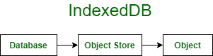
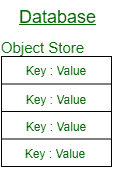
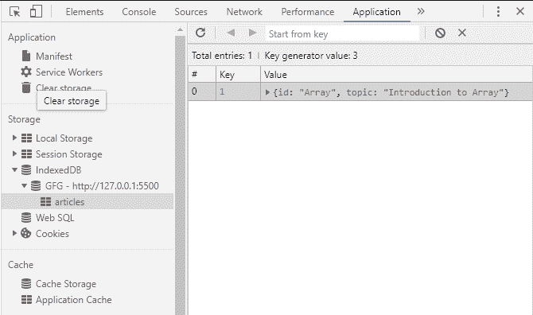

# IndexedDB |简介

> 原文:[https://www.geeksforgeeks.org/indexeddb-introduction/](https://www.geeksforgeeks.org/indexeddb-introduction/)

IndexedDB 是浏览器中的键值数据库。这是一个 NoSQL 数据库。它是事务性的，即如果某个特定操作属于某个事务，则不会应用该事务的任何操作。这确保了数据库保持一致。





**为什么要用 IndexedDB？**

1.  本地存储是为少量数据设计的，只能存储键和值的字符串数据，而索引数据库可以处理大量非结构化数据，包括文件/博客。
2.  它类似于一个 JavaScript 对象，也可以有嵌套的对象和属性。
3.  它可以异步访问，可以与[服务人员](https://www.geeksforgeeks.org/service-workers-in-javascript/)一起使用，这有助于离线存储数据，一旦设备获得互联网访问权限，它就会将其同步到服务器。

**使用 IndexedDB:** 使用 JavaScript 访问 IndexedDB。

1.  Open a Database –

    ```html
    // Syntax
    let request = indexedDB.open(name, version);
    // name : database name, string value
    // version : version number, by default 1, positive integer

    ```

    打开数据库的代码应该检查数据库是否存在。

    ```html
    let request = indexedDB.open("gfg", 1);

     request.onupgradeneeded = function() {
      // Initialize new database
     };

    request.onerror = function() {
      console.error("Unable to access database", request.error);
      // Logs error to the console
    };

    request.onsuccess = function() {
      let db = request.result;
      // Use existing database
    };
    ```

2.  在数据库中创建对象存储–

    ```html
    // Syntax
    let objectStore = db.createObjectStore(name, [keyOption]);
    // name : object store name
    // keyOption : object property key

    ```

    ```html
    let request = indexedDB.open("gfg", 1);

    // Check if object store exists and
    // then creates it
    request.onupgradeneeded = function() {
      let db = request.result;
      if (!db.objectStoreNames.contains('articles')) { 
        db.createObjectStore('articles', {keyPath: 'id'});  
      }
    };
    ```

3.  开始交易–

    ```html
    // Syntax
    db.transaction(objectStore, type]);
    // objectStore : objectStore which is to be used
    // type : readonly or readwrite

    ```

    ```html
    let transaction = db.transaction("articles", "readwrite");

    // Access an object store
    let articles = transaction.objectStore("articles");

    // Create an object
    let article = {
      id: 'Array',
      topic : 'Introduction to Array'
    };

    // Add an object 
    let request = articles.add(article);

    // Success
    request.onsuccess = function() {
      console.log("Article Published", request.result);
    };

    // Failed
    request.onerror = function() {
      console.log("Article Publish failed", request.error);
    };
    ```

4.  Close the transaction

    ```html
    let transaction = db.transaction("books", "readwrite");

    // Conducting operations in the transaction

    // When transaction is over
    transaction.oncomplete = function() {
      console.log("Transaction is complete");
    };
    ```

    我们可以通过 transaction.abort()方法强制中止事务。



IndexedDB 的用法和实现很简单。这就是如何通过 JavaScript 在代码中使用 IndexedDB。