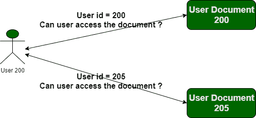

# 不安全直接对象引用(IDOR)漏洞

> 原文:[https://www . geesforgeks . org/不安全-直接-对象-引用-idor-漏洞/](https://www.geeksforgeeks.org/insecure-direct-object-reference-idor-vulnerability/)

OWASP 前 10 名中列出的最重要的漏洞之一是不安全直接对象引用漏洞(IDOR 漏洞)。在本文中，我们将讨论 IDOR 漏洞。在继续之前，让我们先讨论身份验证。身份验证意味着验证一个人的身份，并允许该人在用户通过身份验证(已验证)的情况下访问特定请求。但是，如果用户没有经过身份验证，并且能够像黑客/攻击者那样以错误的方式查看文件(即打开文件)呢？，称为[断认证](https://www.geeksforgeeks.org/broken-authentication-vulnerability/)。本文将重点讨论攻击者使用可能导致 IDOR 的身份验证漏洞的方式。

**什么是 IDOR 漏洞？**
在 web 应用程序中，每当用户生成、发送或接收来自服务器的请求时，都会有一些 HTTP 参数，如“id”、“uid”、“pid”等，这些参数具有用户被分配的一些唯一值。攻击者可以在 cookies、报头或 wifi 数据包捕获中看到此类参数值。通过这种方式，攻击者可能会篡改这些值，这种篡改可能会导致 IDOR。



一些示例演示了可以使用 IDOR 操作的不可信数据:

*   www.xyz.com/myaccount/uid=12
*   www.xyz.com/myaccount/uid=14
*   www.xyz.com/myaccount/uid=15
*   www.xyz.com/myaccount/uid=19

在这里我们可以看到，URL 中的 uid 似乎是易受攻击的，可以被攻击者篡改以破坏身份验证。

【IDOR 漏洞是如何执行的？
我们先来讨论一下一个 Web 应用程序的后端工作，这个 Web 应用程序在 SQL 中使用了未经身份验证的介质，从而导致访问用户帐户信息。

```html
String query = "SELECT * FROM accts WHERE account = ?";
PreparedStatement pstmt = connection.prepareStatement(query, ... );
pstmt.setString(1, request.getParameter("acct"));
ResultSet results = pstmt.executeQuery( );
```

在上面的代码中，攻击者将修改 web 应用程序中的“accts”参数，并可以输入多个账号来检索信息。

**执行 IDOR 攻击所涉及的步骤:**
**Burp 套件工具**被攻击者广泛用于执行此类攻击。以下是正在执行的步骤:

*   **捕获请求:**首先，攻击者将决定他想要对其执行 IDOR 攻击的目标网站。然后将网站添加到范围中，并对网站进行蜘蛛，以获取其中包含特定参数的所有网址。
*   **过滤参数请求:**在第一步之后，我们将使用参数过滤器过滤我们捕获的请求。攻击者只会选择该参数或他们可以执行攻击的注入点。
*   **将请求转发给中继器:**现在，如果攻击者会找到一些可以执行 IDOR 的注入点，他们会将请求转发给中继器。易受攻击的网址可能如下所示:***www.xyz.com/myaccount/uid=19***。这里的“UID”似乎很脆弱。
*   **篡改参数:**现在由于攻击者拥有易受攻击的注入点，他们现在将尝试借助社会工程或注入点中编写的模式来执行 IDOR 攻击。示例:攻击者可能会将 uid 从 19 更改为 20，这将打开另一个被分配了 id 号 20 的用户的帐户。

**IDOR 脆弱性的影响:**

*   **泄露机密信息:**当攻击者通过此漏洞控制您的帐户时，很明显攻击者能够发现您的个人信息。
*   **身份验证绕过:**由于攻击者可以利用此漏洞访问数百万个帐户，因此这将是一种身份验证绕过机制。
*   **更改数据:**攻击者可能有权限访问并更改您的数据。通过这种方式，攻击者可能有权对您的数据进行更改，这可能会导致对记录的操纵。
*   **账户接管:**虽然攻击者可能仅通过更改“UID”值就可以对用户账户进行多次访问，但这将导致账户接管漏洞。当一个漏洞导致另一个漏洞时(就像这个例子)，这就是所谓的 bug 链。

**IDOR 漏洞修复:**

*   开发人员应避免显示私有对象引用，如密钥或文件名。
*   应正确实施参数验证。
*   应该对所有被引用的对象进行验证。
*   令牌的生成方式应该只映射到用户，而不应该是公共的。