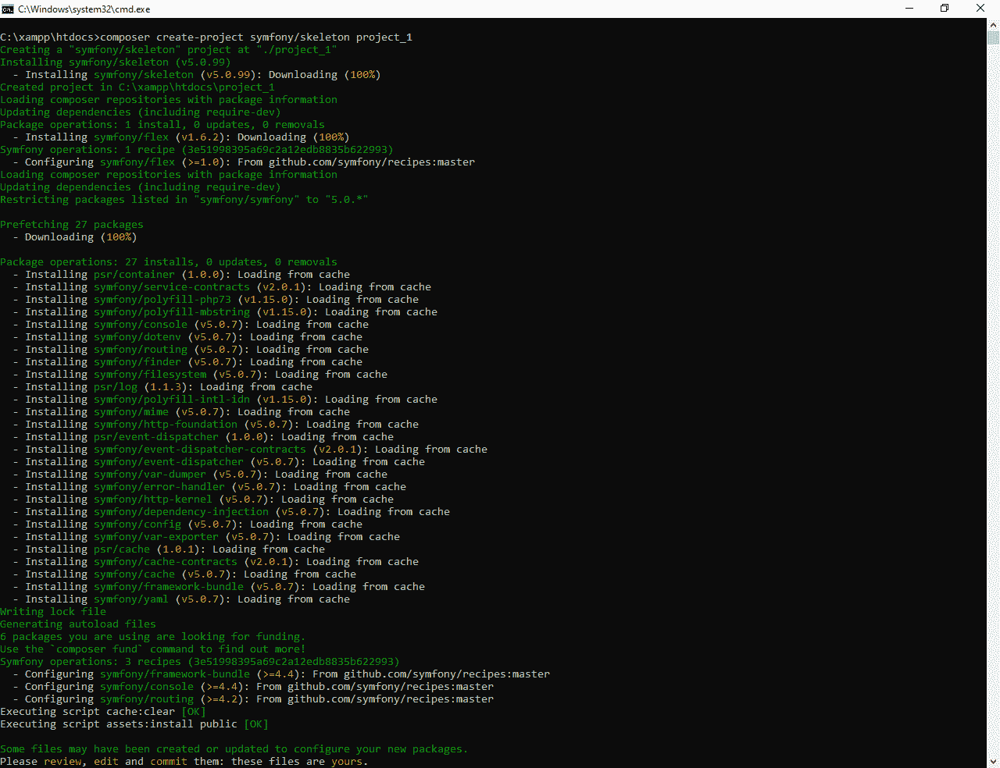
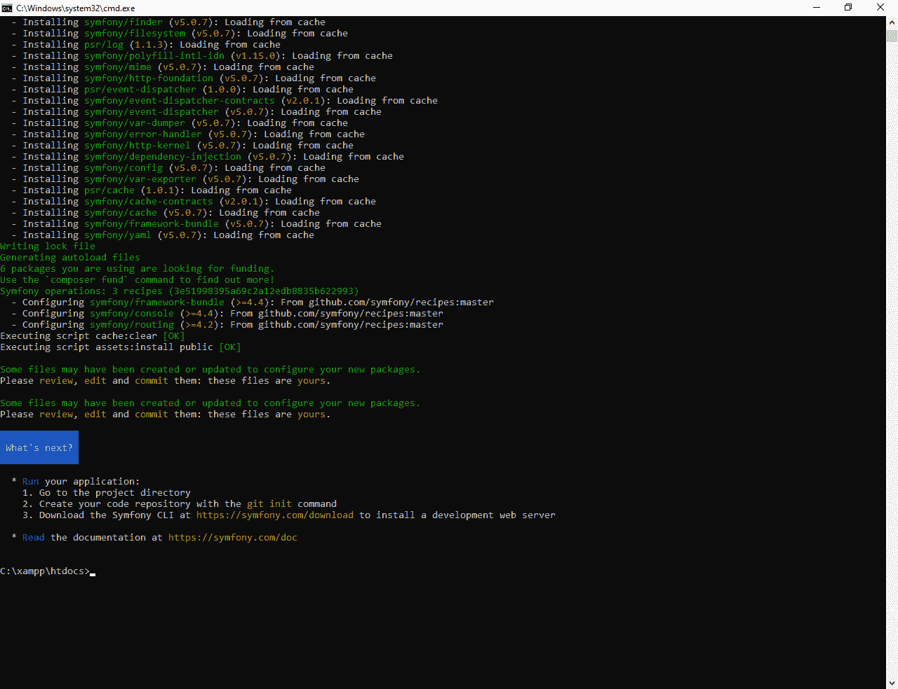
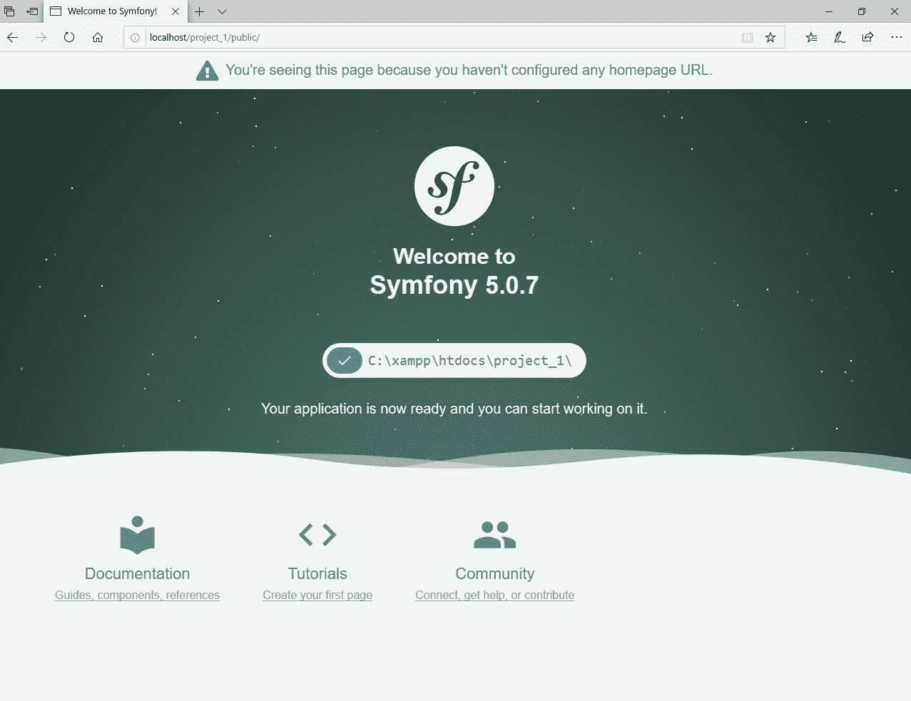
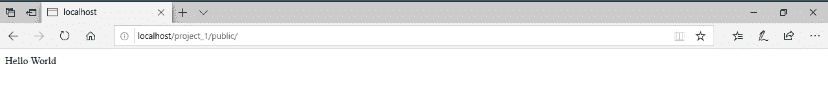

# 安装配置 Symfony 框架

> 原文:[https://www . geesforgeks . org/installation-and-configuration-symfony-framework/](https://www.geeksforgeeks.org/installation-and-configuration-symfony-framework/)

Symfony 是一个采用 MVC 架构的开源 PHP web 应用框架。它是一组可重用的 PHP 组件/库。它基本上是为需要一个优雅而简单的工具包来创建 web 应用程序的开发人员设计的，是开源开发人员社区中最受欢迎的应用程序框架。它用于构建高性能的复杂 web 应用程序。

**先决条件:**

*   [在 windows 上安装 PHP。](https://www.geeksforgeeks.org/how-to-execute-php-code-using-command-line/)
*   [运行项目的环境设置。](https://www.geeksforgeeks.org/how-to-set-php-development-environment-in-windows/)
*   创建 symfony 项目的作曲软件:**https://getcomposer.org/download**
*   Symfony 软件下载:**https://symfony.com/download**

**安装:**

*   **第一步:**转到 xampp 根文件夹，在那里打开 htdocs 文件夹。在地址栏中键入“cmd”(不带引号)(如下所示)，然后按 enter 键。
    T3】
*   **Step 2:** Enter the following command in the command prompt.

    ```
    composer create-project symfony/skeleton project_1
    ```

    在我的情况下，项目的名字是 **project_1** ，你可以选择任何名字。
    如果你看到这样的东西，那么你的项目就成功创建了。
    
    

*   **第三步:**启动你的 xampp 服务器，转到[本地主机/project_1/public](http://localhost/project_1/public) 。
    如果你看到类似这样的东西，那么你的项目就成功创建了。

**第一个项目:**这里我们将分三步创建 Hello World 页面。

*   **步骤 1:** 在 src/Controller/ 文件夹中创建新文件**“hello Controller . PHP”，并在该文件中写入以下代码。

    ```
    <?php
    namespace App\Controller;
    use Symfony\Component\HttpFoundation\Response;
    class HelloController
    {
        public function hello()
        {
            return new Response(
                'Hello World'
            );
        }
    }
    ```** 
*   **步骤 2:** 打开 **config/routes.yaml** 文件，并在该文件中写入以下代码。

    ```
    app_hello:
        path: /
        controller: App\Controller\HelloController::hello
    ```

*   **第三步:**转到[本地主机/项目 _ 1/公共](http://localhost/project_1/public)。
    如果你看到类似这样的东西，那么你已经成功创建了你好世界页面。