# 在 Windows 上安装 WordPress

> 原文:[https://www . geesforgeks . org/installation-of-WordPress-on-windows/](https://www.geeksforgeeks.org/installation-of-wordpress-on-windows/)

你想建一个网站吗？你有关于 HTML、CSS、JS、AJAX、jQuery 的知识吗？不用担心，现在有了 HTML & CSS 的基础知识，就可以用 WordPress 建网站了。让我们看看 WordPress 是什么，以及如何使用 WordPress 构建网站。WordPress 是一个开源的**内容管理系统(CMS)** 来构建动态网站和博客系统。

**CMS:** 它是一种软件，包括想要保存在您网站上的文本、照片、视频、音乐、文档等数据。它允许发布、编辑、修改你网站的内容。WordPress 经常被用来构建网络博客系统。然而，WordPress 可以用来建立任何类型的网站。现在我们将看到 WordPress 如何安装在您的机器上。安装 WordPress 并不是一个复杂的过程。首先，让我们看看 WordPress 的系统需求是什么。

<figure class="table">T28】操作系统

| database | MySQL 5.0+ |
| 网络服务器 | *   窗口*   灯(Linux)*   Xampp (Asheng)*   【mamp(Macintosh)】 |
| cross platform |

</figure>

在安装 WordPress 之前，您的本地机器必须满足上述要求。在本教程中，我们将使用 **XAMP** 作为网络服务器和 **MySQL 5.0** 数据库。我的 PHP 本地机版本是 **7.3** 。

下面是安装 WordPress 的步骤。

**第一步:** **下载 WordPress。**

在网上，你可以看到有两个 WordPress 网页，即 https://wordpress.org/和 https://wordpress.com。在这些网站中，你可以从 https://wordpress.org/download/.免费下载 WordPress。点击**下载 WordPress** 按钮，可以下载最新版本的 WordPress。

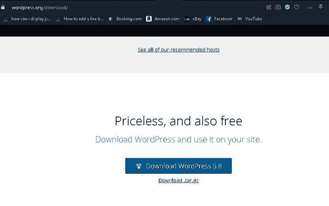

步骤 01:下载

**第二步:将 WordPress 文件夹上传到你的网络服务器。**

下载 WordPress Zip 文件后，您应该提取它。然后，您应该复制该文件夹并将其上传到您的 web 服务器/localhost(粘贴到您的根文件夹)。如果你的网页服务器是 **Xampp** ，那么把你的文件夹粘贴到 **htdocs** 文件夹(*T5】C:\ Xampp \ htdocs*)中。如果你的网页服务器是 **Wamp** ，那么把你的文件夹粘贴到文件夹中( ***C:\wamp\www*** )。

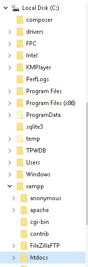

步骤 02:网络服务器的目录

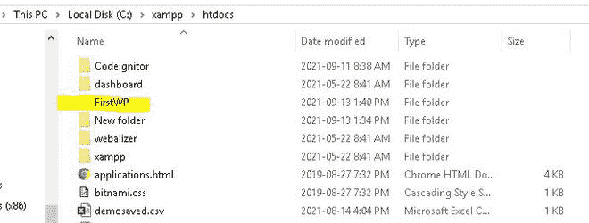

步骤 02:网络服务器文件夹

**第三步:创建 MySQL 数据库。**

WordPress 需要 MySQL 数据库。所以，你需要用你服务器上的用户名和密码创建一个数据库(我的数据库用户名是**‘root’**，密码是" ")。该数据库可能为空。数据库创建窗口如下所示。

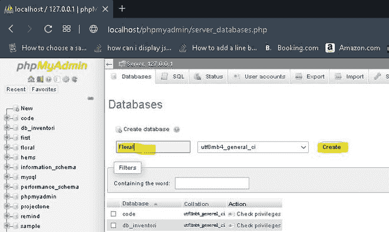

输入数据库的名称，然后单击创建按钮。现在已经创建了数据库。如果你愿意，现在你可以做桌子了。

**第四步:导航到网页浏览器**上的 **WordPress 文件夹**

让我们打开您的网络浏览器，导航到您的网络服务器中的 WordPress 文件夹(我的文件夹名是 FirstWP)，如下所示。在我的例子中，路径是 **localhost/FirstWP** (你的 WordPress 文件夹名)。

步骤 04:导航到浏览器上的 web 服务器文件夹

**第五步:选择语言**

然后你可以看到一个如下的窗口。现在你需要为你的网站选择语言。我选择英语。英语、僧伽罗语、德语等语言有很多，你可以选择自己喜欢的语言。

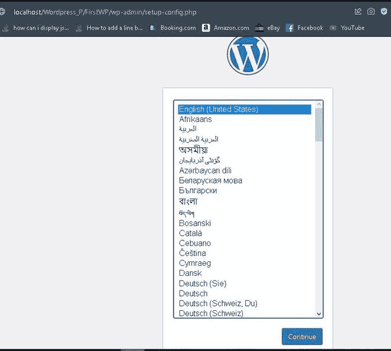

步骤 05:选择语言

选择语言后，可以点击**继续**按钮继续安装过程。

**第六步:**在这一步，可以看到如下画面。它向您展示了安装 WordPress 所需的数据库信息。这一页没什么可改的。所以你可以点击**“我们走！”**按钮。

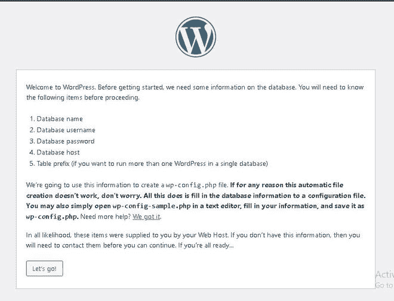

**第 7 步:输入数据库信息。**

那你就可以进入下一阶段了。在这里，您应该为以下字段输入您的数据库详细信息。

<figure class="table">

| Database name | Enter the MySql database name you created in the previous step. |
| user name | Enter the user name of your database. |
| password | Enter the password for your database. |
| Database host | Enter the host name. The default host name is localhost |
| Table prefix | Used to prefix database tables to help execute multiple sites in the same database. Take the default value wp_ |

</figure>

在下面的屏幕上，我输入了关于我的数据库的信息。输入您的数据库信息后，您可以点击位于屏幕底部的“**提交**”按钮。

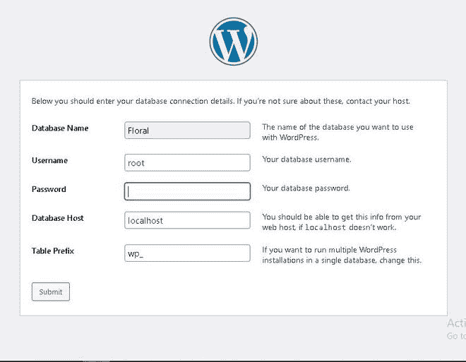

**第 8 步:**在显示以下屏幕之前，WordPress 检查并确认您输入的数据库信息，并显示以下确认快照。然后可以点击**运行安装**按钮进入下一阶段的安装过程。

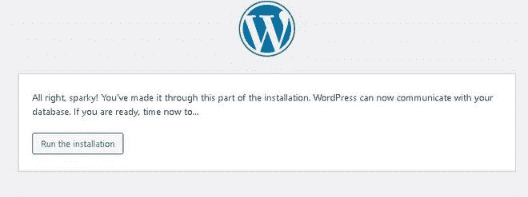

步骤 08:作为安装运行

**第九步:**现在可以看到下面的欢迎页面。在此步骤中，您需要输入网站的管理信息。如用户名、密码等。。不要把这个用户名和密码与前一个混淆。上一步我们已经输入了 MySQL 数据库的用户名&密码。这里我们创建一个用户名和密码来登录 WordPress 来创建和修改网站。在设置标题字段中，你可以给你的网站起一个名字。在电子邮件字段中，您可以给出您的电子邮件地址。当您忘记密码时，它有助于为您的网站创建新密码。给出所有信息后，可以点击**【安装 WordPress】**按钮安装 WordPress。安装过程成功后，您将看到一个屏幕，显示安装成功，如下图所示。

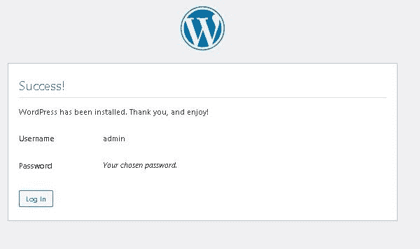

第 10 步:成功页面

现在你可以点击**登录**按钮，使用 WordPress 登录创建你的网站。

**步骤 10:** 登录您的网站登录窗口如下所示。这是安装过程的最后阶段。

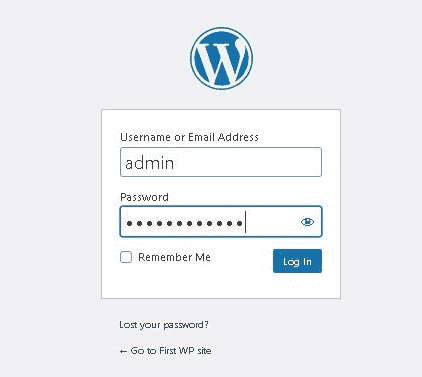

步骤 11:日志页面

**第 11 步:**所以现在点击**登录**按钮后，你可以看到如下 WordPress 仪表盘。现在你可以创建自己的网站了。在此之后，我将在下一篇博客中写如何使用 WordPress 创建您的网站。

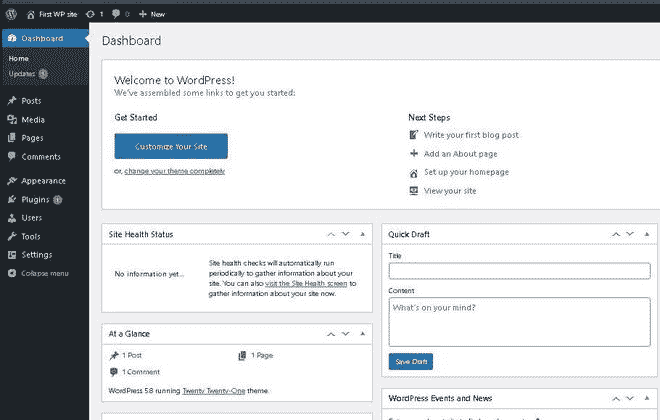

WordPress 仪表板