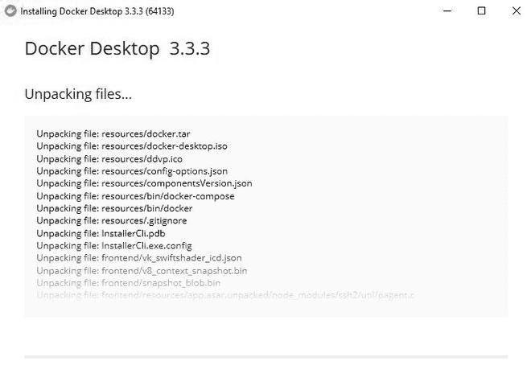
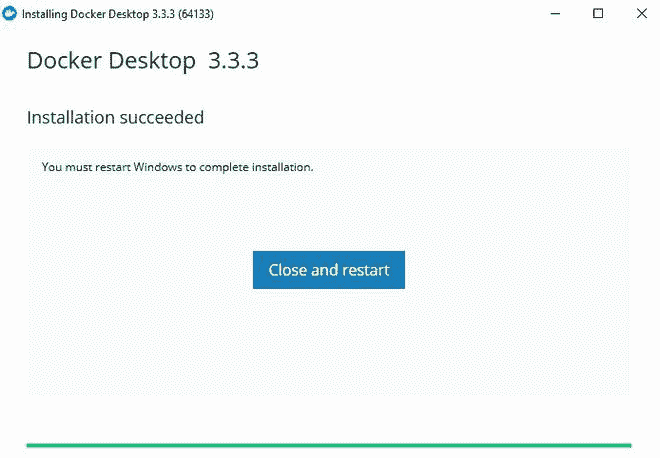
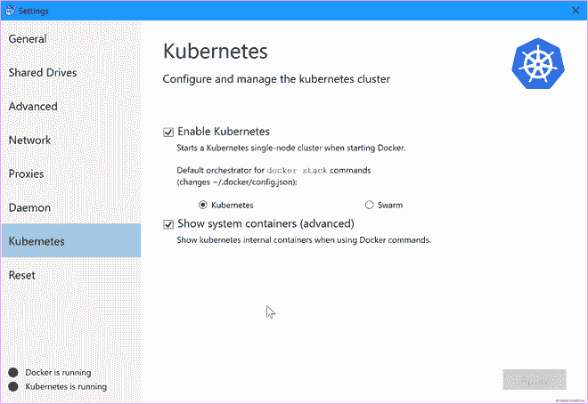
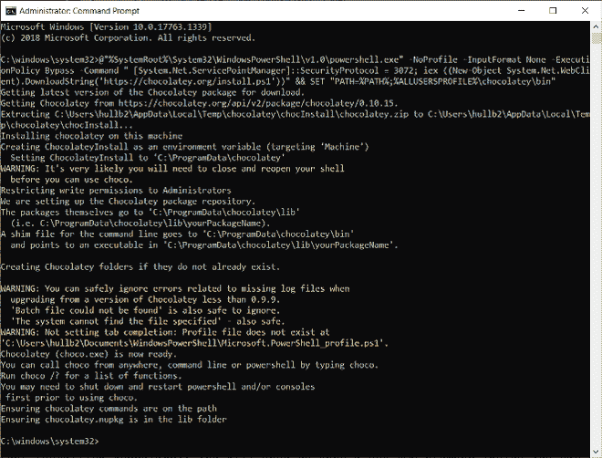
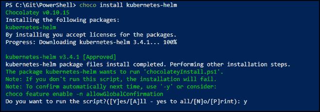

# 【安装头盔】&停泊舱

> 哎哎哎:# t0]https://www . geeksforgeeks . org/installing-helm-ku brites in dock/上

**Helm 只是 Kubernetes** 的一个包管理器。它可以帮助您管理 Kubernetes 应用程序— Helm Charts 可以帮助您定义、安装和升级最复杂的 Kubernetes 应用程序。

## 实施:

按照以下步骤在 Docker 中安装 Helm 和 Kubernetes:

**步骤 1:安装码头工人**

*   首先，从官方网站下载 Docker.exe(点击此处[**链接**](https://desktop.docker.com/win/stable/amd64/Docker%20Desktop%20Installer.exe?utm_source=docker&utm_medium=webreferral&utm_campaign=dd-smartbutton&utm_location=header) 直接下载 docker for the **win64 版本**
*   在桌面上安装 docker.exe 文件。



安装 Docker 桌面

*   安装完成后**，**重启**你的桌面。**

**

安装完成** 

****步骤 2:在 Docker 应用程序中启用 Kubernetes****

**Kubernetes，也称为 K8s，是一个开源系统，用于自动化容器化应用程序的部署、扩展和管理。如果您不了解 Kubernetes，请访问这篇文章，它包含了对 Kubernetes 的基本介绍。如果您想安装 Kubernetes，只需遵循简单的步骤:**

*   **打开 Docker 应用程序。**
*   **点击**设置- >库柏>启用库柏****

****

****第三步:为库本内特斯添加头盔包:****

**有两种方法可以添加 Helm 包:**

### **使用巧克力包管理器(窗口):**

*   **首先，确保您使用的是管理外壳。**
*   **在您的命令上运行 ***设置-执行策略旁路-作用域过程*** 来检查执行策略**
*   **现在要在您的系统上下载 choco，请复制以下代码并将其粘贴到您的命令 shell 中-**

```html
Set-ExecutionPolicy Bypass -Scope Process -Force; [System.Net.ServicePointManager]::SecurityProtocol = [System.Net.ServicePointManager]::SecurityProtocol -bor 3072; iex ((New-Object System.Net.WebClient).DownloadString('https://chocolatey.org/install.ps1'))
```

**

这可能与您的命令外壳不同，但过程是相同的。** 

*   **现在从巧克力安装头盔，转到**命令外壳**或更常见的**动力外壳**并键入:**

```html
choco install kubernetes-helm
```

**

Windows PowerShell 运行 choco install kubricks 头盔** 

### ****使用脚本:****

**最简单的方法就是复制下面的代码，粘贴到你的命令外壳上:-**

```html
curl https://raw.githubusercontent.com/helm/helm/master/scripts/get > get_helm.sh
chmod 700 get_helm.sh
./get_helm.sh
```

**

运行代码后的 LocalHost 提示窗口**