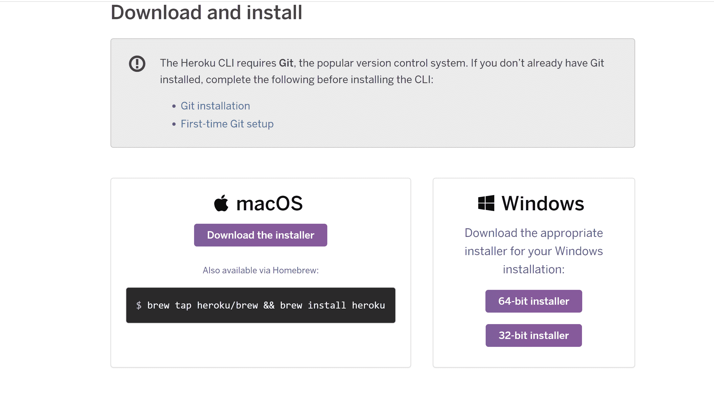
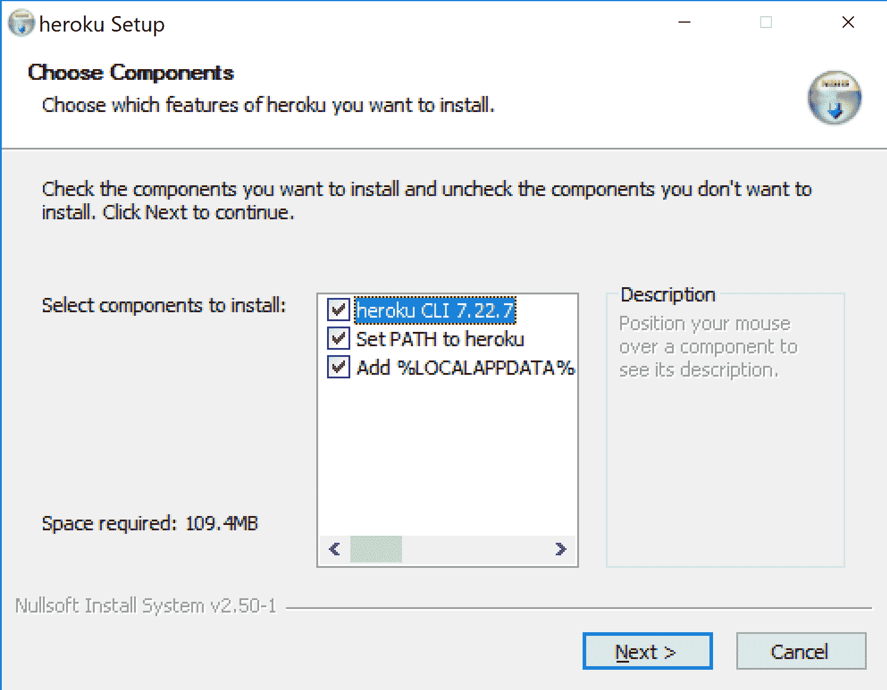
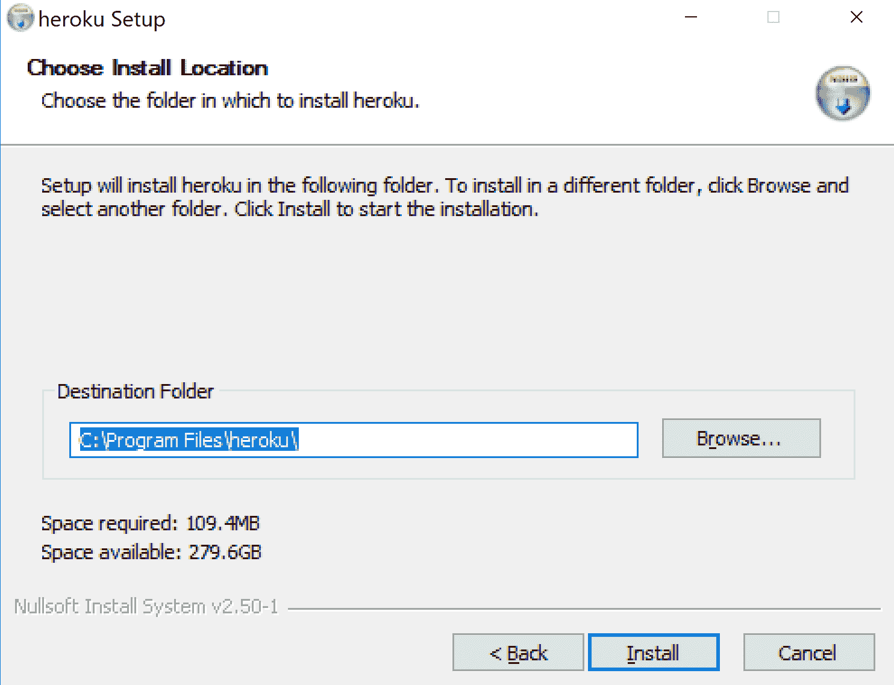
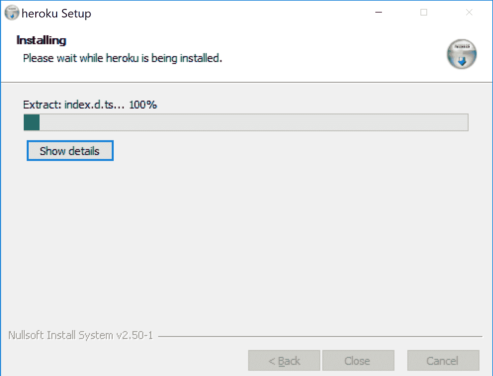
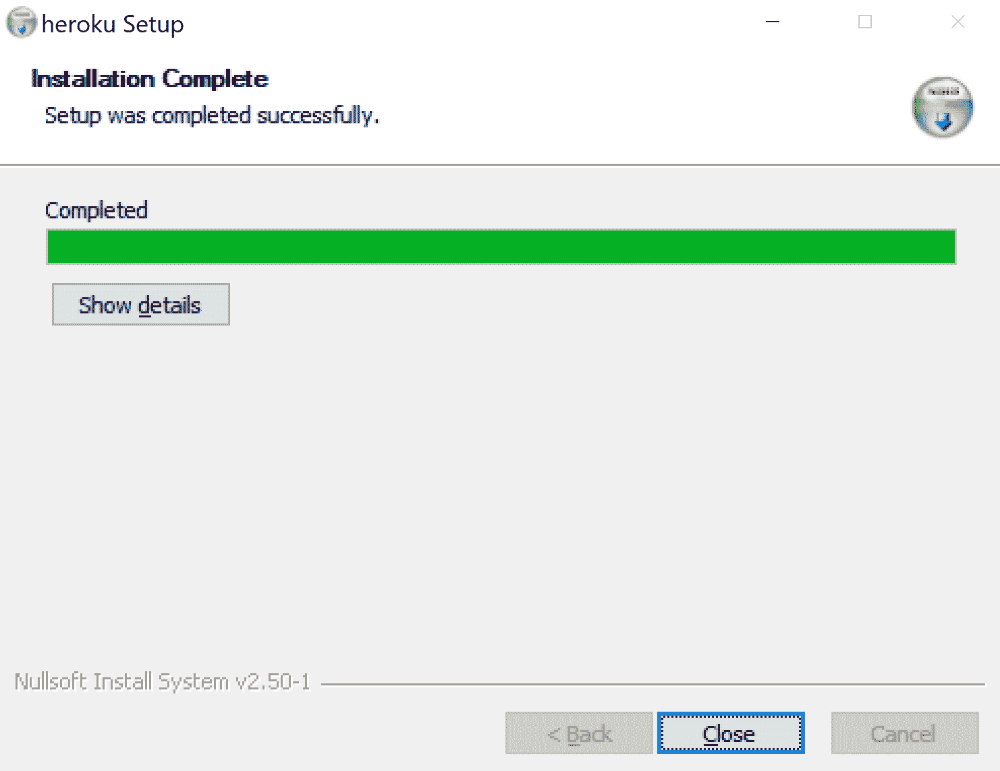
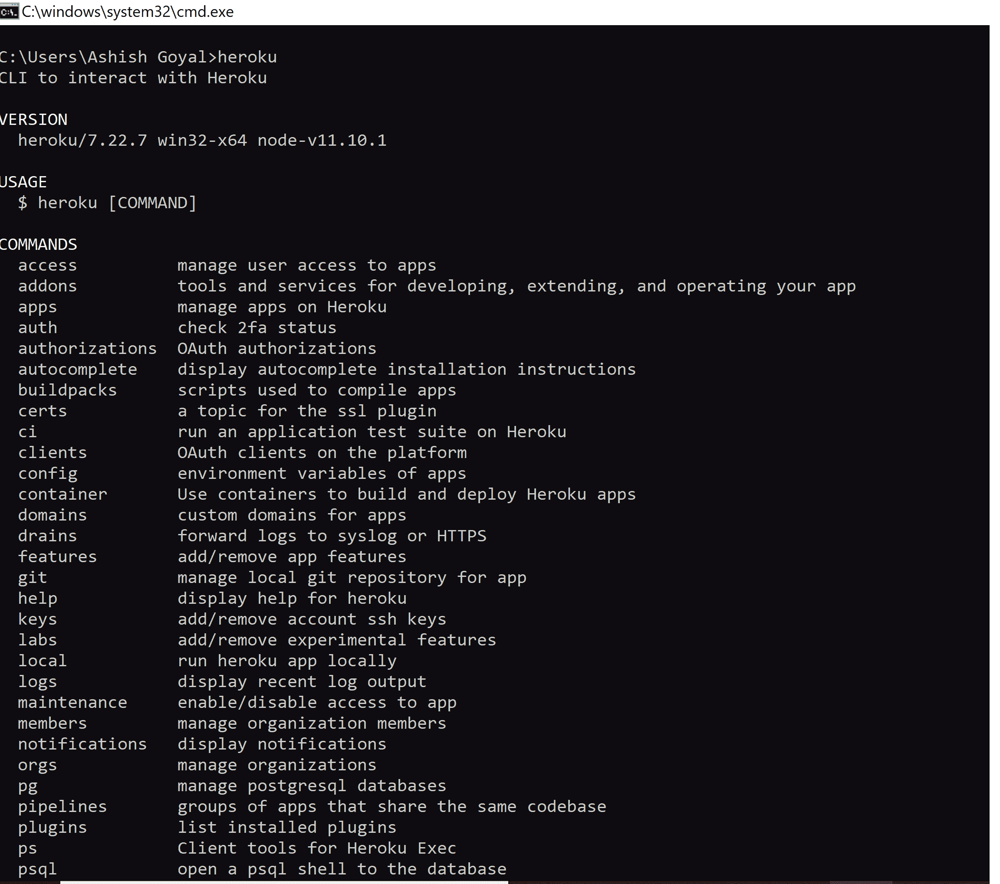
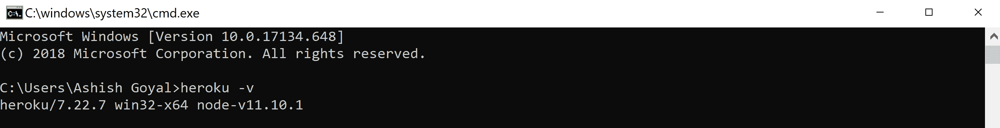
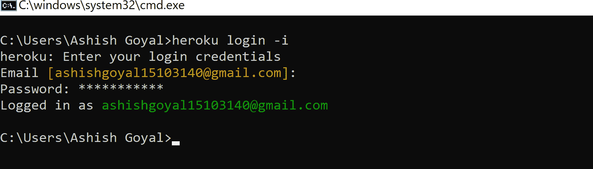

# 在 Windows 机器上介绍安装 Heroku CLI

> 原文:[https://www . geeksforgeeks . org/introduction-and-installation-of-heroku-CLI-on-windows-machine/](https://www.geeksforgeeks.org/introduction-and-installation-of-heroku-cli-on-windows-machine/)

**Heroku:** 是基于云的应用部署和管理服务。
Heroku 致力于基于容器的设计系统，这些智能容器被称为 **dynos** 。
它在各种 dyno 内部运行应用程序，每个 dyno 彼此分离。

**Installation of Heroku on Windows machine:**

*   **Step 1: Download Windows installer**

    根据系统配置从[这里](https://devcenter.heroku.com/articles/heroku-cli#download-and-install)下载适合你 Windows 安装的安装程序

    

    *   **Step 2: Running the installer to the system**
    Now, click on the installer file and it will ask for choosing components from the following options as given below.

    ```
     Heroku cli
    Adding heroku to system path
    Adding local data 

    ```

    确保你检查了所有的。现在点击“下一步”按钮。
    

    *   **第三步:设置目标文件夹**
    默认路径为系统 c 盘的路径。可以使用“浏览”按钮更改默认安装路径。
    *   **Step 4: Installation:**
    After clicking “Install”, it will start to install Heroku CLI into the destination folder as shown in the below screenshot:
    

    **几秒钟后，Heroku CLI 将完全安装到系统中。**

    

    **英雄库命令行界面已成功安装在您的系统上。要进行验证，请在命令提示符或终端中运行以下命令。**

    ```
    heroku
    ```

    

    **检查 Heroku 版本，在终端运行以下命令:**

    ```
    heroku -v
    ```

    

    因此，Heroku 命令行界面已正确安装到您的系统中。

    *   **Step 5 : Signing up for the Heroku services:**
    Create an account for Heroku services [here](https://signup.heroku.com)

    

    成功为 Heroku 服务创建帐户后，我们将通过 Heroku CLI 登录。

    **通过终端登录进入 Heroku CLI**
    **通过 Heroku CLI 登录在终端运行以下命令:**

    ```
    heroku login
    ```

    现在，终端会要求按“任意键”将进程重定向到浏览器或按“Q”退出登录进程。

    按任意键后，它会将你重定向到浏览器，如下图
    

    **成功登录账号后，浏览器屏幕上会显示如下消息:**
    

    **登录的另一种方法是通过命令提示符:**
    要做到这一点，请在终端

    ```
    heroku login -i
    ```

    
    运行以下命令。成功登录后，您现在可以使用 Heroku CLI 进入您的系统。

    英雄库命令行界面已成功安装并初始化到您的系统中。