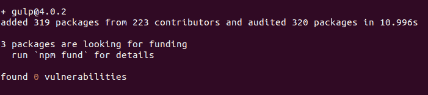

# 大口

的介绍及安装过程

> 原文:[https://www . geeksforgeeks . org/introduction-and-installation-process-of-of-of-grade/](https://www.geeksforgeeks.org/introduction-and-installation-process-of-gulp/)

**grave**可以定义为任务运行器或工具包，用于自动化耗时的任务，如网络开发中的放大、串联、缓存破坏、单元测试和林挺。它以 **Node.js** 为平台，利用 JavaScript 代码帮助运行前端任务和大规模 web 应用。这些任务可以使用命令行在 **PowerShell** 、 **Bash Scripts** 或其他**终端**应用程序上运行。

**囫囵吞枣**不同于其他任务运行器，因为它将数据流从一个插件传递到另一个插件，而不在磁盘上创建临时文件。这些任务返回修改后的数据流。Gulp 是一个面向功能的框架，具有直接的应用程序编程接口，可以更有效地修改数据并将命令链接在一起。此外，与配置相比，大口更喜欢代码，这使得任务更易于管理。

**优势:**

*   吞咽插件是用户友好的，一次执行一个任务。插件也可以由程序员创建。
*   grave 效率更高，因为它使用 Node.js 平台来提高速度。
*   在上面编写和测试 web 应用程序很容易。

**缺点:**

*   如果底层库的功能过期，graw 插件可能不支持这些功能。
*   大口插件的文档不是很健壮，调试一个插件可能是一项艰巨的任务。

**外挂:**大口有 3500 多个外挂。插件通过 **npm** 本地安装。它们用于转换通过数据流的文件的行为。插件也可以是有条件的或内嵌的。每个插件都有特定的任务，并在处理 HTML 和 CSS、图形、JavaScript、单元测试、编译或其他杂项活动中发挥作用。很少有插件像**大口响应、大口注射、大口吞咽、大口咕噜、大口自动呼吸、大口 jscs** 等。

**安装前提:**

1. **Node.js** 应该安装在你的系统中。设置**节点时，必须安装 **npm** 包管理器。**

*   [**在 Linux 上安装 node . js**](https://www.geeksforgeeks.org/installation-of-node-js-on-linux/)
*   [**在 Windows 上安装 node . js**](https://www.geeksforgeeks.org/installation-of-node-js-on-windows/)

2.根据系统要求，存在任何终端应用，如 **PowerShell** 、 **iTerm2** 、 **Bash Script** 等。

**安装大口:**

*   **第一步:**打开你系统的终端应用。为了方便起见，文章中附上了截图并运行了下面的命令。-g 表示大口将在系统中全局安装，任何文件都可以访问。

```
$ sudo npm install gulp-cli -g
```

**注意:**如果正在 Windows 中使用，请以管理员身份运行。Mac 不提供相同的选项。

*   **步骤 2:** 创建一个项目目录，并使用以下命令导航到该目录。

```
$ npx mkdir install-project
$ cd install-project
```

*   **第三步:**在打开的目录中输入以下命令行。这条线确保我们已经打开了一个基于 **npm** 的项目目录。所附图像显示了进入命令行后的屏幕输出。现在，软件包名称必须由用户用小写字母提供。这里，输入的示例包名是 install-project。

```
$ npm init
```

> {
> 
> “名称”:“安装-项目”，
> 
> “版本”:“1.0.0”，
> 
> “描述”:“安装检查”，
> 
> “main”:“index . js”，
> 
> "脚本":{ 0
> 
> “测试”:“回应”错误:未指定测试”&&退出 1”
> 
> },
> 
> 《作者》:《XYZ》，
> 
> “许可证”:“ISC”
> 
> }

*   **第 4 步:**以下命令将在您的**开发依赖项**中安装吞咽包。

```
$ npm install --save-dev gulp
```



*   **第 5 步:**要检查 glaw 是全局安装还是本地安装，您可以运行以下命令。

```
$ gulp --version
```

