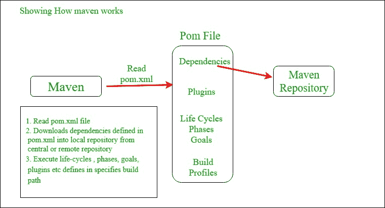
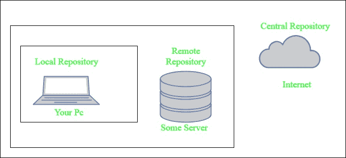

# Apache Maven 简介|一个 Java 项目的构建自动化工具

> 原文:[https://www . geesforgeks . org/introduction-Apache-maven-build-automation-tool-Java-project/](https://www.geeksforgeeks.org/introduction-apache-maven-build-automation-tool-java-projects/)

### 什么是 Maven？

Maven 是一个基于 POM(项目对象模型)的强大项目管理工具。它用于项目构建、依赖和文档。它像 ANT 一样简化了构建过程。但是它比 ANT 先进太多了。
简而言之，我们可以知道 maven 是一个工具，可以用来构建和管理任何基于 Java 的项目。maven 使 Java 开发人员的日常工作变得更加容易，并且通常有助于理解任何基于 Java 的项目。

### 梅文是做什么的？

Maven 做了很多有用的任务，比如

1.  我们可以使用 maven 轻松构建一个项目。
2.  我们可以在 maven 的帮助下轻松地添加 jar 和项目的其他依赖项。
3.  Maven 提供项目信息(日志文档、依赖列表、单元测试报告等)。)
4.  Maven 在更新 JARs 和其他依赖项的中央存储库时对项目非常有帮助。
5.  在 Maven 的帮助下，我们可以将任意数量的项目构建成输出类型，如 JAR、WAR 等，而无需编写任何脚本。
6.  使用 maven，我们可以轻松地将我们的项目与源代码控制系统(如 Subversion 或 Git)集成在一起。

### maven 是如何工作的？


**马文核心概念:**

1.  **POM 文件:**项目对象模型(POM)文件是 XML 文件，包含与项目相关的信息和配置信息，如依赖项、源目录、插件、目标等。由 Maven 用来构建项目。当您应该执行 maven 命令时，您应该给 maven 一个 POM 文件来执行这些命令。Maven 读取 pom.xml 文件来完成它的配置和操作。
2.  **依赖项和存储库:**依赖项是 Project 所需的外部 Java 库，存储库是打包的 JAR 文件的目录。本地存储库只是机器硬盘上的一个目录。如果在本地 Maven 存储库中找不到依赖项，Maven 会从中央 Maven 存储库中下载它们，并将它们放在本地存储库中。
3.  **构建生命周期、阶段和目标:**构建生命周期由一系列构建阶段组成，每个构建阶段由一系列目标组成。Maven 命令是构建生命周期、阶段或目标的名称。如果通过给出 maven 命令来请求执行生命周期，那么该生命周期中的所有构建阶段也会被执行。如果一个构建阶段被请求执行，那么在定义的序列中它之前的所有构建阶段也会被执行。
4.  **构建概要文件:**构建概要文件一组配置值，允许您使用不同的配置来构建项目。例如，为了开发和测试，您可能需要为本地计算机构建项目。要启用不同的构建，您可以使用其配置文件元素将不同的构建配置文件添加到您的 POM 文件中，并以多种方式触发。
5.  **构建插件:**构建插件用于执行特定的目标。可以给 POM 文件添加一个插件。Maven 有一些标准插件可以使用，也可以用 Java 实现自己的插件。

### Maven 的安装过程

Maven 的安装包括以下步骤:

1.  验证您的系统是否安装了 java。如果没有，则安装 Java([Java 安装链接](https://www.geeksforgeeks.org/setting-environment-java/))
2.  检查是否设置了 java 环境变量。如果没有，则设置 java 环境变量。(链接到[安装 java 并设置环境变量](https://docs.oracle.com/cd/E19182-01/820-7851/inst_cli_jdk_javahome_t/))
3.  下载 maven ( [链接](https://maven.apache.org/download.cgi))
4.  在系统的任何地方打开 maven zip 文件。
5.  将创建的目录 apache-maven-3.5.3 的 bin 目录(取决于您的安装版本)添加到 PATH 环境变量和系统变量中。
6.  打开 cmd 并运行 **mvn -v** 命令。如果它打印以下代码行，则安装完成。

    ```html
     Apache Maven 3.5.3 (3383c37e1f9e9b3bc3df5050c29c8aff9f295297; 2018-02-25T01:19:05+05:30)
    Maven home: C:\apache-maven-3.5.3\bin\..
    Java version: 1.8.0_151, vendor: Oracle Corporation
    Java home: C:\Program Files\Java\jdk1.8.0_151\jre
    Default locale: en_US, platform encoding: Cp1252
    OS name: "windows 10", version: "10.0", arch: "amd64", family: "windows" 

    ```

### Maven pom.xml 文件

POM 意味着项目对象模型是操作 Maven 的关键。Maven 读取 pom.xml 文件来完成它的配置和操作。它是一个 XML 文件，包含与项目相关的信息和配置信息，如**依赖关系**、**源目录**、**插件**、**目标等**。由 Maven 用来构建项目。

pom.xml 的示例

```html
<project xmlns="http://maven.apache.org/POM/4.0.0" 
   xmlns:xsi="http://www.w3.org/2001/XMLSchema-instance"
    xsi:schemaLocation="http://maven.apache.org/POM/4.0.0
http://maven.apache.org/xsd/maven-4.0.0.xsd">

         <modelVersion>4.0.0</modelVersion>
         <groupId> com.project.loggerapi </groupId>
         <artifactId>LoggerApi</artifactId>
         <version>0.0.1-SNAPSHOT</version>

       <!-- Add typical dependencies for a web application -->
       <dependencies>
               <dependency>
                       <groupId>org.apache.logging.log4j</groupId>
                       <artifactId>log4j-api</artifactId>
                       <version>2.11.0</version>
                 </dependency>
       </dependencies>

   </project>
```

用于创建 pom.xml 文件的元素

1.  **项目-** 它是 pom.xml 文件的根元素。
2.  **model version-**model version 表示您正在使用的 POM 模型的版本。maven 2 和 maven 3 使用 4.0.0 版本。
3.  **groupId-** groupId 表示项目组的 Id。它是唯一的，通常您会使用一个组标识，它类似于项目的根 Java 包名，就像我们使用的组标识一样。
4.  **artifactId-** artifactId 用于给出您正在构建的项目的名称。在我们的示例中，我们项目的名称是 LoggerApi。
5.  **版本-** 版本元素包含项目的版本号。如果你的项目已经发布了不同的版本，那么给出你项目的版本是很有用的。

Pom.xml 文件的其他元素

1.  **依赖项-** 依赖项元素用于定义项目的依赖项列表。
2.  **dependency-** dependency 定义了一个依赖项，并在 dependencies 标签中使用。每个依赖项都由其组标识、人工标识和版本来描述。
3.  **name-** 这个元素用来给我们的 maven 项目命名。
4.  **范围-** 这个元素用于定义这个 maven 项目的范围，可以是编译、运行时、测试、提供的系统等。
5.  **打包-** 打包元素用于将我们的项目打包成输出类型，如 JAR、WAR 等。

### 马文知识库

Maven 存储库是包含一些元数据的打包 JAR 文件的目录。元数据是与每个打包的 JAR 文件所属的项目相关的 POM 文件，包括每个打包的 JAR 有哪些外部依赖。这种元数据使 Maven 能够递归地下载依赖项的依赖项，直到所有依赖项都被下载并放入本地机器。

Maven 有三种类型的存储库:

*   **本地存储库***   **中央存储库***   **Remote repository

    Maven 在这个存储库中搜索依赖项。如果在 POM 中指定了远程存储库，则首先在本地存储库中搜索，然后在中央存储库中搜索，然后在远程存储库中搜索。
    

    1.  **本地存储库-** 本地存储库是开发者机器上的一个目录。该存储库包含 Maven 下载的所有依赖项。Maven 只需要下载一次依赖项，即使多个项目依赖于它们(例如 ODBC)。
        默认情况下，maven 本地存储库是 user_home/m2 目录。
        示例–**C:\ user \ asing \ . m2**
    2.  **中央存储库-** 中央 Maven 存储库是 Maven 社区创建的。Maven 在这个中央存储库中查找任何需要但在本地存储库中找不到的依赖项。Maven 然后将这些依赖项下载到您的本地存储库中。您可以通过[这个链接](http://search.maven.org/#browse)查看中央资料库。
    3.  **远程存储库-** 远程存储库是网络服务器上的一个存储库，Maven 可以从中下载依赖项，它通常用于托管组织内部的项目。Maven 然后将这些依赖项下载到您的本地存储库中。

        ### 马文的实际应用

        当在一个 java 项目上工作，并且该项目包含大量的依赖、构建、需求时，手动处理所有这些事情是非常困难和令人厌倦的。因此使用一些工具可以做这些工作是非常有帮助的。
        Maven 就是这样一个*构建管理工具*，它可以做所有的事情，比如添加依赖项、管理项目的类路径、自动生成 war 和 jar 文件等等。

        ### 使用 Maven 的利弊

        **优点:**

        1.  Maven 可以通过读取 pom 文件自动添加项目所需的所有依赖项。
        2.  人们可以很容易地建立他们的项目来制造矛盾、战争等。根据他们的要求使用 Maven。
        3.  Maven 使得在不同的环境中启动项目变得容易，并且不需要处理依赖注入、构建、处理等。
        4.  添加新的依赖项非常容易。只需要在 pom 文件中编写依赖代码。

        cons:t1]

        1.  Maven 需要在系统中安装 maven 才能工作，并且需要为 ide 安装 maven 插件。
        2.  如果现有依赖项的 maven 代码不可用，则不能使用 maven 添加该依赖项。

        ### 什么时候应该有人用 Maven？

        在以下情况下可以使用 Maven 构建工具:

        1.  当项目有很多依赖项时。然后使用 maven 很容易处理这些依赖关系。
        2.  当依赖版本频繁更新时。那么你只需要更新 pom 文件中的版本号来更新依赖关系。
        3.  使用 maven 可以轻松地处理持续的构建、集成和测试。
        4.  当一个人需要一种从源代码生成文档的简单方法时，编译源代码，将编译后的代码打包成 JAR 文件或 ZIP 文件。

        **参考-** [阿帕奇马文文档](https://maven.apache.org/guides/getting-started/index.html)**