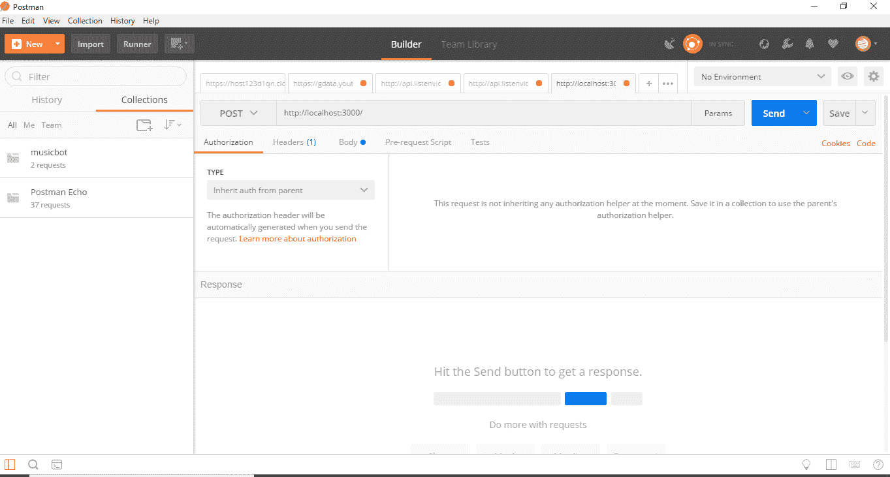
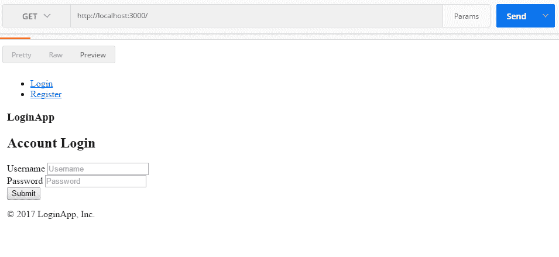
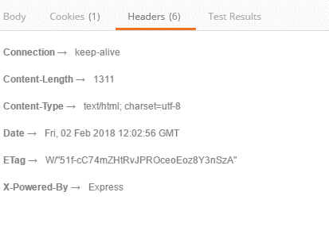
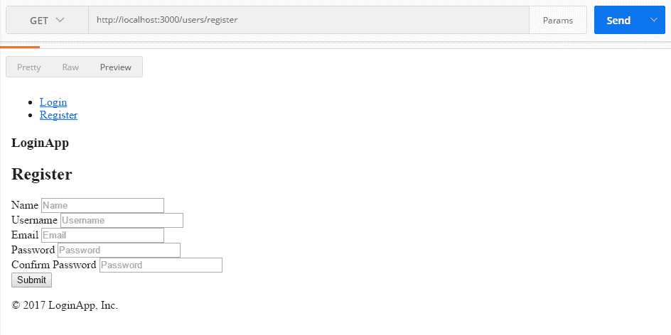
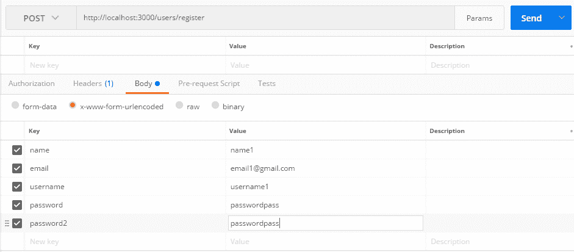
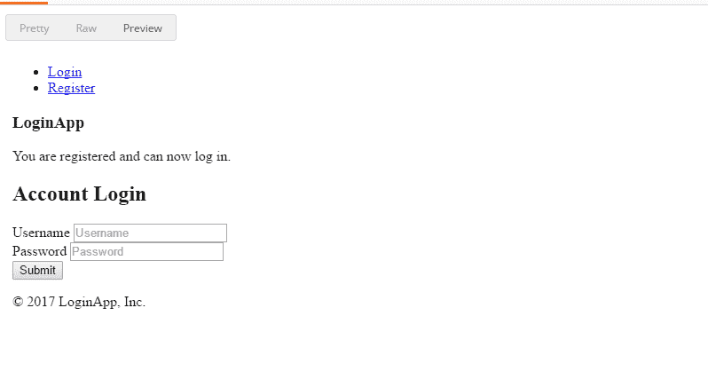
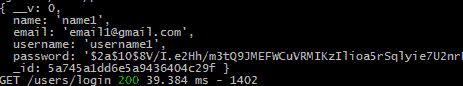

# API 开发波兹曼介绍

> 原文:[https://www . geesforgeks . org/introduction-postman-API-development/](https://www.geeksforgeeks.org/introduction-postman-api-development/)

**Postman** : Postman 是一个 API(应用编程接口)开发工具，帮助构建、测试和修改 API。几乎任何开发人员可能需要的任何功能都封装在这个工具中。每月有 500 多万开发人员使用它，使他们的应用编程接口开发变得简单易行。它能够发出各种类型的 HTTP 请求(GET、POST、PUT、PATCH)，保存环境以备后用，将 API 转换为各种语言的代码(如 JavaScript、Python)。

在这篇文章中，我将使用邮差软件发送和接收请求，将数据发布到服务器，我将尝试演示一些其他流行的操作。你可以把这篇文章当作你和邮递员的第一次接触。所以，让我们开始吧！！
可以从[这里](https://www.getpostman.com/postman)下载邮差。
下载安装邮差后，打开软件。

邮递员接口。图片:https://media . geesforgeks . org/WP-content/uploads/postman-interface-1 . png

。

**解释界面**

*   看起来像搜索栏的最长的中间输入字段是我们想要获取或发布或删除的网址，等等。被喂养。
*   就在它的左边，是一个下拉按钮，它有所有不同的 HTTP 方法作为选项。如果您想发布到您指定的网址，请选择发布。
*   它的右边是参数按钮。如果你点击它，会出现一个新的界面。参数基本上是我们希望随请求发送到服务器的数据。我们将使用此参数界面来**发布**以将应用程序放入新用户。
*   该按钮的左侧是**发送**按钮，在这种情况下，该按钮用于向服务器或应用程序发送请求。

我认为对界面的介绍已经足够让我们开始了。如果有必要的话，我会解释一下邮递员的其他情况。
那么，让我们开始通过邮递员发送和接收请求。

**通过邮递员发送和接收请求**

*   在我上面描述的网址栏中输入你想点击的网址。我会把 **http:localhost:3000** 放在我的情况下。
*   让我们在左边的按钮中选择我们的 HTTP 方法来发送请求。现在点击**发送**按钮。

    获取 localhost https://media。吉斯弗格斯。org/WP-content/uploads/get-localhost。png

*   您将被返回您获得的网址的超文本标记语言。我选择了**预览**来拥有类似浏览器的外观。
*   正如您在下面的快照中看到的，在服务器或应用程序的响应中，主响应也返回了各种标题。

    返回标题获取

*   **头球解说:**
    第一个回传的头球是**保活**。这基本上意味着服务器与用户的连接不会在一段时间后自行终止。

    *   **内容长度**是返回的 html 文档的长度。
    *   **日期**是向服务器请求返回文件的时间。
    *   **X-power-By**发送快递，因为应用服务器是快递。
    *   **Etag** 是资源特定版本的标识符。这有助于节省时间和带宽，以防用户在没有任何修改的情况下再次请求相同的页面，然后可以发送相同的文件。你可以在这里阅读更多关于 T2 的信息。
    *   为此，我们将首先获取注册表。

        获取寄存器

    *   更改我们要发送到 POST 的下一个请求的 HTTP 方法。打开邮递员的参数标签。这将帮助我们发送带有我们想要的值的表单。

        在邮递员参数选项卡中作为键值对填充的表单值。图片:https://media。吉斯弗格斯。org/WP-content/uploads/form-value-filled-as-key-value-pair-in-postman-params-tab。巴布亚新几内亚

        T4】
    *   在我们点击 enter 后，它用我们的键值对发布表单并返回响应。

        注册用户的预览外观邮递员

    *   终端也记录注册用户。

        控制台记录了注册用户

    *   超级简单的应用编程接口
    *   广泛的功能，如支持所有可能的 HTTP 方法、保存进度、API 到代码的转换、不断变化的 API 开发环境等。
    *   帮助查看状态代码、响应时间和其他性能参数。
    *   API 的测试可以被安排和自动化。
    *   有一个导入现有工作的选项，这样您就不必从头开始。
    *   太多的选择会让初学者不知所措。
    *   在邮差中开发的应用编程接口不一定能在浏览器中运行。
    *   有限的应用领域(应用编程接口测试和一些其他技术)。