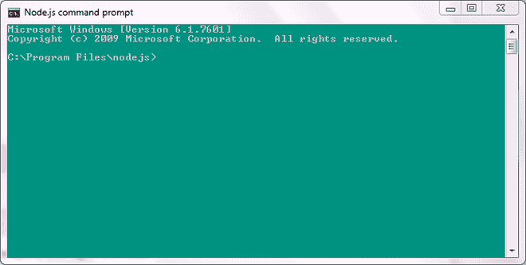
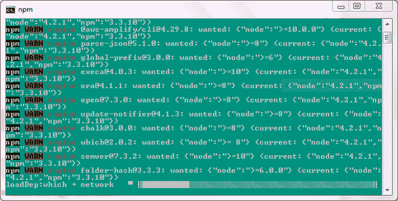
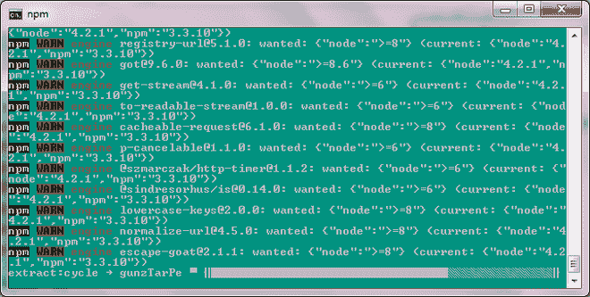
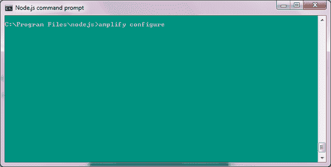
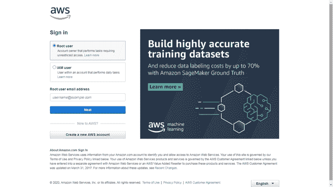

# AWS 放大器介绍

> 原文:[https://www.geeksforgeeks.org/introduction-to-aws-amplify/](https://www.geeksforgeeks.org/introduction-to-aws-amplify/)

**亚马逊网络服务**是我们能接触到的一些最有用的产品。随着时间的推移，这样的服务变得越来越受欢迎，这就是 **AWS 放大器。**2018 年发布，运行在亚马逊的云基础设施上。它与 **Firebase** 直接竞争，但有一些特性让它们与众不同。

#### **为什么需要？**

任何应用程序的用户体验都是需要考虑的最重要的方面。**AWS amplife**帮助统一网络、移动等平台的用户体验。这使得用户更容易选择他们更喜欢哪一个。它在前端开发的情况下很有用，因为它有助于构建和部署。许多使用它的人声称，它的可伸缩性实际上让全栈开发变得更加容易。

#### **主要特点:**

*   可用于验证由亚马逊 Cognito 支持的用户。
*   在亚马逊 AppSync 和亚马逊 S3 的帮助下，它可以安全地在应用程序之间无缝存储和同步数据。
*   由于它是无服务器的，因此对任何后端相关案例进行更改变得更加简单。因此，维护和配置后端功能花费的时间更少。
*   它还允许离线同步。
*   它促进了更快的应用程序开发。
*   它对于实现机器学习和人工智能相关的需求非常有用，因为它是由亚马逊机器学习服务支持的。
*   这对于持续部署很有用。

各种 AWS 服务用于各种功能。 **AWS 放大器**提供。主要组件有**库、UI 组件**、**T5】和 **CLI 工具链。**还提供**静态网页托管**使用 **AWS 功放控制台。****

让我们简单了解一下其中的一些组件:

#### 库:

这些图书馆由 AWS 服务提供动力。对应用程序生产的帮助非常大，尤其是在后端。

*   **认证:**支持登录、谷歌、脸书或亚马逊本身注册等各种认证流程。这是在亚马逊 Cognito 的帮助下完成的。
*   **API:** 向 REST 和 GraphQL 发出 HTTP 请求变得更加容易。通过整合来自其服务(如 AWS lambda 等)的信息，以及使用其他服务(如 Amazon AppSync)，能够构建具有离线同步的应用程序已经成为可能。
*   **分析:**分析在所有应用程序中扮演着重要角色。在亚马逊 pinpoint 等服务的帮助下，开发人员可以了解他们用户的需求。这项服务也有助于在**推送通知**的情况下，这是另一个功能。
*   **数据存储:**亚马逊 AppSync 有助于减少数据分发的麻烦，因为在离线和在线情况下，不需要额外的代码来执行该过程。
*   **预测:**亚马逊 Sagemaker 增强您的机器学习和 AI 体验。做文本翻译或把文本转换成语音比你最初投入的精力要少得多。
*   **存储:**管理和存储用户数据安全由亚马逊 S3 处理。
*   **交互:**在亚马逊 Lex 的支持下，你可以用简单的代码轻松构建对话式机器人。

#### 用户界面组件:

**AWS 放大器**为**认证、存储**、**T5】和**交互提供嵌入式用户界面组件。****

#### 静态网络托管:

从自定义域到免费的 HTTPS 证书，构建和部署一个完整的堆栈网站是完全涵盖的。它确保了连续的工作流程以及全球可用性。

与许多其他替代方案相比，部署只需几个步骤。在开发阶段，**amplife 框架**用于配置后端需求和连接所需的应用。对于部署部分，**放大器控制台**用于连接到具有所需文件的存储库或直接上传它们。之后，确定构建设置，然后进行部署。

#### 安装:

先决条件:

*   Node.js
*   NPM
*   AWS 帐户

遵循以下指南成功安装 AWS 放大器:

下载后，您可以通过以下方法安装放大器命令行界面。

安装它只需要**一个命令**，之后你就可以启动它根据你的需要进行配置。

首先，打开您的 Node.js 命令提示符:



Node.js 命令提示符

现在，您可以键入以下命令开始安装过程:

```html
npm install -g @aws-amplify/cli 

```

这个过程可能需要几分钟到 10 分钟以上，但不会持续太久。



安装



一旦这样做了，你就成功地**完成了安装**的过程！

现在要将您的 AWS 帐户与此类型链接:

```html
amplify configure 

```



*注意:我输入了 clear 命令来清除屏幕，所以如果你的屏幕不像上面那样清晰也没关系。*

这将提示您登录您的 AWS 帐户。



如果您尚未登录，将被重定向到此页面

**作为**根用户**登录，这将成功建立连接。现在你已经准备好使用**自动气象站放大器了！****

#### 参考文献:

*   https://aws.amazon.com/amplify/?nc=sn&loc=1