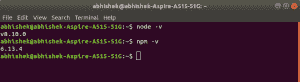
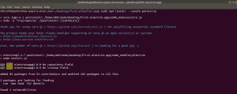
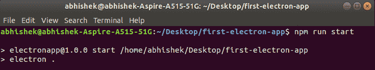

# 电商入门

> 原文:[https://www.geeksforgeeks.org/introduction-to-electronjs/](https://www.geeksforgeeks.org/introduction-to-electronjs/)

如果您有兴趣使用网络开发技能为不同的桌面平台(如视窗、Linux 或苹果操作系统)开发应用程序，电子是适合您需求的完美框架。我们先来简单介绍一下电子。

**electronijs:**electronic 是开源和版本控制巨头 GitHub 在 2013 年新开发的。Electron 以 NodeJs 为核心，将基于 HTML 和 CSS 的页面作为桌面应用提供服务。这意味着对 HTML5 或 Android Development 感到舒适的开发人员可以轻松地将其平台切换到 electronic。

电子应用程序可以分为两个主要过程，即主过程和渲染器过程。

**表演文化:**电子表演文化有两个过程:

*   **主进程**主进程负责使用`BrowserWindow`实例创建窗口。单个浏览器窗口实例在其呈现器过程中呈现网页。销毁浏览器窗口实例意味着相应的渲染器进程也将终止。*   **Renderer Process** There is a single main process which is responsible for maintaining multiple renderer processes. Each renderer process manages the webpage and its scripts running inside it.

    Electron 支持主进程和渲染器进程的各种 API，这有助于与桌面操作系统及其资源进行交互。

    **先决条件:**对于从电子开始可能被认为重要的主要先决条件如下。

    *   用户界面的 HTML 和 CSS。
    *   JavaScript 作为一种主要语言。
    *   Node.js 和 npm

    **安装电子:**我们先从用电子开发的构件开始。

    *   **Step 1:** Make sure **node** and **npm** are installed.

    ```html
    node -v
    ```

    ```html
    npm -v
    ```

    

    *   **步骤 2:** 在您的工作文件夹中，从您的代码编辑器集成终端运行以下命令，然后查看一个基本的 **package.json** 文件，npm 使用该文件来定义属性和导入库。

    ```html
    npm install electron --save-dev 
    ```

    ```html
    {
      "name": "electronapp",
      "version": "1.0.0",
      "description": "Electron application",
      "main": "main.js",
      "scripts": {
        "start": "electron ."
      },
      "keywords": [
        "Electron"
      ],
      "author": "xyz",
      "devDependencies": {
        "electron": "^7.1.7"
      }
    }
    ```

    *   **第三步:**现在，我们来看一个基本的 **main.js** 文件，它充当主进程。

    ```html
    const { app, BrowserWindow } = require('electron')

    let win

    function createWindow () {
      // Create the browser window.
      win = new BrowserWindow({
        width: 800,
        height: 600,
        icon: ( './icon.png'),
        webPreferences: {
          nodeIntegration: true
        }
      })

      // and load the index.html of the app.
      win.loadFile('./index.html')
      //win.loadURL('https://google.com/')

      // Open the DevTools.
       win.webContents.openDevTools()

      // Emitted when the window is closed.
      win.on('closed', () => {
        // Dereference the window object, usually you would store windows
        // in an array if your app supports multi windows, this is the time
        // when you should delete the corresponding element.
        win = null
      })
    }

    // This method will be called when Electron has finished
    // initialization and is ready to create browser windows.
    // Some APIs can only be used after this event occurs.
    app.on('ready', createWindow)

    // Quit when all windows are closed.
    app.on('window-all-closed', () => {
      // On macOS it is common for applications and their menu bar
      // to stay active until the user quits explicitly with Cmd + Q
      if (process.platform !== 'darwin') {
        app.quit()
      }
    })

    app.on('activate', () => {
      // On macOS it's common to re-create a window in the app when the
      // dock icon is clicked and there are no other windows open.
      if (win === null) {
        createWindow()
      }
    })
    ```

    *   **第 4 步:**主要过程完成，让我们看看一个基本的 HTML 代码，它充当**渲染器过程**。

    ```html
    <!DOCTYPE HTML>
    <html>
        <head>
        <title>my first electron app</title>
        </head>

        <body>
            <h1>my first electron app</h1>
        </body>    
    </html>
    ```

    *   **Step 5:** This ends our coding part. Now, running

    ```html
    npm install --unsafe-perm=true
    ```

    将下载必要的 node_modules，由电子渲染页面所需。
    

    *   **Step 6:** After this, we will launch the app using **`npm run start`**, start being the script which we have defined in package.json.
    
    **Output:**
    

    **参考文献:**[https://electronijs . org/docs/tutorial/first-app # installing-electronic](https://electronjs.org/docs/tutorial/first-app#installing-electron)