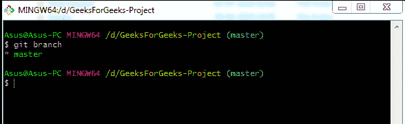
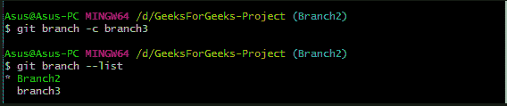

# 吉特分店介绍

> 原文:[https://www.geeksforgeeks.org/introduction-to-git-branch/](https://www.geeksforgeeks.org/introduction-to-git-branch/)

分支意味着脱离主线，继续独立工作，不干扰主线。几乎每个 VCS 都有某种形式的分支支持。在 Git 中，分支仅仅是对提交的引用，下面的提交将被附加到其中。

**Git vs SVN:** 近年来，Git 的使用量大幅上升。与 SVN 不同，git 允许用户创建自己的存储库副本。git 成功的主要原因之一是它的速度。由于所有文件都存储在开发人员的本地计算机上，因此即使互联网连接非常差，他/她也可以访问所有文件。在其他 VCS 分支在时间和磁盘空间上都是一项昂贵的操作。

**Git vs Other VCS:** Git 的分支特性是它区别于其他 VCS 工具的地方。Git 分支操作几乎是瞬时的，使得来回切换到分支的流程非常流畅。以下是 git 优于其他 VCS 的几个优点:

*   高运行速度
*   可用树的完整历史记录
*   分支运营
*   分类分布式模型

**分支:**当您提交时，Git 会存储一个提交对象，该对象包含指向您转移的内容的快照的指针。该对象还包含作者的姓名和电子邮件地址、您键入的消息、初始提交的零父项、正常提交的一个父项以及两个或多个分支合并后的提交的多个父项。前面讨论的分支是一个单独的开发线，因为 git 将分支存储为提交的引用。

**注意:** Git 分支用于列出、创建或删除分支，逻辑上划分你的工作比拥有大而结实的分支更容易。

**Git Branch-Options**

<figure class="table">T57】此选项删除指定的分支。分支机构必须与其上游分支机构完全合并。

| **选项** | **描述** |
| **去-a** | These options list both the remote tracking branch and the local branch. |
| **Git branch-list** | Active list mode or simple *git branch* lists all branches of the repository. |
| **去-【c】去** | This option is used to copy branches. |
| **去-【c】去** | 它是*––复制––强制* |
| t54–删除 |
| **去-D【去】** | This is a shortcut to *-delete-force* . It deletes the branch, even if it has unmerged changes. |
| **去-m【去】** | This option moves/renames the branch. |
| **去-M【去】** | It is the shortcut of *-dynamic-force.* |
| **去-去-去-去** | Or delete branches, this option suppresses non-error messages. |
| **git -r 或––远程** | This option is used to list all remote tracking branches. If used with -d, this can also be used to delete remote branches. |
| **git-t 阿力——轨道〔t1〕** | When creating a new branch, it sets a configuration to mark the starting branch. |
| **git––无轨道** | It does not set the "upstream" configuration of ip. |
| **git––edit-description** | It edits the usage description of the branch. |
| **git –––-包含[]** | Displays a list of branches containing the specified submission. |
| **去吴亚玲分支** | Create a new branch-[my branch] |
| **转到 t610-b mybranch** | Create a new branch-[my branch] and check out in it. |
|  |  |

</figure>

*   **Git 分支列出项目 ie 的唯一分支。主分支**

*   **更名主分支**

*   **复制“分支 2”并创建“分支 3”**

*   **删除“分支 3”**

**总结:**在本文中，我们讨论了高运行速度和分支行为。我们了解了 git 分支命令，它的主要功能是列出、创建和删除分支。我们还了解了各种 git 分支选项，以完全实现该命令的功能。