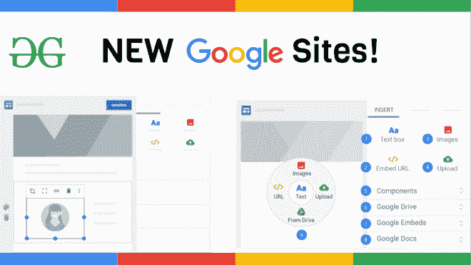
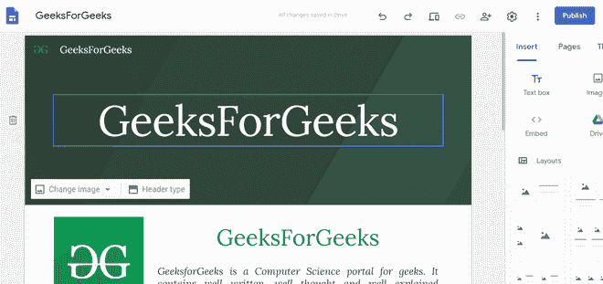

# 谷歌网站介绍

> 原文:[https://www.geeksforgeeks.org/introduction-to-google-sites/](https://www.geeksforgeeks.org/introduction-to-google-sites/)

### 导言:

许多小店主想上网，为此，他们必须有一个网站。谷歌网站是一个为从谷歌建立网站而打造的网络平台。它类似于其他平台，如 Wix 或 WordPress，但免费。它最初是由一家名为 **JotSpot** 的公司发起的，后来被谷歌收购并开发为**新的谷歌网站平台**。这个网站不仅可以帮助你建立一个专业的网站，还可以免费在网站的域名**托管。**

#### **网站链接:[https://sites.google.com/new](https://sites.google.com/new)**

****

****为什么使用谷歌网站？****

*   **使用新的谷歌网站可能会非常有用，因为它们是一个响应迅速的网站。此外，还有各种模板可供选择。**
*   **你也可以选择域名，如果你没有，谷歌网站会在他们的域名上给你提供一个。**
*   **制作页面只是拖放，所以非常容易。**
*   **所有进度都实时存储在您自己的驱动器帐户中。**
*   **除了 palet 窗口中的元素，您还可以嵌入额外的 HTML、CSS 和 JavaScript 属性。**

****限制:**使用新谷歌网站时存在某些限制:**

*   **他们不支持任何类似于经典谷歌网站的第三方小工具扩展。**
*   **他们缺乏像其他平台一样定制网站的自由。**
*   **不支持谷歌应用程序脚本。**
*   **无法向网站添加广告。**
*   **网站网址必须以“sites.google.com/site/”开头，这对网站来说太长了。**
*   **最大的限制是它在谷歌上，如果谷歌决定解散该产品，那么你的网站就永远消失了。**

### **基本网站:**

**你可以简单地通过上面提到的网址进入网站，然后选择想要的模板或者从头开始。基本网站如下图所示:**

**

工作区的屏幕截图** 

****参考资料:**[https://en . Wikipedia . org/wiki/Google _ sites](https://en.wikipedia.org/wiki/Google_Sites)**