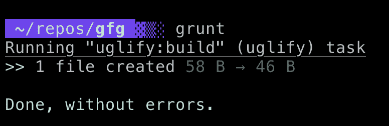
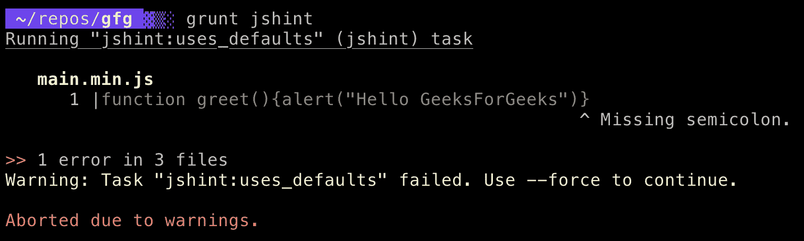

# 咕噜的介绍

> 原文:[https://www.geeksforgeeks.org/introduction-to-grunt/](https://www.geeksforgeeks.org/introduction-to-grunt/)

Grunt 是一个 JavaScript 任务运行器，它帮助我们自动化平凡且重复的任务，如缩小、编译、单元测试、林挺等。Grunt 有数百个插件可供选择，你可以用最少的努力使用 Grunt 来自动化任何事情。
本文的目标是开始使用 Grunt，并学习如何自动缩小我们的 JavaScript 文件，并使用 JSHint 验证它们。

**安装 Grunt-CLI:** 首先，你需要全局安装 Grunt 的命令行界面(CLI)，这样我们就可以从任何地方使用它。

```
$ npm install -g grunt-cli
```

**创建新的 Grunt 项目:**您需要创建一个新项目，或者可以使用现有项目。就叫它**咕噜吧 _app** 。
现在你需要给你的项目添加两个文件:package.json 和 Gruntfile。

**package.json:** 它存储了项目的各种 devDependencies 和 dependencies 以及一些元数据。你将在这个文件中列出你的项目需要的咕噜和咕噜插件作为开发依赖。

**咕噜文件:**这是咕噜的配置文件。可以命名为`Gruntfile.js`或`Gruntfile.coffee`。

从项目的根目录运行以下命令:

```
// Generate a package.json file
$ npm init

// Install grunt and add in package.json
$ npm install grunt --save-dev
```

现在在你的目录中创建一个名为`Gruntfile.js`的文件，并将以下内容复制到其中。

```
module.exports = function(grunt) {
    // Do grunt-related things in here
};

```

这是“包装”函数，所有的咕噜代码都必须在里面指定。它包括项目配置和任务配置。

现在再创建两个文件:`index.html`和`main.js`

**index.html**

```
<html>
<body>
    <h1>Hello World</h1>
    <script src="main.min.js"></script>
</body>
</html>
```

**main.js**

```
function greet() {  
    alert("Hello GeeksForGeeks");  
}  
```

我们将使用一个`grunt-contrib-uglify`插件来缩小带有 UglifyJS 的 JavaScript 文件。

**安装咕噜出资:**

```
$ npm install grunt-contrib-uglify --save-dev
```

按照以下方式更新您的个人档案:

```
module.exports = function(grunt) {
    grunt.initConfig({
        pkg: grunt.file.readJSON('package.json'),
        uglify: {
            build: {
                src: 'main.js',
                dest: 'main.min.js'
            }
        }
    });
    grunt.loadNpmTasks('grunt-contrib-uglify');
};
```



现在你可以运行`$ grunt uglify`来缩小你的文件。您也可以为每当`$ grunt`运行时运行的咕噜任务设置默认任务。
为了验证我们的 JavaScript 文件，我们将使用 **grunt-contrib-jshint** 。使用`$ npm install grunt-contrib-jshint --save-dev`安装插件，运行`$ grunt jshint`即可使用

```
module.exports = function(grunt) {
    grunt.initConfig({
        pkg: grunt.file.readJSON('package.json'),
        uglify: {
            build: {
                src: 'main.js',
                dest: 'main.min.js'
            }
        },
        jshint: {
            options: {
                curly: true,
                eqeqeq: true,
                eqnull: true,
                browser: true,
                globals: {
                    jQuery: true
                },
            },
            uses_defaults: ['*.js']
        },
    });
    grunt.loadNpmTasks('grunt-contrib-uglify');
    grunt.loadNpmTasks('grunt-contrib-jshint');

    // Default task(s).
    grunt.registerTask('default', ['uglify']);
};
```

