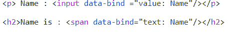
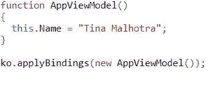
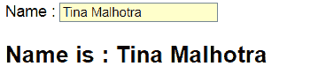

# 击倒对手介绍

> 原文:[https://www.geeksforgeeks.org/introduction-to-knockoutjs/](https://www.geeksforgeeks.org/introduction-to-knockoutjs/)

**基本介绍:**
**淘汰赛是一个用 JavaScript 编写的基于 MVVM (MODEL VIEW VIEWMODEL)模式的库。它有助于建立丰富和反应迅速的网站。它可以与任何框架一起工作，并处理数据驱动的接口。
**KO** 是淘汰赛的简称。KO 库文件体积小，重量轻。**

****先决条件:**
HTML、CSS、JAVA SCRIPT、DOCUMENT OBJECT MODEL(DOM)、TEXT EDITOR(任意)。**

****特征:****

*   ****简单可扩展**–轻松扩展自定义行为。**
*   ****依赖跟踪**–KO 属性和库函数之间的关系是透明的。**
*   ****声明性绑定**–DOM 元素通过数据绑定属性连接到模型。
    或
    它允许我们将用户界面的 HTML 元素绑定到任何数据模型。(通常，响应性是通过这个实现的
    )。**
*   ****自动用户界面刷新**–对查看模型数据所做的更改会自动反映在用户界面中，反之亦然
    。**
*   **它非常紧凑，拉链后约为 13KB。**
*   **适用于主流浏览器。**

****语法:****

**让我们考虑一个基本程序:**

**视图:

视图模型:

输出:
**

****节目讨论:**
**视图:**
我们有一个输入框:你叫什么名字。该变量用值“你的名字是什么”视图模型初始化，即
第一行表示我们正在使用数据绑定属性输入数据，即我们正在使用 HTML 控件，以使数据可编辑，但这不会在屏幕上显示名字时更新数据。
第二行只是在屏幕上打印 Name，这就是我们如何使用正文部分的‘数据绑定’属性将视图模型中的值绑定到 HTML 元素。这里，“名称”指的是视图模型变量。
**VIEW MODEL:**
First Line 只是一个函数的名字(函数就是这么写的)。
第三行分配给视图模型属性。
第五行是视图模型到视图的绑定。**

****设置环境:**
要使用敲门 JS，请在 HTML 页面中使用标签引用 JavaScript 文件。
如何访问敲门 JS:
1。从其官方网站下载《击倒》的制作版本:https://knockoutjs.com/downloads/
2。参考 CDNS 的《击倒》图书馆
3。请参考来自 CDNS 的简化版本的 KnockoutJS 库。**

****优势:****

*   **随时连接数据模型中的用户界面元素是可行的。**
*   **确保业务规则的应用、数据安全和对网页的更多控制。**
*   **为额外的
    安全性提供参考完整性和许多关于工作流的验证特性。**
*   **支持事件驱动的编程模型，并提供 100%的定制。**
*   **轻松创建复杂的动态数据模型。**

****缺点:****

*   **淘汰赛只是针对双向数据绑定，随着数据的变化自动刷新 UI，这意味着我们
    需要另一个库或者工具来满足其他需求，比如基于哈希的路由，UI 组件等等。**
*   **很难使用存在于外部文件中的模板，这将使开发人员很难协同工作。**