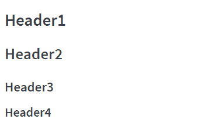
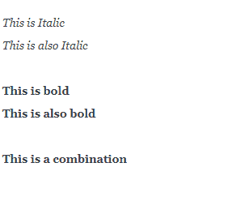
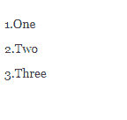
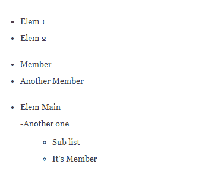
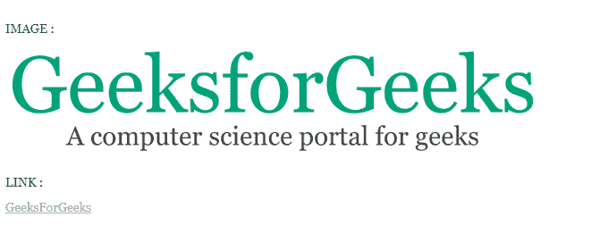
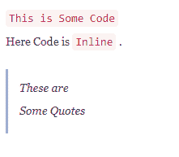

# 降价介绍

> 原文:[https://www.geeksforgeeks.org/introduction-to-markdown/](https://www.geeksforgeeks.org/introduction-to-markdown/)

如果你曾经在 GitHub、BitBucket 等 git 平台上工作过，或者在网上论坛上提交过任何问题或答案，很可能你已经在不知不觉中使用了 Markdown。

Markdown 是一种轻量级标记语言。由约翰·格鲁伯于 2004 年创建的 Markdown 现在是世界上最流行的标记语言之一。下面详细解释了它的优点和使用方法。

减价文件的扩展名是*。md* 或*。降价*。要编译一个降价文件，你需要一个能够处理降价文件的应用程序，比如微软的 Word、迪林杰等。这些应用程序使用标记处理器或解析器，将标记文件转换为可打印的 HTML 代码。

**降价优势:**

1.  它不仅仅是为程序员制作的，因为你可以用它来写电子书。
2.  可转换为 PDF、HTML、文档等格式。
3.  您可以使用[标记此处](https://markdown-here.com/)的标记来格式化您的邮件。
4.  它被大量用于跨各种平台(如 StackOverflow、Github 等)编写格式化页面。
5.  可以使用 [Github Pages](https://pages.github.com/) 、 [blot.im](https://blot.im/) 和 [smallvictori.es](https://www.smallvictori.es/) 等工具将 Markdown 文件转换为网页。

如果你知道网页格式的基础知识，那将会非常有帮助，但是如果你不知道，也不用担心，我们会涵盖从业余到专业的所有内容。Markdown 有助于创建您在网页上看到的所有基本元素，如文本、列表、外部链接、图像等。

要开始编写 Markdown 代码，网上有很多可用的工具。正如你所知，学习的最好方法就是去做。你可以在任何像[迪林杰](https://dillinger.io/)这样的在线标记编辑器中开始执行如下所示的代码。

下面给出了一个语法，将有助于学习，并在以后作为编写 Markdown 代码的备忘单。

*   **表头**
    **语法:**

```html
# Header1
## Header2
### Header3
#### Header4
....
```

*   **输出:**



*   **格式化**
    **语法:**

```html
*This is Italic*
_This is also Italic_

**This is bold**
__This is also bold__

__This is a **combination**__
```

*   **输出:**



*   **列出**
    **语法:**

```html
1.One
2.Two
3.Three

- Elem 1
- Elem 2

* Member
* Another Member

- Elem Main
- Another one
    - Sub list
    - It's Member
```

#### 输出:





*   **图像&链接**
    **语法:**

```html
    IMAGE :


    LINK :
[GeeksForGeeks](https://www.geeksforgeeks.org/)
```

*   **输出:**



*   **代码&引用**
    **语法:**

```html
``` This is Some Code ```html
Here Code is `Inline` .
> These are
> Some Quotes
```

*   **输出:**



这篇文章是一个你可以用来做标记的备忘单，
关于标记语法的详细教程见[daringfireball.net](https://daringfireball.net/projects/markdown/syntax)T3】