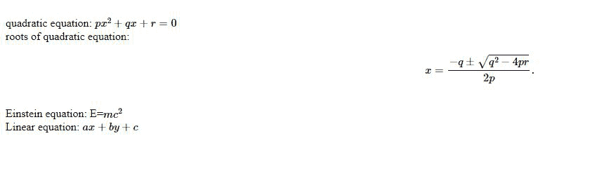
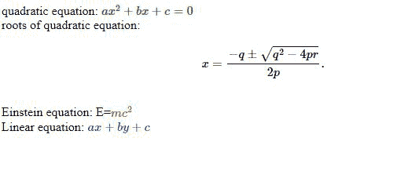

# MathJax 简介

> 原文:[https://www.geeksforgeeks.org/introduction-to-mathjax/](https://www.geeksforgeeks.org/introduction-to-mathjax/)

**MathJax** 是一个用 JavaScript 编写的库，用于在浏览器中非常容易和有效地显示数学公式和符号。这是一个开源的 JavaScript 显示引擎，用于 LaTeX、MathML 和 AsciiMath 符号，适用于所有现代浏览器。MathJax 不需要任何类型的设置，这使得客户端更容易自然地查看它，没有任何困难。这个库是建立在 MathML 之上的。

**特征:**

*   易于在浏览器中编写，阅读灵活。
*   大多数最新版本的浏览器都支持。
*   强大的应用编程接口集成。

**使用 CDN 安装:**

```html
<script id="MathJax-script" async
  src="https://cdn.jsdelivr.net/npm/mathjax@3/es5/tex-mml-chtml.js">
</script>

```

在 Nodejs 中安装:

```html
npm install mathjax
```

下面的例子说明了 MathJax 的用例:

**例 1:**

## 超文本标记语言

```html
<!DOCTYPE html>
<html lang="en">

<head>
    <meta charset="UTF-8">
    <meta name="viewport" content="width=device-width,
                 initial-scale=1.0">
    <title>Math jax</title>
</head>

<body>

    <!-- Using mathjax style to write
        math notation in browser -->
    <br />quadratic equation:
    \(px^2 + qx + r = 0\)
    <br />
    roots of quadratic equation:
    $x = {-q \pm \sqrt{q^2-4pr} \over 2p}.$
    <br />
    Einstein equation: E=\(mc^2\)
    <br />
    Linear equation: \(ax+by+c\)

    <!-- Linking to CDN -->
    <script id="MathJax-script" async src=
"https://cdn.jsdelivr.net/npm/mathjax@3/es5/tex-mml-chtml.js">
    </script>

    <!-- Configuration of math jax -->
    <script>
        MathJax = {
            tex: {
                inlineMath: [['{content}apos;, '{content}apos;], 
                            ['\\(', '\\)']]
            },
            svg: {
                fontCache: 'global'
            }
        };
    </script>
</body>

</html>
```

**输出:**



**示例 2:** 该示例显示了文本颜色的变化。

## 超文本标记语言

```html
<!DOCTYPE html>
<html lang="en">

<head>
    <meta charset="UTF-8">
    <meta name="viewport" content="width=device-width,
                 initial-scale=1.0">
    <title>Math jax</title>
</head>

<body>

    <!-- Using mathjax style to write
        math notation in browser -->
    <!-- Setting color to green -->
    <br />quadratic equation:
    ${\color{green} ax^2+bx+c=0}$
    <br />
    roots of quadratic equation:
    $x = {-q \pm \sqrt{q^2-4pr} \over 2p}.$
    <br />

    <!-- Setting color to red -->
    Einstein equation: E=${\color{red} mc^2}$
    <br />
    Linear equation: ${\color{blue} ax+by+c}$

    <!-- Linking to CDN -->
    <script id="MathJax-script" async src=
"https://cdn.jsdelivr.net/npm/mathjax@3/es5/tex-mml-chtml.js">
    </script>

    <!-- Configuration of math jax -->
    <script>
        MathJax = {
            autoload: {
                color: [],
                colorV2: ['color']
            },
            tex: {
                inlineMath: [['{content}apos;, '{content}apos;], 
                        ['\\(', '\\)']]
            },
            svg: {
                fontCache: 'global'
            }
        };
    </script>
</body>

</html>
```

**输出:**

