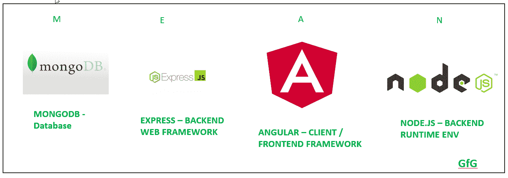
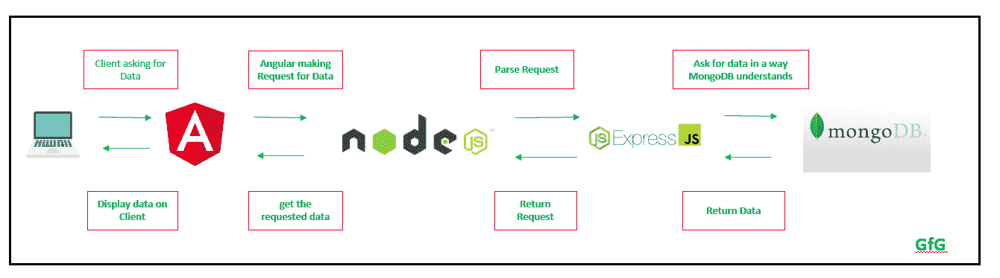
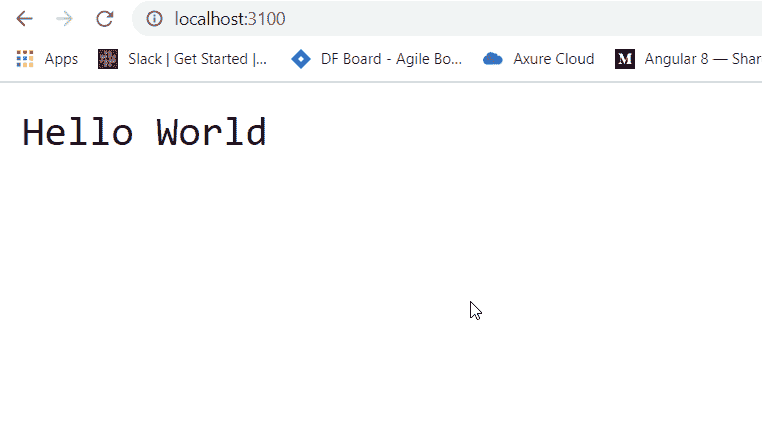
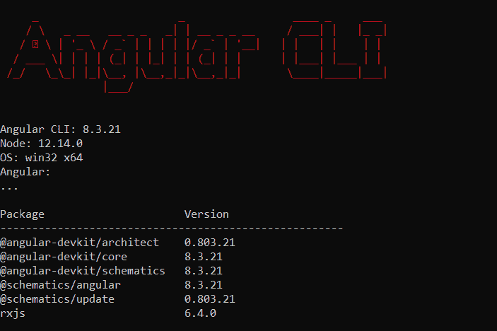
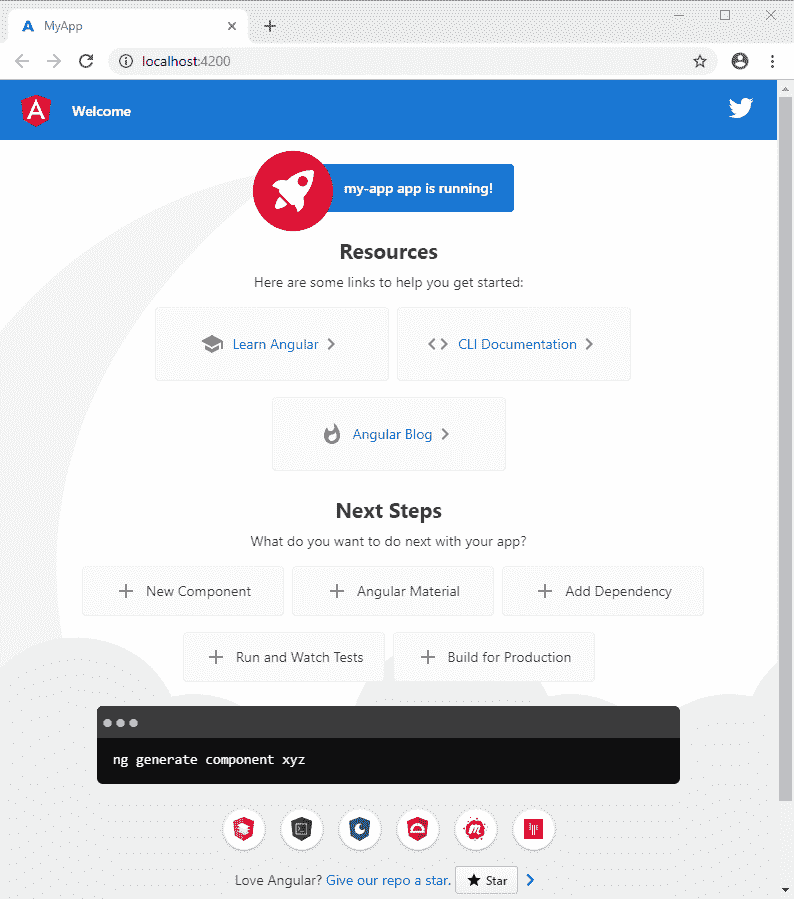
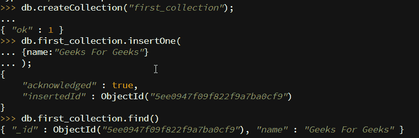
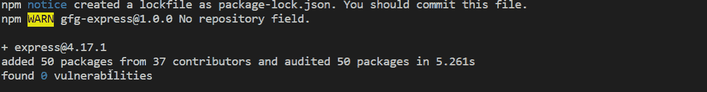
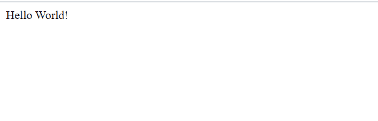

# 平均值堆栈介绍

> 原文:[https://www.geeksforgeeks.org/introduction-to-mean-stack/](https://www.geeksforgeeks.org/introduction-to-mean-stack/)

均值栈是最流行的技术栈之一。它用于开发一个全栈网络应用程序。虽然它是不同技术的堆栈，但所有这些都基于 JavaScript 语言。

平均值代表:

1.  **m**–蒙戈布
2.  **E**–快车
3.  **A**–有角度
4.  **N**–node . js

这种堆栈导致更快的开发以及网络应用程序的部署。Angular 是前端开发框架，而 Node.js、Express 和 MongoDB 用于后端开发，如下图所示。



**MEAN Stack 应用程序中的数据流:**这里，每个模块都与其他模块通信，以便有一个从服务器/后端到客户端/前端的数据流。



**通过示例开始每项技术:**下面给出了该堆栈中每项技术的描述以及学习它们的链接:

**1。Node.js:** Node.js 用于用 Javascript 编写服务器端代码。最重要的一点是它在浏览器之外运行 JavaScript 代码。它是跨平台和开源的。

*   学习节点的先决条件
*   转到 [Node.js 下载](https://nodejs.org/en/download/)，点击下载按钮，获取最新版本，并根据您的操作系统进行安装。
*   Verify whether it is installed correctly by checking the version:

    ```html
    node -v
    ```

    如果没有获得版本，则说明安装不正确。

*   检查 npm 版本(默认与节点一起安装):

    ```html
    npm -v
    ```

*   在项目文件夹中创建一个 index.js 文件，并复制以下代码:

    ```html
    var http = require("http");

    http.createServer(function (request, response) {

       response.writeHead(200, {'Content-Type': 'text/plain'});

       // Send the response text as "Hello World"
       response.end('Hello World\n');
    }).listen(3100);

    console.log('Server running at http://127.0.0.1:3100/');
    ```

*   现在打开终端，执行以下命令:

    ```html
    node index.js
    ```

*   您将在终端控制台上看到一个日志，上面写着:

    ```html
    Server running at http://127.0.0.1:3100/
    ```

*   进入浏览器，输入网址:http://127.0.0.1:3100/会看到如下输出:
    
*   了解更多关于 Node.js:
    [1 的链接。](https://docs.mongodb.com/https://www.geeksforgeeks.org/introduction-to-nodejs/)
    [2。Node.js 教程](https://www.geeksforgeeks.org/nodejs-tutorials/)
    [3。了解 Node.js 最新版本](https://nodejs.org/en/docs/)

**2。AngularJS:** Angular 是谷歌团队开发的前端开源框架。这个框架以保持向后兼容性的方式进行了修改(如果有任何重大变化，Angular 会很早通知它)。使用 Angular 团队开发的 Angular CLI(命令行界面)工具创建 Angular 项目非常简单。

*   学习 Angular 的先决条件:
    1.  以打字打的文件
    2.  CSS 预处理器
    3.  模板代码(角度素材、HTML 5 等)
*   使用 npm(节点包管理器)安装 Angular CLI–命令行界面

    ```html
    npm install -g @angular/cli
    ```

*   Now check whether it was installed correctly using below command:

    ```html
    ng --version
    ```

    它应该显示类似于:
    

*   现在，使用以下命令创建一个新项目:

    ```html
    ng new project_name
    ```

*   使用以下命令进入项目目录:

    ```html
    cd project_name
    ```

*   使用以下命令启动角度应用:

    ```html
    ng serve
    ```

*   应用将在 http://localhost:4200 上启动，你会看到如下:
    
*   现在在 app.component.html 文件中进行更改并保存文件，应用程序将自动重新加载，相应的更改将会反映出来。
*   相关 Angular 文章链接:
    [1。](https://www.geeksforgeeks.org/introduction-to-angularjs/)
    [2。棱角分明 7 引言](https://www.geeksforgeeks.org/angular-7-introduction/)
    [3。角度 7 安装](https://www.geeksforgeeks.org/angular-7-installation/?ref=rp)
    [4。Angular 7 数据服务和观察](https://www.geeksforgeeks.org/angular-7-angular-data-services-using-observable/)
    [5。Angular 7 简单易用 App](https://www.geeksforgeeks.org/how-to-create-todo-list-in-angular-7/)
    [6。了解最新发布的 Angular](https://angular.io/docs)

**3。蒙古数据库:**蒙古数据库是一个 NoSQL 数据库。它有类似 JSON 的文档。它是面向文档的数据库。

*   学习 MongoDB 的先决条件:
    1.  什么是数据库
    2.  数据库的缺点
*   创建数据库:

    ```html
    use database_name;
    ```

*   创建收藏:

    ```html
    db.createCollection("first_collection");
    ```

*   在集合中插入记录:

    ```html
    db.first_collection.insertOne(
        {name:"Geeks For Geeks"}
    );
    ```

*   Print all the records in a collection:

    ```html
    db.first_collection.find()
    ```

    

*   关于 MongoDB 的链接:
    [1。](https://www.geeksforgeeks.org/mongodb-an-introduction/)
    [2。MongoDB 入门](https://www.geeksforgeeks.org/mongodb-getting-started/)
    [3。定义、创建和删除 MongoDB 集合](https://www.geeksforgeeks.org/defining-creating-and-dropping-a-mongodb-collection/)
    [4。MongoDB 是如何工作的？](https://www.geeksforgeeks.org/how-mongodb-works/?ref=rp)
    [5。了解最新版本的 MongoDB](https://docs.mongodb.com/)

**4。ExpressJS:** Express 是一个基于 Node.js 构建的 web 框架，用于制作 API 和构建 Web 应用程序。

*   学习快递的先决条件:
    1.  JavaScript/ TypeScript
    2.  Node.js
*   通过在终端上键入以下命令来初始化项目:

    ```html
    npm init
    ```

*   它会问一些问题，按回车键以设置所有默认选项。这将创建如下所示的 package.json 文件:

    ```html
    {
      "name": "gfg-express",
      "version": "1.0.0",
      "description": "Basic Express Node.js Application",
      "main": "index.js",
      "scripts": {
        "test": "echo \"Error: no test specified\" && exit 1"
      },
      "author": "",
      "license": "ISC",
    }
    ```

*   Install the express using below command:

    ```html
    npm install express --save
    ```

    

*   现在，package.json 文件将被更改以添加依赖项，如下所示:

    ```html
    {
      "name": "gfg-express",
      "version": "1.0.0",
      "description": "Basic Express Node.js Application",
      "main": "index.js",
      "scripts": {
        "test": "echo \"Error: no test specified\" && exit 1"
      },
      "author": "",
      "license": "ISC",
      "dependencies": {
        "express": "^4.17.1"
      }
    }
    ```

*   创建 index.js 文件并添加下面的代码:

    ```html
    const express = require('express')
    const app = express()
    const PORT = 3000

    app.get('/', (req, res) => 
            res.send('Hello World!'))

    app.listen(PORT, () => console.log(
    `Example app listening at http://localhost:${PORT}`))
    ```

*   使用以下命令启动快递服务器:

    ```html
    node index.js
    ```

*   转到 http://localhost:3000 看到如下输出:
    
*   学习 ExpressJS 的链接:
    [1。](https://www.geeksforgeeks.org/introduction-to-express/)快递简介
    T4】2。使用 Express 设计第一个应用