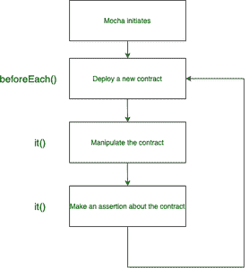
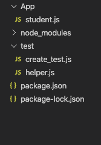
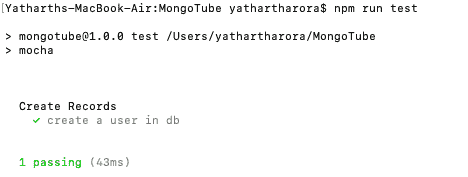

# 摩卡介绍

> 原文:[https://www.geeksforgeeks.org/introduction-to-mocha/](https://www.geeksforgeeks.org/introduction-to-mocha/)

Mocha 是一个运行在 Node.js 上的 Javascript 测试框架，这些框架使得在浏览器中测试异步 Javascript 概念变得更加容易。Mocha 广泛用于在将 Javascript 代码部署到服务器上之前对其进行测试。

**模块安装:**

1.  在摩卡使用的系统上安装 [Nodejs](https://www.geeksforgeeks.org/introduction-to-nodejs/) 。
2.  运行以下命令安装模块:

    ```
    npm install mocha
    ```

**Mocha 中的钩子:**也就是说，这个框架在测试中使用了六个钩子来设置或加载测试中使用的前提条件。

1.  **it()**
2.  **描述()**
3.  **【beforeeach()**
4.  **afterEach()**
5.  **之前()**
6.  **在()**之后

```
describe("hooks", function() {

 before(function() {
   // Runs before all tests in this block
  });

 after(function() {
  // Runs after all tests in this block
 });

 beforeEach(function() {
  // Runs before each test in this block
 });

 afterEach(function() {
  // Runs after each test in this block
 });

 // Test cases
});
```

**摩卡结构:**



**示例:**在项目中创建一个测试目录。在测试目录中分别创建两个名为 **helper.js** 和 **create_test.js** 的文件。

**项目目录:**项目目录应该是这样的:



项目目录

现在在 package.json 文件中，将“test”字段改为“mocha”，因为测试框架是 mocha。

```
Javascript {
  "name": "Introduction to Mocha",
  "version": "1.0.0",
  "description": "Learn to code",
  "main": "index.js",
  "scripts": {
    "test": "mocha"
  },
  "author": "Yatharth Arora",
  "license": "ISC",
  "dependencies": {
    "mocha": "^8.1.3",
  }
}
```

**helper.js** 文件包含 before()函数，该函数将在所有测试用例之前执行。

**文件名:helper.js**

```
// Using moongoose as a database
const mongoose = require('mongoose'); 
mongoose.Promise = global.Promise;

// The before() hook
before( (done) => {
    mongoose.connect("mongodb://localhost/mongotube", 
    { useUnifiedTopology: true, useNewUrlParser: true});

    mongoose.connection
    .once('open', () => {
        // console.log('Connected...')
        done();
    })
    .on('error', (error) => {
        console.log("Your error", error);
    });
});
```

**create_test.js** 文件包含了我们将要使用框架检查的所有测试用例。它包含一个 description()函数，该函数包含了它所定义的所有测试用例。

**文件名:create_test.js**

```
// Student is the database where we will 
// add details and test if details are added

const Student = require('../App/student');
const assert = require('assert');

describe("Create Records", () => {

    // First test case
    it("create a user in db", () => {

        // assert(true);
        const geek = new Student({name: "geek"});

        // Save the object in database
        geek.save()
        .then( () => {
          // The geek.isNew returns false if
          // object is stored in database
          // The !geek.isNew becomes true and
          // the test passes.
          assert(!geek.isNew)
        })
        .catch( () => {
           console.log("error");
        })
    });
});
```

**运行代码的步骤:**

1.  导航到测试文件所在的目录，并键入以下命令:

    ```
    npm test
    ```

2.  控制台将显示您作为每个 it()方法中的第一个参数传递的消息。如果测试失败，将报告错误。

**输出:**



输出文件

**对摩卡的需求**一旦代码部署到服务器端，做任何修改都是非常困难和昂贵的。用户满意度非常重要，因此代码应该在生产就绪之前经过严格的测试。