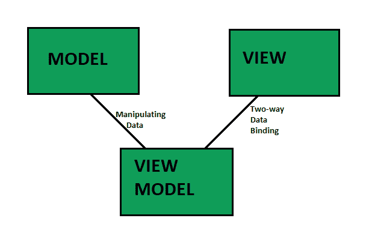

# 模型视图模型介绍(MVVM)

> 原文:[https://www . geesforgeks . org/introduction-to-model-view-view-model-mvvm/](https://www.geeksforgeeks.org/introduction-to-model-view-view-model-mvvm/)

**基本介绍:**
【结构编码方式】

注意:模型和视图模型之间的链接是操纵数据，视图模型和视图之间的链接是双向数据绑定。
**模型描述:**
**模型:**(可重用代码–数据)封装数据和应用程序域行为的业务对象，简单地保存数据。
**视图:**(平台特定代码–用户界面)用户看到的是格式化的数据。
**视图模型:**(可重用代码–逻辑)模型和视图之间的链接或者它从模型中检索数据并将其公开给视图。这是专为视图设计的模型。

**特征:**

*   将保持应用程序的生命周期状态。
*   应用程序将处于与用户离开时相同的位置。
*   用户界面组件远离业务逻辑。
*   业务逻辑远离数据库操作。
*   易于理解和阅读。

**基本示例:**
我们想要以紫色显示姓名(不是以适当的格式、适当的长度写的)或者如果一个人的年龄是> 18 岁则显示紫色，如果一个人的年龄是< 18 岁则显示粉色，那么紫色和粉色的逻辑将出现在视图模型中。

**摘要:**
从服务器获取数据(在模型对象中可用)，视图模型读取模型对象，然后便于在视图上轻松呈现数据。

**MVVM 与 MVC 的区别:**

<figure class="table">

| 【MVVM】 | MVC: |
| --- | --- |
| The model is somewhat similar to MVC, but here we have a view model that is passed to the view. All the logic is in the view model, so there is no controller. Example: knockout. js | In this mode, we have models, which are basic objects without code, only attributes, the contribution of views is presentation items (HTML, WinForms, etc.), and the controller focuses on the logical part. Example: ASP.NET MVC, Angular |
| In MVVM, your delegator will be called from your view model. | We have a PersonController with an operation deleter, which creates a person. |
| We are on the client side, so we can keep objects and perform more logic in a non-disconnected state. | MVC is usually used in transactional and disconnected situations, which is the case with server-side web. In ASP MVC, we send the view through the network, and then the transaction with the client ends. |

</figure>

**优势:**

*   可维护性——能够保持敏捷并快速发布连续版本。
*   可扩展性——能够替换或添加新的代码。
*   可测试性——更容易针对核心逻辑编写单元测试。
*   透明通信–视图模型为视图控制器提供了一个透明的接口，它使用该接口来填充视图层并与模型层交互，从而在应用程序的各层之间实现透明的通信。

**缺点:**

*   有些人认为，对于简单的用户界面，MVVM 可能有些矫枉过正。
*   在更大的情况下，可能很难设计视图模型。
*   当我们有复杂的数据绑定时，调试会有点困难。