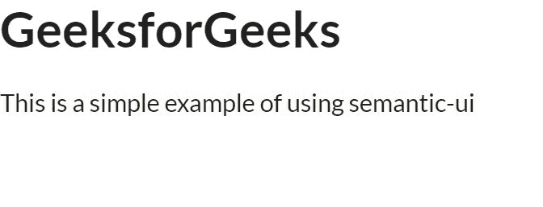

# 语义 UI 介绍

> 原文:[https://www.geeksforgeeks.org/introduction-to-semantic-ui/](https://www.geeksforgeeks.org/introduction-to-semantic-ui/)

语义 UI 是一个开源框架，它使用 CSS 和 jQuery 来构建出色的用户界面。它和引导程序一样，有很大的不同元素，可以让你的网站看起来更加惊艳。

**如何使用语义 UI？**
只需谷歌 CDN 语义用户界面，你就会得到语义用户界面的 CDN 链接，并把它放在你的 HTML 的标题标签中，你就可以走了。

让我们看看如何在 HTML 中放置语义 UI CDN 的代码。

```html
<!DOCTYPE html>
<html>
    <head>
        <title>Semantic UI</title>
        <link href=
"https://cdnjs.cloudflare.com/ajax/libs/semantic-ui/2.4.1/semantic.min.css"
         rel="stylesheet" />
    </head>
    <body>
        <h1>This is How to intergrate semantic-ui</h1>
        <script src=
"https://cdnjs.cloudflare.com/ajax/libs/semantic-ui/2.4.1/semantic.min.js">
        </script>
    </body>
</html>
```

你可以去掉头部的链接，看看有什么不同。

第二种使用方式是下载语义 UI 的 min.css 文件，你可以在语义 UI 官方网站上找到它的链接，直接使用它，它帮助离线。

现在让我们看一个使用语义用户界面的例子。

```html
<!DOCTYPE html>
<html>
    <head>
        <title>Semantic UI</title>
        <link href=
"https://cdnjs.cloudflare.com/ajax/libs/semantic-ui/2.4.1/semantic.min.css"
         rel="stylesheet" />
    </head>
    <body>
        <div class="container">
            <h1>GeeksforGeeks</h1>
            <p>This is a simple example of using semantic-ui</p>
        </div>
        <script src=
"https://cdnjs.cloudflare.com/ajax/libs/semantic-ui/2.4.1/semantic.min.js">
         </script>
    </body>
</html>
```

**输出:**


让我们看看语义用户界面加载器的另一个例子。

```html
<!DOCTYPE html>
<html>
    <head>
        <title>Semantic UI</title>
        <link href=
"https://cdnjs.cloudflare.com/ajax/libs/semantic-ui/2.4.1/semantic.min.css"
         rel="stylesheet" />
    </head>
    <body>
        <div class="ui inverted segment">
            <div class="ui active inverted loader"></div>
            <br>
            <br>
            <br>
            <br>
          </div>
        <script src=
"https://cdnjs.cloudflare.com/ajax/libs/semantic-ui/2.4.1/semantic.min.js">
         </script>
    </body>
</html>
```

**输出:**


您可以通过单击在 IDE 上运行来直接运行这些示例。