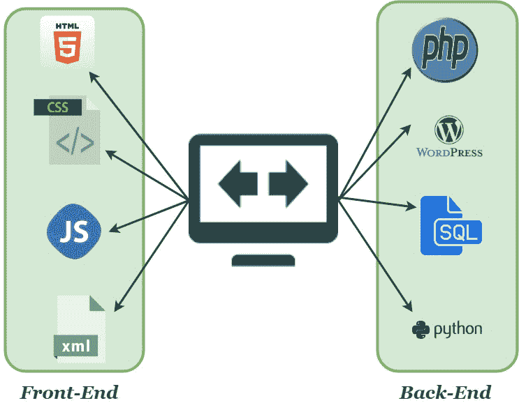

# Web 开发及其三位一体介绍

> 原文:[https://www . geesforgeks . org/introduction-web-development-圣三一/](https://www.geeksforgeeks.org/introduction-web-development-holy-trinity/)

**Web 开发的入门与圣三位一体**

本文将向您概述前端开发、后端开发和全栈开发，并向您详细介绍其中的每一项，以便您可以自己决定感兴趣的领域。
从基本的书籍定义出发，Web 开发’是指网站的建立、创建和维护。它包括网页设计、网页发布、网页编程和数据库管理等方面。


现在我们来详细介绍一下 web 开发的各个方面。

**前端:**
“前端”通常是指用户在网站上实际看到的所有种类的东西，一旦完全加载。这就是为什么它也被称为前端的“客户端”。
包括菜单和下拉菜单、导航栏、侧栏、页眉、页脚以及 CSS 动画等用户界面元素。任何网站的前端都必须与用户和系统的后端进行通信。所以，前端开发者要对网站的唯美、设计和外观负责。此外，根据最近的市场趋势，前端开发人员必须具备使网站响应不同设备、浏览器和屏幕大小的知识。这是因为市场是非常多才多艺的，不同的浏览器和设备有一些复杂和属性，在制作网站或博客之前必须考虑到(例如，影子属性)。

一个前端开发人员非常注重对 [HTML](https://www.geeksforgeeks.org/tag/html-and-xml/) 、CSS 和 [JavaScript](https://www.geeksforgeeks.org/how-to-be-a-javascript-developer-without-knowing-javascript/) 的理解。

前端开发人员还必须确保用户与网站的交互流畅友好。前端开发人员不需要后端开发技能，前端开发人员创建的网站也不需要与存储在数据库中的信息交互就能正常运行。
现在说就业机会，行业内有多个岗位和空缺。但是，一家公司的职务概要所需的技能集可能与其他公司的同一职务概要所需的技能集完全不同。
这意味着一个职位可能在一家公司意味着什么，然后在另一家公司完成另一件事。所以，在去面试之前，最好不要自己去猜测任何关于工作的信息，而是去搜索和阅读你需要的技能和你被录用后必须做的工作。

**最常见的职位头衔，与前端开发相关的有:**

*   前端开发人员
*   用户界面/UX 设计师
*   网页设计师

注: **UI 代表用户界面，UX 代表用户体验**。用户界面设计师必须处理网站设计的虚拟方面，而 UX 设计师进行用户测试，以确保网站的顺利运行。

在有抱负的网络开发者和求职者中，一个非常常见的问题是“网络开发者和网络设计师有什么不同”，以及“两者有什么不同”。

*   网页设计师使用图形和图形设计软件，如 Adobe Photoshop、Illustrator 或 InDesign 来创建网站外观。一个好的网页设计师需要对各种概念有很强的把握，包括颜色和排版、特殊关系、受众和用户体验。因此，网站设计师的主要工作是使用 Adobe Photoshop、InDesign 等软件为网站创造最具美感的外观。
*   然而，web 开发人员负责将 web 设计人员给出的设计开发成一个可供全球不同用户访问的工作模型。HTML、JavaScript、JQuery 和 CSS 是 web 开发人员必须在他们的工具包中拥有的一些工具。

**后端:**
应用程序中基本生活在服务器上的部分称为网站后端。由于网站访问者和用户可以访问这一部分，因此它也被称为网站的服务器端。后端的主要目标是确保根据用户的请求将正确的数据发送到浏览器。虽然这不是一个容易的过程，并且需要做很多工作来从后端检索信息，然后在前端将其显示给用户。
我们举个例子把事情说清楚；一个学生想从学校的网站上获得他的学期成绩。填写完所需表格(注册号码、出生日期等)后，他提交提交按钮。按下提交按钮后，网站开始将用户输入的信息与其数据库中存储的信息进行匹配。如果发现信息是正确的，后端将从后端收集和处理数据，并将其发送到网站的前端，最终将结果显示给学生。

后端开发人员使用 Java、PHP、Ruby on Rails、Python、and.Net 等语言来完成工作。创建动态网站非常需要后端开发。动态网站是那些数据随着时间不断自我更新的网站。例如，当你在相当长的时间后登录你的推特账户时，你会自动收到你关注的人的最新更新。它们不会是你昨天看到的同样的更新。页面是如何变化的？任何公司都不可能仅仅为了手动更新新闻提要而招聘员工。实际上，推特后端的脚本会收到更新，并相应地重新生成前端。
动态网站的例子包括脸书、推特和谷歌地图。
**后端有三个部分:服务器、应用程序和数据库。**
注:数据库管理采用 MySQL、MongoDB 等技术。

**全栈**
我们可以将全栈开发人员定义为在两端中的一端非常精通，但在必要时也能处理另一端工作的人。基本上，全栈开发人员对前端和后端开发都很熟悉。然而，他们的知识深度可能不如专门研究前端或后端的人。这就是为什么有时他们被称为“两种交易的杰克”。

**网页开发的三位一体**

前端 web 基本上由脚本语言 **HTML** 和 **CSS** 以及编程语言 **JavaScript** 组成。所有网站的前端，无论大小，都是用这三种语言构建的。这就是为什么他们被称为前端网络开发的**三位一体。**
对于全栈开发人员来说，熟悉这三种语言也是必不可少的，这样他们就可以了解服务器端的变化如何影响网站的用户界面端(对动态网站的开发很有用)。

以下是这三种语言的简要总结。
**HTML(Hyper Text Markup Language):**
[HTML](https://www.geeksforgeeks.org/html-basics/)是用来创建你每天访问的网站的语言，它为网站提供了一种结构化内容的逻辑方式。我们还可以将 HTML 定义为有助于创建任何网站主干的语言。
下面提到的是基本的 HTML 标签，它将整个文档分成头部、身体等各个部分。

*   每个 HTML 文档都以一个 HTML 文档标签开始。虽然这不是强制性的，但用下面提到的标签开始文档是一个很好的习惯:

    ```html
    <!DOCTYPE html>
    ```

*   **< html >** :每一个 html 代码都必须封装在基本的 HTML 标签之间。以 **< html >** 开头，以 **< /html >** 标签结尾。
*   **<head>**:head 标签紧随其后，它包含网页或文档的所有标题信息，如页面标题和其他杂项信息。这些信息包含在头牌中，头牌以**<>**开头，以**</头牌>** 结尾。这个标签的内容将在后面的章节中解释。
*   **<标题> :** 我们可以使用 **<标题>** 标签来提及网页的标题。这是一个标题信息，因此在标题标签中提到。标签以 **<标题>** 开头，以**</标题>** 结尾
*   **<正文> :** 下一步是我们到目前为止学到的所有标签中最重要的。body 标签包含页面的实际主体，所有用户都可以看到。以 **<车身>** 开始，以**</车身>** 结束。这个标签中包含的每一个内容都将显示在网页上，无论是文字、图像、音频、视频，甚至是链接。我们将在本节后面看到如何使用各种标签将提到的内容插入到我们的网页中。

代码的整个模式如下所示:

```html
<html>
<head>
    <!-- Information about the page -->
    <!--This is the comment tag-->
    <title>GeeksforGeeks</title>
</head>
<body>
    <!--Contents of the webpage-->
</body>
</html>
```

这段代码不会显示任何内容。它只是展示了如何编写 HTML 代码的基本模式，并将页面标题命名为 GeeksforGeeks。是 HTML 中的注释标签，它不读取这个标签中的行。

**CSS(级联样式表):**

[CSS](https://www.geeksforgeeks.org/css-introduction/) 用于风格化网站上呈现的 HTML 内容。这包括修改页面颜色、字体系列、字体大小、元素定位等等。
CSS 有三种类型:

1.  在单独的文件中(外部)
2.  在网页文档的顶部(内部)
3.  就在它修饰的文本旁边(内嵌)

**外部样式表:**包含 CSS 指令的独立文件，文件扩展名为**(。css)** 。使用外部样式表的主要优点是可以一次改变整个网站的样式，而不需要重写或修改每一页的样式标签。从而节省了大量的时间和精力。但是，必须使用之间的标记将外部样式表链接到 HTML 文件中，才能使其工作。

```html
<head>
    <link rel="stylesheet" type="text/css" href="gfg.css">
</head>
```

**内部样式:**在列出任何内容之前，放置在每个网页文档的顶部。内部样式 CSS 代码写在 HTML 文件本身的头部标签之间。内部样式非常容易找到，它们被赋予第二高的优先级，仅次于外部样式表。

```html
<head>
   <style>
      body {
      background-color: linen;
      }
      h1 {
      color: maroon;
      font-style: bold; 
      }
   </style>
<body>
   <h1>Hello,GeeksforGeeks</h1>
</body>
</head>
```

输出:

```html
你好，GeeksforGeeks
```

**内嵌样式:**放在你需要的地方，在你想要装饰的文本或图形旁边。内嵌样式可以插入到 HTML 代码的中间。这给了指定每个网页元素的真正自由，然而，会使网站的维护工作变得困难。

```html
<h1 style="color:blue; font-style: italic;"> Hello, GeeksforGeeks </h1>
```

输出:

```html
你好，GeeksforGeeks
```

 **但是一个网站可以有多个样式表吗？**
是的，但是会有一些规则需要遵守。请看下面的例子。

假设名为 **gfg.css** 的外部样式表对于< h1 >元素具有以下样式:

```html
h1 {
    color: orange;
}
```

如果内部样式是在链接到外部样式表后定义的(如下所示)，

# 元素将为“绿色”:

示例:

```html
<head>
   <link rel="stylesheet" type="text/css" href="gfg.css">
   <style>
      h1 {
      color: green;
      }
   </style>
</head>
<body>
   <h1>Hello, GeeksforGeeks</h1>
</body>
```

输出:

```html
你好，GeeksforGeeks
```

但是，如果在链接到外部样式表之前定义了内部样式，

# 元素将为“橙色”:

示例:

```html
<head>
   <style>
      h1 {
      color: green;
      }
   </style>
   <link rel="stylesheet" type="text/css" href="gfg.css">
</head>
<body>
   <h1>Hello, GeeksforGeeks</h1>
</body>
```

输出:

```html
你好，GeeksforGeeks
```

**JavaScript:**
有一点必须记住的是 [JavaScript](https://www.geeksforgeeks.org/javascript-tutorial/) 和 [Java](https://www.geeksforgeeks.org/java/) 是完全不同的语言，无论是概念还是设计，两者都没有相互关联。Java 是由太阳微系统公司的詹姆斯·高斯林创建的面向对象编程语言。JavaScript 是一种脚本语言，最初被称为 LiveScript。JavaScript 用于前端开发，而 Java 用于 web 开发的后端开发。
Javascript 的主要功能是为网页添加逻辑和交互性(例如。一旦用户点击链接，链接就会改变颜色)。
但是，脚本应该包含在 HTML 文档中或被 HTML 文档引用，以便浏览器解释代码。这意味着网页不必是静态的 HTML，而是可以包括与用户交互、控制浏览器和动态创建 HTML 内容的程序。

**使用 JavaScript 的优点是:**

1.  更少的服务器交互:在将页面发送到服务器之前，可以验证用户输入。这样可以节省服务器流量，进而加快网站的加载速度。
2.  访问者不必等待页面重新加载来查看他们是否忘记输入了什么。例如，网站会在表单提交前立即通知用户需要进行的更正。
3.  可以创建这样的界面，一旦用户用鼠标悬停在这些界面上，就会改变链接的字体样式或字体颜色。
4.  JavaScript 可以用来将项目包含为拖放组件和滑块，从而为用户创建更丰富、更好的界面。

**所以这是一些关于[HTML](https://www.geeksforgeeks.org/html-basics/)[CSS](https://www.geeksforgeeks.org/tag/css/)和 [JavaScript](https://www.geeksforgeeks.org/javascript-tutorial/) 的信息，如果你想成为前端开发人员或者全栈开发人员，你必须了解它们。**