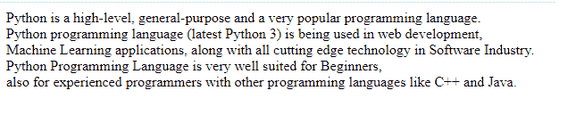
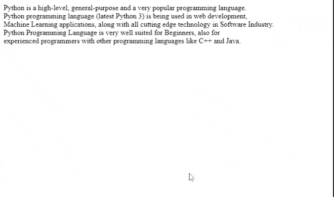
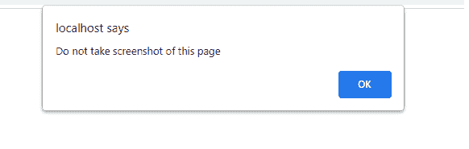
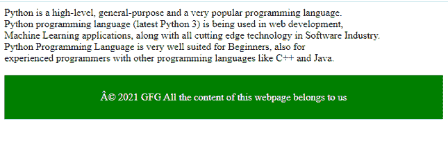

# 有没有可能阻止用户截图网页？

> 原文:[https://www . geesforgeks . org/是否有可能阻止用户截图网页/](https://www.geeksforgeeks.org/is-it-possible-to-prevent-users-from-taking-screenshots-of-webpage/)

截图是 windows 中 **OS** 的一个功能。我们可以简单的按下键盘上的**打印屏幕**(打印屏幕)进行截图。如果键盘没有 *prt sc* 键，我们可以使用 **Fn + Windows logo 键+空格键**。另外，我们可以使用*剪下&草图*或*剪下工具*通过按下**窗口标志键+ Shift + S** 并选择一个区域进行截图。

在 MacOS 中，我们可以使用**命令+ Shift + 3** 、**命令+ Shift + 4** 进行截图。

所有这些命令都由我们的操作系统控制，我们不能在浏览器中使用 HTML/CSS/JavaScript 禁用或阻止它们。所以，我们不能阻止用户截图。

除了所有这些，如果用户想获得我们网页的内容，他们可以复制、打印、使用一些第三方应用程序或使用其他设备拍摄照片。所以很难阻止用户截取我们网页的截图或者内容。

我们不能阻止这一切，但我们可以用一些方法在某种程度上避免这一切。

**示例 1:** 在本例中，我们将禁用网页的打印选项。

## 超文本标记语言

```html
<!DOCTYPE html>
<html lang="en">

<head>
    <style>

        /* We are stopping user from
        printing our webpage */
        @media print {

            html,
            body {

                /* Hide the whole page */
                display: none;
            }
        }
    </style>
</head>

<body>
    <div>
        Python is a high-level, general-purpose
        and a very popular programming language.
        <br />Python programming language (latest
        Python 3)is being used in web development,
        <br />Machine Learning applications, along
        with all cutting edge technology in
        Software Industry.<br />Python Programming
        Language is very well suited for Beginners,
        <br />also for experienced programmers with
        other programming languages like C++ and
        Java.<br />
    </div>
</body>

</html>
```

**输出:**这将简单地输出我们网页的内容，但是当我们试图打印它时，我们将一无所获。



打印将不起作用

**例 2。**在本例中，我们将使用 CSS 更改文本选择功能。

## 超文本标记语言

```html
<!DOCTYPE html>
<html lang="en">

<head>
    <style>
        html {
            user-select: none;
        }
    </style>
</head>

<body>
    <div>
        Python is a high-level, general-purpose
        and a very popular programming language.
        <br />Python programming language (latest
        Python 3)is being used in web development,
        <br />Machine Learning applications, along
        with all cutting edge technology in
        Software Industry.<br />Python Programming
        Language is very well suited for Beginners,
        <br />also for experienced programmers with
        other programming languages like C++ and
        Java.<br />
    </div>
</body>

</html>
```

**输出:**这将阻止用户选择和复制我们的文本内容。



复制没有发生

**例 3。**在本例中，我们将向用户显示一条警告消息，不要复制/窃取/打印/截图我们的网页。

## 超文本标记语言

```html
<!DOCTYPE html>
<html lang="en">

<head>
    <script>
        alert("Do not take screenshot of this page");
    </script>
</head>

<body>
    <div>
        Python is a high-level, general-purpose and
        a very popular programming language.<br />
        Python programming language (latest Python 3)
        is being used in web development,<br />
        Machine Learning applications, along with all
        cutting edge technology in Software Industry.
        </br />Python Programming Language is very well
        suited for Beginners, also for <br />
        experienced programmers with other programming
        languages like C++ and Java.<br />
    </div>
</body>

</html>
```

**输出:**这将向用户显示一条警告消息，提示他不应该拍摄该网页的任何截图。



警告警报消息

**例 4。**在这个例子中，我们会添加一条我们网页的版权信息，显示这个网页的所有内容都属于我们，严格来说不允许以任何形式使用我们的内容。

## 超文本标记语言

```html
<!DOCTYPE html>
<html lang="en">

<head>
    <style>

        /* Styling the footer */
        footer {
            text-align: center;
            padding: 10px;
            background-color: green;
            color: white;
        }
    </style>
</head>

<body>
    <div>
        Python is a high-level, general-purpose and
        a very popular programming language.<br />
        Python programming language (latest Python 3)
        is being used in web development,<br />
        Machine Learning applications, along with all
        cutting edge technology in Software Industry.
        </br />Python Programming Language is very well
        suited for Beginners, also for <br />
        experienced programmers with other programming
        languages like C++ and Java.<br /><br />
    </div>

    <footer>

<p>
            © 2021 GFG All the content of this
            webpage belongs to us
        </p>

    </footer>
</body>

</html>
```

**输出:**我们用一条简单的消息在页脚添加了版权消息。



页脚消息