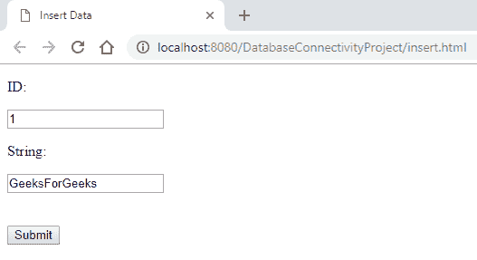
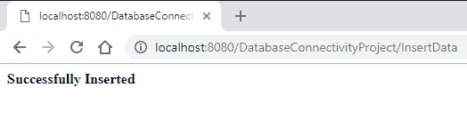

# Java Servlet 和 JDBC 示例|在 MySQL 中插入数据

> 原文:[https://www . geesforgeks . org/Java-servlet-and-JDBC-example-insert-data-in-MySQL/](https://www.geeksforgeeks.org/java-servlet-and-jdbc-example-insert-data-in-mysql/)

**先决条件:** [小服务程序](https://www.geeksforgeeks.org/introduction-java-servlets/)[JDBC 连接](https://www.geeksforgeeks.org/establishing-jdbc-connection-in-java/)

**开始用 JDBC 连接对接 Java Servlet 程序:**

1.  应该在创建数据库的同时建立适当的 JDBC 环境。
2.  为此，从互联网上下载 mysql-connector.jar 文件，
3.  下载时，将 jar 文件移动到 apache-tomcat 服务器文件夹中，
4.  将文件放在 apache-tomcat 目录中的 **lib** 文件夹中。
5.  **从接口的基本概念开始:**
    *   **Step 1: Creation of Database and Table in MySQL**

        一旦 jar 文件放入文件夹，就在 MySQL 中创建一个数据库和表，

        ```html
        mysql> create database demoprj;
        Query OK, 1 row affected (4.10 sec)

        mysql> use demoprj
        Database changed

        mysql> create table demo(id int(10), string varchar(20));
        Query OK, 0 rows affected (1.93 sec)

        mysql> desc demo;
        +--------+-------------+------+-----+---------+-------+
        | Field  | Type        | Null | Key | Default | Extra |
        +--------+-------------+------+-----+---------+-------+
        | id     | int(10)     | YES  |     | NULL    |       |
        | string | varchar(20) | YES  |     | NULL    |       |
        +--------+-------------+------+-----+---------+-------+
        2 rows in set (0.40 sec)

        ```

    *   **Step 2: Implementation of required Web-pages**
        Create a form in HTML file, where take all the inputs required to insert data into the database. Specify the servlet name in it, with the POST method as security is important aspects in database connectivity.

        ```html
        <!DOCTYPE html>
        <html>
        <head>
        <title>Insert Data</title>
        </head>
        <body>
            <!-- Give Servlet reference to the form as an instances 
            GET and POST services can be according to the problem statement-->
            <form action="./InsertData" method="post">
                <p>ID:</p> 
                <!-- Create an element with mandatory name attribute,
                so that data can be transfer to the servlet using getParameter() -->
                <input type="text" name="id"/>
                <br/>
                <p>String:</p> 
                <input type="text" name="string"/>
                <br/><br/><br/>
                <input type="submit"/>
            </form>
        </body>
        </html>
        ```

        **输出:**
        

        插入所有需要的数据后，提交数据(带验证)。

    *   **Step 3: Creation of Java Servlet program with JDBC Connection**

        创建 JDBC 连接的步骤是

        1.  导入所有包
        2.  注册 JDBC 司机
        3.  打开连接
        4.  执行查询，并检索结果
        5.  清理 JDBC 环境

        创建一个单独的类来创建数据库连接，因为在所有程序中编写相同的代码片段是一个蹩脚的过程。创建一个返回连接对象的. java 文件。

        ```html
        import java.sql.Connection;
        import java.sql.DriverManager;
        import java.sql.SQLException;

        // This class can be used to initialize the database connection
        public class DatabaseConnection {
            protected static Connection initializeDatabase()
                throws SQLException, ClassNotFoundException
            {
                // Initialize all the information regarding
                // Database Connection
                String dbDriver = "com.mysql.jdbc.Driver";
                String dbURL = "jdbc:mysql:// localhost:3306/";
                // Database name to access
                String dbName = "demoprj";
                String dbUsername = "root";
                String dbPassword = "root";

                Class.forName(dbDriver);
                Connection con = DriverManager.getConnection(dbURL + dbName,
                                                             dbUsername, 
                                                             dbPassword);
                return con;
            }
        }
        ```

    *   **Step 4: To use this class method, create an object in Java Servlet program**

        下面的程序展示了创建连接并将数据插入`**demo**`表的 Servlet 类，

        ```html
        import java.io.IOException;
        import java.io.PrintWriter;
        import java.sql.Connection;
        import java.sql.PreparedStatement;

        import javax.servlet.ServletException;
        import javax.servlet.annotation.WebServlet;
        import javax.servlet.http.HttpServlet;
        import javax.servlet.http.HttpServletRequest;
        import javax.servlet.http.HttpServletResponse;

        // Import Database Connection Class file
        import code.DatabaseConnection;

        // Servlet Name
        @WebServlet("/InsertData")
        public class InsertData extends HttpServlet {
            private static final long serialVersionUID = 1L;

            protected void doPost(HttpServletRequest request, 
        HttpServletResponse response)
                throws ServletException, IOException
            {
                try {

                    // Initialize the database
                    Connection con = DatabaseConnection.initializeDatabase();

                    // Create a SQL query to insert data into demo table
                    // demo table consists of two columns, so two '?' is used
                    PreparedStatement st = con
                           .prepareStatement("insert into demo values(?, ?)");

                    // For the first parameter,
                    // get the data using request object
                    // sets the data to st pointer
                    st.setInt(1, Integer.valueOf(request.getParameter("id")));

                    // Same for second parameter
                    st.setString(2, request.getParameter("string"));

                    // Execute the insert command using executeUpdate()
                    // to make changes in database
                    st.executeUpdate();

                    // Close all the connections
                    st.close();
                    con.close();

                    // Get a writer pointer 
                    // to display the successful result
                    PrintWriter out = response.getWriter();
                    out.println("<html><body><b>Successfully Inserted"
                                + "</b></body></html>");
                }
                catch (Exception e) {
                    e.printStackTrace();
                }
            }
        }
        ```

    *   **Step 5: Get the data from the HTML file**

        要从 HTML 文件中获取数据，需要使用请求对象，该对象调用 [getParameter()](https://www.geeksforgeeks.org/getparameter-passing-data-from-client-to-jsp/) 方法从通道中获取数据。成功插入后，创建 writer 对象以显示成功消息。

        从 Servlet 插入操作后，数据将反映在 MySQL 数据库中

        **输出:**
        

        **结果在 MySQL 界面**

        ```html
        mysql> select * from demo;
        +------+---------------+
        | id   | string        |
        +------+---------------+
        |    1 | GeeksForGeeks |
        +------+---------------+
        1 row in set (0.06 sec)
        ```

本文展示了 JDBC 与 Java Servlet 程序的基本联系，要插入大量数据，就应该进行适当的验证，就像任何格式不正确的数据都会遇到错误一样。数据库中插入的所有数据都应该加密。