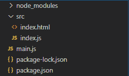
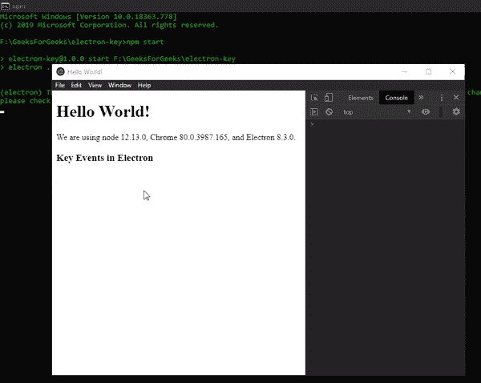

# 电子表格中的键盘事件

> 原文:[https://www . geesforgeks . org/keyboard-events-in-electronijs/](https://www.geeksforgeeks.org/keyboard-events-in-electronjs/)

[**electronijs**](https://www.geeksforgeeks.org/introduction-to-electronjs/)是一个开源框架，用于使用能够在**Windows****macOS**和 **Linux** 操作系统上运行的 HTML、CSS 和 JavaScript 等 web 技术构建跨平台原生桌面应用。它将 Chromium 引擎和 [**NodeJS**](https://www.geeksforgeeks.org/introduction-to-nodejs/) 结合成一个单一的运行时。

在 web 开发中， [**jQuery**](https://www.geeksforgeeks.org/jquery-tutorials/) [**键盘事件**](https://api.jquery.com/category/events/keyboard-events/) 提供了一种便捷的方式，通过这种方式我们可以按顺序记录键盘的**按键**。这些事件包括组合键、特殊键和修饰符，一旦键按下并释放，就会触发。这些事件非常重要，以防我们想要跟踪或触发某些按键的某些功能。除了提供 [**加速器**](https://www.electronjs.org/docs/api/accelerator) 和 [**全局快捷方式**](https://www.electronjs.org/docs/api/global-shortcut) 模块之外，Electron 还为我们提供了一种方法，通过该方法，我们可以使用内置**浏览器窗口**对象的实例方法和事件以及**网络内容**属性来记录键盘事件。本教程将演示电子键盘事件。

我们假设您熟悉上述链接中介绍的先决条件。电子要工作， [**节点**](https://www.geeksforgeeks.org/introduction-to-nodejs/) 和 [**npm**](https://www.geeksforgeeks.org/node-js-npm-node-package-manager/) 需要预装在系统中。

*   **项目结构:**



**示例:**按照 [**如何在电子表格**](https://www.geeksforgeeks.org/how-to-find-text-on-page-in-electronjs/) 中查找页面上的文本中给出的步骤设置基本的电子应用程序。复制文章中提供的 **main.js** 文件和**index.html**文件的样板代码。还要对**包. json** 文件进行必要的更改，以启动电子应用程序。我们将继续使用相同的代码库构建我们的应用程序。设置电子应用程序所需的基本步骤保持不变。

**package.json:**

```html
{
  "name": "electron-key",
  "version": "1.0.0",
  "description": "Key events in Electron",
  "main": "main.js",
  "scripts": {
    "start": "electron ."
  },
  "keywords": [
    "electron"
  ],
  "author": "Radhesh Khanna",
  "license": "ISC",
  "dependencies": {
    "electron": "^8.3.0"
  }
}

```

**输出:**此时，我们的基本电子应用程序设置完毕。启动应用程序后，我们应该会看到以下结果

[](https://media.geeksforgeeks.org/wp-content/uploads/20200512225834/Output-1105.png)

**电子商务中的键盘事件:****浏览器窗口**实例和**网站内容**属性是**主进程**的一部分。要在**渲染器进程**中导入和使用浏览器窗口，我们将使用电子**远程**模块。

**index.html**:在该文件中添加以下片段。

## 超文本标记语言

```html
<h3>Key Events in Electron</h3>
```

**index.js** :在该文件中添加以下代码片段。

## java 描述语言

```html
const electron = require("electron");

// Importing BrowserWindow from Main Process 
// using Electron remote
const BrowserWindow = electron.remote.BrowserWindow;
const win = BrowserWindow.getFocusedWindow();

// let win = BrowserWindow.getAllWindows()[0];

win.webContents.on("before-input-event", (event, input) => {
    console.log(input);
});
```

**网络内容**属性的**输入前事件**与[T5】键盘事件 T7】网络应用编程接口紧密配合。**键盘事件**描述了用户与键盘的交互。它继承了 **UIEvent** 和全局 **Event** 对象的实例方法和属性。在网页中**键盘事件**的**向下键**和**向上键**事件发出前**输入前事件**实例事件。此实例事件利用了**键盘事件**对象的构造函数。它返回以下参数。](https://developer.mozilla.org/en-US/docs/Web/API/KeyboardEvent)

*   **事件:**全局事件对象。
*   **输入:对象**包含以下参数。
    *   **类型:字符串**该参数定义已经发生的**键盘事件**的类型。数值可以是**向上键**或**向下键**。输入前**事件**事件不支持**按键**事件，因为它已经被**键盘事件**网络应用编程接口本身否决了。
    *   **键:字符串**该参数相当于**键盘事件.键**参数。这是一个*只读*属性。该值返回一个 **DOMString** ，代表所按键的键值。
    *   **代码:字符串**该参数相当于**键盘事件.代码**参数。这是一个*只读*属性。该值返回一个按下键的代码值的 **DOMString** 。
    *   **isaouterepat:Boolean**该参数相当于**键盘事件.重复**参数。这是一个*只读*属性。如果按键被长时间按下，使其自动重复，则该值返回 **true** 。默认值为**假**。
    *   **shift:布尔值**该参数相当于**键盘事件. shift 键**参数。这是一个*只读*属性。如果按下**换档**键时该键处于激活状态，则该值返回**真**。
    *   **控制:布尔型**该参数相当于**键盘事件.控制键**参数。这是一个*只读*属性。如果按下 **Ctrl** 键时该键有效，则该值返回 **true** 。默认值为**假**。
    *   **alt: Boolean** 该参数相当于**键盘事件. altKey** 参数。这是一个*只读*属性。如果按下 *Windows* 和 Linux 上的 **Alt** 键，该值返回 **true** (相当于 macOS 上的**选项**键)。默认值为**假**。
    *   **元:布尔**该参数相当于**键盘事件元键**参数。这是一个*只读*属性。如果按下*窗口*和 *Linux* 上的**窗口**键激活(相当于 *macOS* 上的**命令**键)，则该值返回**真**。默认值为**假**。

要在**渲染器进程**中获取当前**浏览器窗口**实例，我们可以使用**浏览器窗口**对象提供的一些*静态*方法。

*   **BrowserWindow . getallwindow():**此方法返回一个活动/打开的 BrowserWindow 实例数组。在这个应用程序中，我们只有一个活动的**浏览器窗口**实例，它可以直接从数组中引用，如代码所示。
*   **浏览器窗口. getFocusedWindow():** 此方法返回在应用程序中聚焦的**浏览器窗口**实例。如果没有找到当前浏览器窗口实例，则返回**空值**。在这个应用程序中，我们只有一个活动的**浏览器窗口**实例，可以使用这个方法直接引用它，如代码所示。

**输出:**此时，我们应该可以成功触发电子中的键盘事件。

[](https://media.geeksforgeeks.org/wp-content/uploads/20200614134158/Output-1-GIF7.gif)