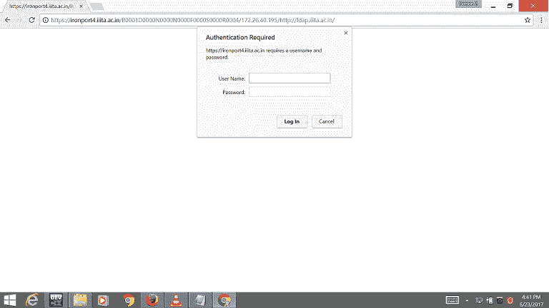
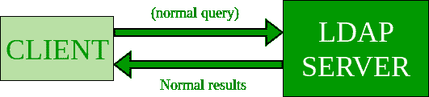
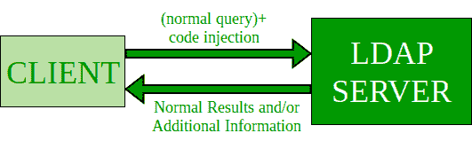

# LDAP 和 LDAP 注射/预防

> 原文:[https://www . geesforgeks . org/LDAP-LDAP-injection prevention/](https://www.geeksforgeeks.org/ldap-ldap-injectionprevention/)

**轻量级目录访问协议**

LDAP(轻量级目录访问协议)是一种软件协议，您必须在大学和初创企业中使用它，以使任何人都能在网络中找到组织、个人和其他资源，如文件和设备，无论是在公共互联网上还是在公司内部网中。

LDAP 的一个常见用途是提供一个存储用户名和密码的中心位置。这允许许多不同的应用程序和服务连接到 LDAP 服务器来验证用户

**我的大学 LDAP:**



我的大学安全 LDAP

**本协议中可执行的主要操作**

*   **添加:**在数据库中添加新数据
*   **绑定(认证):**所有的认证和加密都在这一部分完成
*   **删除:**删除数据 drm 数据库
*   **搜索和比较:**搜索操作用于搜索和读取条目。
*   **Modify:**LDAP 客户端使用 Modify 操作请求 LDAP 服务器对现有条目进行更改
*   **解除绑定:**关闭连接。

**简单的目录条目，有几个属性:**

```
 dn: cn=akash sharan, dc=example, dc=com
 objectClass: organizationalStudent
 cn: akash sharan

```

存在一个 LDAP 统一资源标识符(URI)方案，客户端在不同程度上支持该方案，服务器返回引用和延续引用。

LDAP URI 语法:

```
ldap://host:port/DN?attributes?scope?filter?extensions

```

```
ldap://ldap.example.com/cn=akash%20sharan, dc=example, dc=com

host - IP address
DN - is the distinguished name to use as the search base.
for example - cn=John Doe, dc=example, dc=com
Attributes - is a comma-separated list of attributes to retrieve.
Scope specifies the search scope and can be "base" 
(the default), "one" or "sub" classes.
Filter is a search filter.
Extensions are extensions to the LDAP URL format.

```

**LDAP 注射**

LDAP 注入是一种攻击，用于利用基于用户输入构建 LDAP 语句的基于网络的应用程序。当应用程序无法正确净化用户输入时，可以通过类似于 SQL 注入的技术来修改 LDAP 语句。

### 正常操作:



### 代码注入操作:



**LDAP 注入示例:**
对于用户搜索，以下代码负责采取行动

```
Insert the username

```

将在后端执行的 LDAP 查询

```
String ldapSearchQuery = "(cn =" + $userName + ")";
System.out.println(ldapSearchQuery);
```

如果变量$userName 未被验证，则有可能**完成 LDAP 注入**，如下所示:

> 如果用户将“*”放在搜索框中，系统可能会返回 LDAP 基础上的所有用户名。如果用户输入“akash”(|(password = *)”，它将生成下面的代码，显示 akash 的密码(cn = akash ) ( | (password = *))。

**预防**

*   **Input Validation** : All user-end input must be sanitized. It should be free of suspicious characters and strings that can be malicious.There are OWASP Api present which can help in defense to these vulnerability like:
    *   [esapi-java](https://github.com/ESAPI/esapi-java-legacy/blob/develop/src/main/java/org/owasp/esapi/reference/DefaultEncoder.java)
    *   C# AntiXSS 功能包括编码器。编码器。LdapDistinguishedNameEncode(字符串)和 Encoder。LdapDistinguishedNameEncode(字符串、bool、bool)。

    我将为您提供上述搜索查询的转义搜索过滤器思想:

    ```
    public static final String escapeLDAPSearchFilter(String filter)
    {
        // If using JDK >= 1.5 consider using StringBuilder
        StringBuffer sb = new StringBuffer(); 

        for (int i = 0; i < filter.length(); i++) {
            char curChar = filter.charAt(i);
            switch (curChar) {
            case '\\':
                sb.append("\\5c");
                break;
            case '*':
                sb.append("\\2a");
                break;
            case '(':
                sb.append("\\28");
                break;
            case ')':
                sb.append("\\29");
                break;
            case '\u0000':
                sb.append("\\00");
                break;
            default:
                sb.append(curChar);
            }
        }
        return sb.toString();
    }
    ```

*   **安全配置:**在处理用户对象权限的同时，保护敏感信息。当目录被应用程序用于登录过程时，这就更加重要了。在一个组织中设置 ldap 时，应该进行限制和约束。

**参考文献**
[https://www . owasp . org/index . PHP/LDAP _ Injection _ Prevention _ Sheet](https://www.owasp.org/index.php/LDAP_Injection_Prevention_Cheat_Sheet)
[https://en . Wikipedia . org/wiki/轻量级 _ Directory _ Access _ Protocol](https://en.wikipedia.org/wiki/Lightweight_Directory_Access_Protocol)
[http://www.faqs.org/rfcs/rfc2254.html](http://www.faqs.org/rfcs/rfc2254.html)

本文由**阿卡什·莎兰**供稿。如果你喜欢 GeeksforGeeks 并想投稿，你也可以使用[contribute.geeksforgeeks.org](http://www.contribute.geeksforgeeks.org)写一篇文章或者把你的文章邮寄到 contribute@geeksforgeeks.org。看到你的文章出现在极客博客主页上，帮助其他极客。

评论如果你发现任何不正确的地方，或者你想分享更多关于上面讨论的话题的信息。