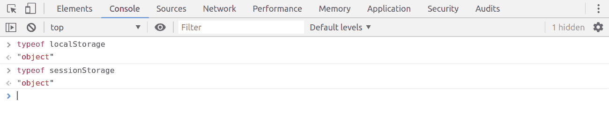
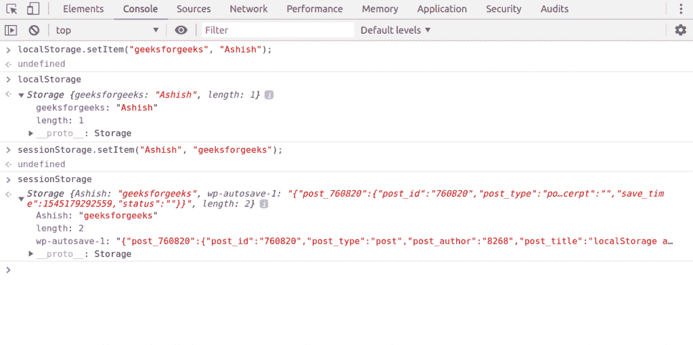
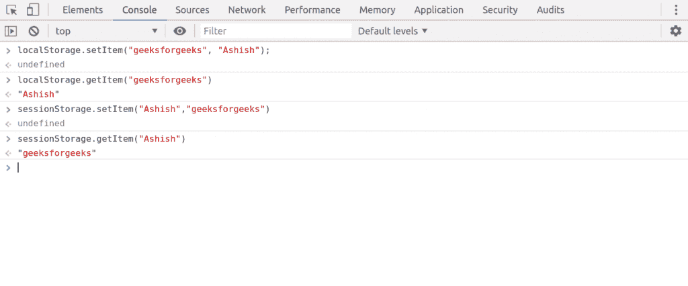
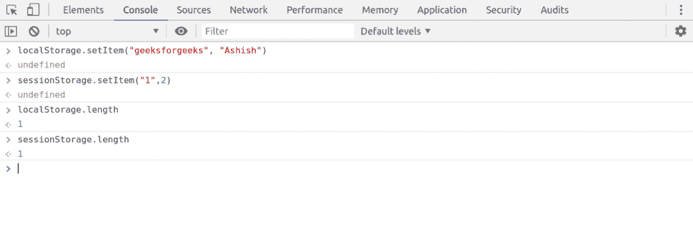
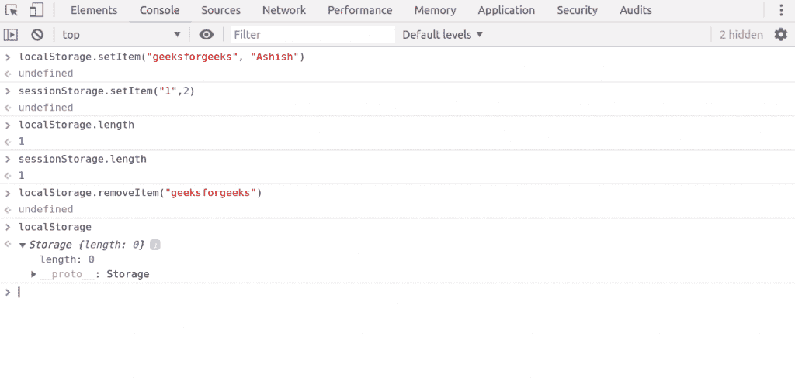
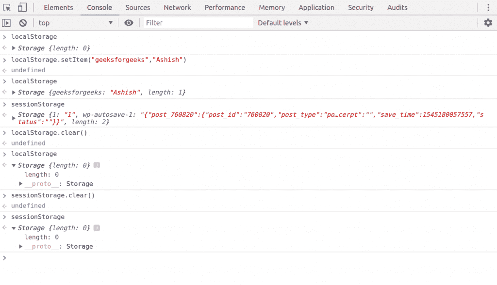
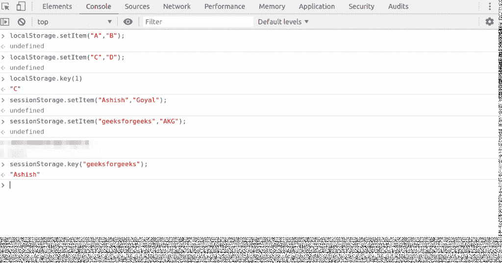

# 本地存储和会话存储|网络存储应用程序接口

> 原文:[https://www . geesforgeks . org/local storage-and-session storage-web-storage-API/](https://www.geeksforgeeks.org/localstorage-and-sessionstorage-web-storage-apis/)

**会话存储**和**本地存储**被称为网络存储应用编程接口。通过使用这些 API，数据可以存储在客户端。

**会话存储:**

*   SessionStorage 用于在客户端存储数据。
*   会话存储中数据保存的最大限制约为 5 MB。
*   会话存储中的数据一直存在到当前选项卡打开。如果我们关闭当前选项卡，我们的数据也会自动从会话存储中删除。

**注意:**如果在关闭当前选项卡后，我们按 ctrl+shift+T 来恢复该选项卡，那么理想情况下，在 SessionStorage 中数据不应该在那里，但是我们可以看到，在恢复选项卡时，SessionStorage 在 chrome、firefox 中维护，但在 safari 浏览器中没有。它是恢复选项卡时的浏览器相关功能。

**本地存储:**

*   像会话存储一样，本地存储也用于在客户端存储数据。
*   本地存储中数据保存的最大限制也是 5 MB 左右。
*   本地存储没有到期时间，本地存储中的数据会一直存在，直到用户手动删除它。这是本地存储和会话存储之间的唯一区别

**下面是关于会话存储和本地存储的一些细节:**

*   **Both are Object type**:

    

*   **Format of storing data in SessionStorage and LocalStorage:** Data must be stored in key-value pair in the SessionStorage and LocalStorage and key-value must be either number or string

    

    这里可以看到，直到我们以字符串或数字的形式插入数据，我们才能够正确地获取数据！

    在第二次也是最后一次尝试中，我们将在 key geek 中插入一个普通的对象，当我们得到这个项目时，它会返回[object，object]

    ```html
    LocalStorage.setItem("geek", {
    "key":"value"
    })
    undefined
    LocalStorage.getItem("geek")
    "[object Object]"

    ```

    如果我们想存储对象或除字符串/数字之外的其他东西，那么它必须是字符串的形式，这就是我们在上次尝试中所做的。

    ```html
    LocalStorage.setItem("geeks", JSON.stringify({
    "key":"value"
    }))
    undefined
    LocalStorage.getItem("geeks")
    "{"key":"value"}"

    ```

    在这次尝试中，我们使用 JSON.stringify()方法将对象转换为字符串。

    **local storage 和 SessionStorage 中的常用方法:**

*   **For storing data in web storage:**

    ```html
    LocalStorage.setItem("key", "value");  //key and value both should be string or number;
    SessionStorage.setItem("key", "value");  //key and value both should be string or number;

    ```

    

*   **For getting data from web storage:**

    ```html
    LocalStorage.getItem("key");
    SessionStorage.getItem("key");

    Here we will pass the key and it will return value.

    ```

    

*   **For Getting the length of web storage object:**

    ```html
    LocalStorage.length; 
    SessionStorage.length;

    ```

    

*   **For deleting a particular key-value pair:**

    ```html
    LocalStorage.removeItem("key");
    SessionStorage.removeItem("key");

    when we pass key in method,
    it will erase the complete data related to that key.

    ```

    

*   **For clearing complete storage:**

    ```html
    LocalStorage.clear();
    SessionStorage.clear();

    ```

    

*   **For getting nth key name from web storage we will pass the number n:**

    ```html
    LocalStorage.key(n);
    SessionStorage.key(n);

    ```

    

    **注:**

    1.  Web 存储安全是一个大问题。强烈建议不要将敏感信息存储在网络存储中，因为它总是以纯文本格式存储数据，任何人都可以轻松窃取数据。
        所以千万不要用网络存储存储密码或支付凭证。
    2.  Web 存储只能在客户端存储数据，只有客户端或我们的 javascript 可以处理这些数据。
        要在服务器端保存数据， [Cookies](https://www.geeksforgeeks.org/cookies-used-website/) 是更好的选择。