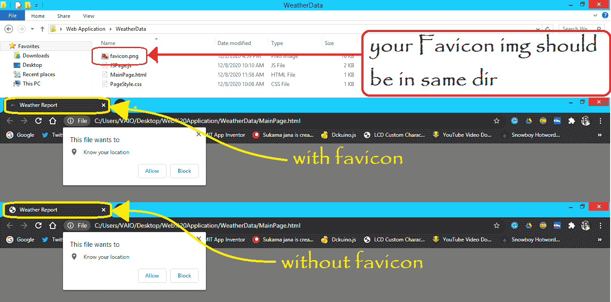
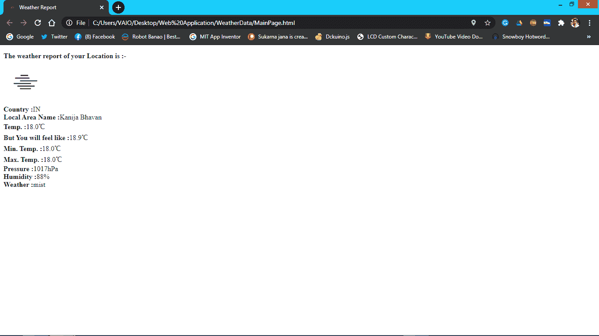
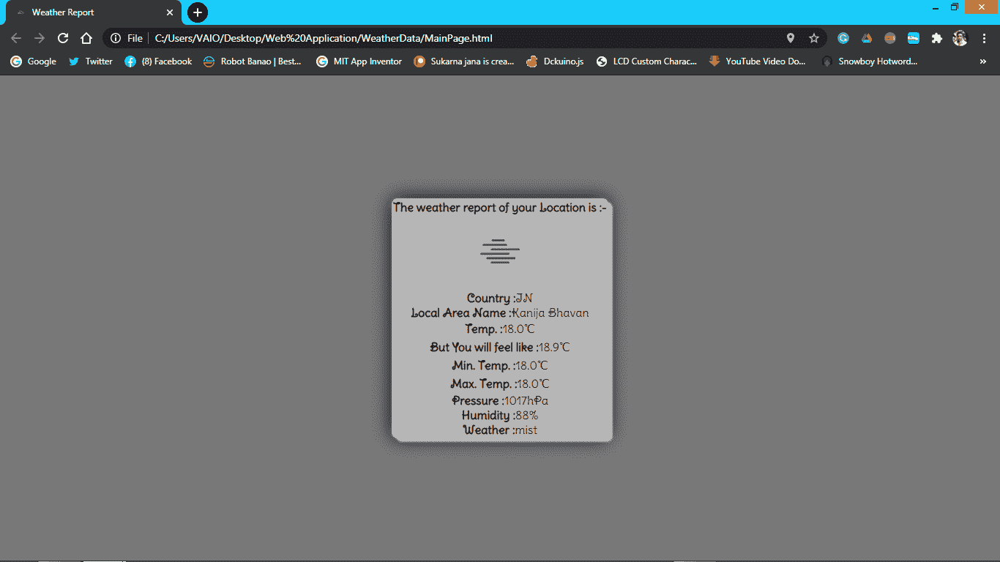
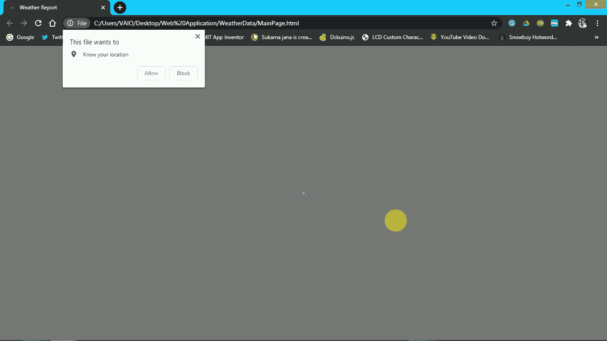

# 使用开放天气地图应用编程接口

制作你所在位置的网络天气报告

> 原文:[https://www . geesforgeks . org/make-a-基于网络的天气报告-使用-openweathermap-api/](https://www.geeksforgeeks.org/make-a-web-based-weather-report-of-your-location-using-openweathermap-api/)

按照这些简单的步骤，使用[开放天气地图应用编程接口制作一个基于网络的天气应用程序。](https://openweathermap.org/api)

**第一步:**在**开通天气地图**账号，获取他们对我们项目的 API。[创建账户](https://home.openweathermap.org/users/sign_up)。完全免费。创建帐户后，您将获得一个默认密钥，只需记下/复制该密钥，因为我们将在功能步骤中使用它。

**第二步:**在**MainPage.html**文件中写下以下 HTML 代码。您可以为文件选择任何名称。

**文件名：主页.html**

## 超文本标记语言

```html
<!DOCTYPE html>
<html>
<head>
  <title>Weather Report</title>
  <link rel="icon" href="favicon.png">
  <link rel="stylesheet" href="PageStyle.css">
  <link href=
'https://fonts.googleapis.com/css?family=Delius Swash Caps' 
  rel='stylesheet'>
</head>
<body>
  <p id="data" class="styleIt"></p>

  <script src="JSPage.js"></script>
</body>
</html>
```

**说明:**

*   第五行是用来把图标放在你的网页上。
*   第六行用于将我们的 CSS 文件链接到 HTML 文件。
*   第 7 行用于使用取自网页的字体。
*   第 10 行用于打印我们从 JS 获得的数据。
*   第 12 行用于将我们的 JS 文件链接到 HTML 文件。



关于图标图标

**第三步:**写下下面的 CSS，让网页的外观更有吸引力。

**文件名： 页面样式.css**

## 超文本标记语言

```html
p.styleIt{
    background-color: rgb(182, 182, 182);
    border: 2px solid rgb(182, 182, 182);
    border-radius: 8px;
    text-align: center;
    box-shadow: 6px 5px 2px rgb(182, 182, 182), 
    0 0 25px rgb(0, 0, 0), 0 0 5px rgb(182, 182, 182);
    font-family: 'Delius Swash Caps';
}

body{
    background:rgb(120, 120, 120);
    margin: 0;
    position: absolute;
    top: 50%;
    left: 50%;
    margin-right: -50%;
    transform: translate(-50%, -50%)
}
```

**说明:**

*   我们使用了 p.styleIt，其中 p 代表段落的 HTML 标记和 ***。styleIt*** 用于定位上面代码中由 class =“style it”调用的特定段落(步骤 3)。
*   为了给我们已经使用的段落一个阴影外观**框阴影:6px 5px 2px rgb(182，182，182)，0 0 25px rgb(0，0，0)，0 0 5px rgb(182，182，182)；**
*   为了制作雕刻的边框，我们使用了**边框半径:8px**
*   将整个身体对准网页的中心:-**身体{…..}** 使用。



没有 CSS 的应用程序



带有 CSS 的应用程序

**第四步:**这是我们整个项目的主文件，将带来我们现在所在位置的**位置**，并使用 **API** 获取我们所在位置的数据并打印在网页上。

**文件名：JS 页.js**

## java 描述语言

```html
var data = document.getElementById("data");
var Latitude;
var Longitude;
var key = "------Put Your Own Key-----";
var url = "http://api.openweathermap.org/data/2.5/weather?";

// Function to get the latitude and longitude data
function getLocation() {
    if (navigator.geolocation) {
        navigator.geolocation.getCurrentPosition(showPosition);
    } else {
        data_of_Lat_Lon.innerHTML = 
            "Geolocation is not supported by this browser";
    }
}

// Function to fetch the Latitude and Longitude
// from position data
function showPosition(position) {
    Latitude = position.coords.latitude;
    Longitude = position.coords.longitude;

    getData(Latitude, Longitude);
}

// Fetching the data and calling the API
function getData(Lat, Lon) {
    const readyToSent = (url + "lat=" + Lat 
        + "&lon=" + Lon + "&appid=" + key);
    fetch(readyToSent)
        .then(response => response.json())
        .then(data => {
            console.log(data);
            fetchData(data)
        })
}

// Fetching the JSON file and printing it to 
// the paragraph which is called by ID data
function fetchData(data) {
    const icon = "http://openweathermap.org/img/wn/"
        + data.weather[0].icon + "@2x.png"

    document.getElementById("data").innerHTML =
        "<b>The weather report of your Location is :-"
            + "</b><br> <br>"
            + "<b>Country :</b>" + data.sys.country 
            + "<br><b>Local Area Name :</b>" 
            + data.name + "<br><b>Temp. :</b>" 
            + parseFloat((data.main.temp - 273.15))
            .toFixed(1) + "℃" + 
            "<br><b>But You will feel like :</b>" 
            + parseFloat((data.main.feels_like - 
                273.15)).toFixed(1) + "℃" 
            + "<br><b>Min. Temp. :</b>" 
            + parseFloat((data.main.temp_min - 
                273.15)).toFixed(1) + "℃" 
            + "<br><b>Max. Temp. :</b>" 
            + parseFloat((data.main.temp_max - 
                273.15)).toFixed(1) + "℃" 
            + "<br><b>Pressure :</b>" 
            + data.main.pressure + "hPa" 
            + "<br><b>Humidity :</b>" 
            + data.main.humidity + "%" 
            + "<br><b>Weather :</b>" 
            + data.weather[0].description + "<br>"
}

// Function call
getLocation();
showPosition();
getData();
```

**说明:**

*   利用内置功能，我们获取经纬度数据(参考[本](https://www.w3schools.com/html/html5_geolocation.asp))
*   然后我们通过将我们的纬度和经度数据作为查询参数来调用一个 API。
*   要了解更多关于此 API 的信息，请访问 https://openweathermap.org/api 官方文档。
*   在调用这个应用编程接口后，我们得到一个 JSON 文件，我们只需要获取数据并打印它。

**第五步:**现在只需在任意浏览器中打开**MainPage.html**文件，就会看到如下输出。



基于网络的天气应用

**参考:**[https://github . com/Sukarnascience/Web _ Application/tree/main/Weather % 20 report % 20 Application](https://github.com/Sukarnascience/Web_Application/tree/main/Weather%20Report%20Application)