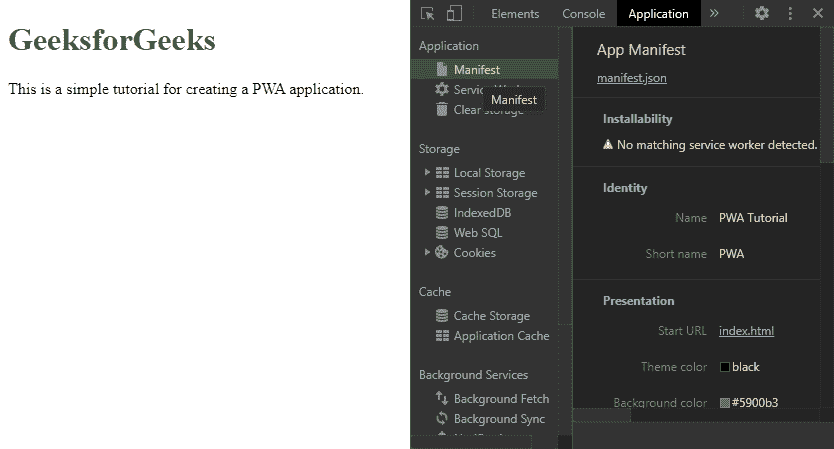
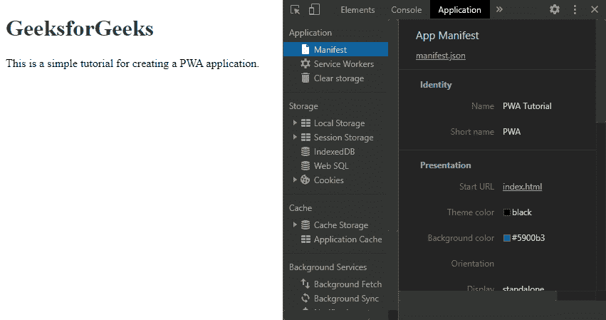
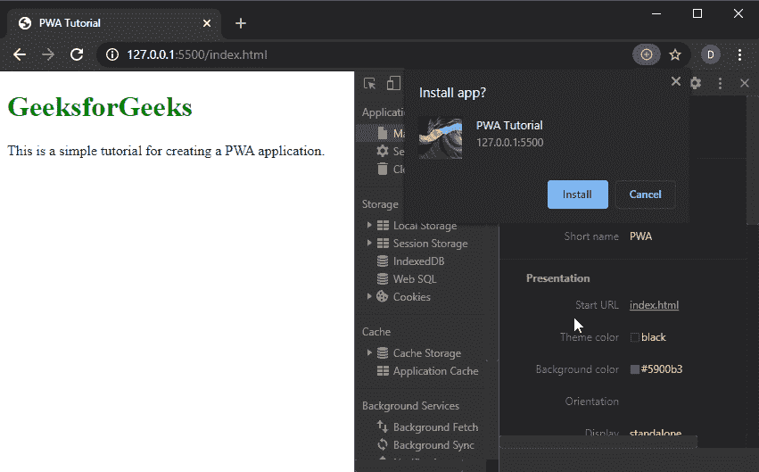
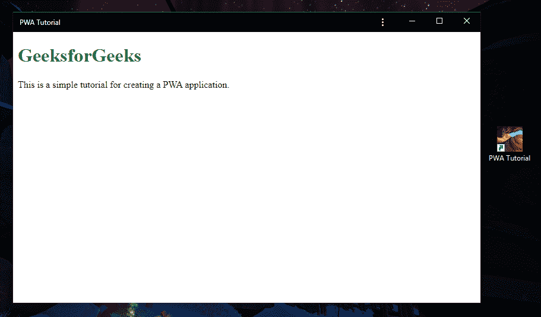

# 5 分钟内做一个简单的 PWA

> 原文:[https://www . geesforgeks . org/making-a-simple-pwa-5 分钟以下/](https://www.geeksforgeeks.org/making-a-simple-pwa-under-5-minutes/)

渐进式网络应用程序，即 PWAs，是一种使用网络技术开发的应用程序，可以像传统应用程序一样安装在任何设备上。创建一个简单的 PWA 非常容易，因为它涉及到向项目中添加两个重要的文件。之后，PWA 就可以安装在任何操作系统上了。

创建渐进式 web 应用程序必须遵循以下步骤:

**步骤 1:** 创建一个 HTML 页面，作为应用程序的起点。该 HTML 将包含一个指向名为 manifest.json 的文件的链接。这是将在下一步创建的一个重要文件。

**代码:**

## 超文本标记语言

```html
<!DOCTYPE html>
<html>
<head>

  <!-- Responsive -->
  <meta charset="utf-8">
  <meta name="viewport"
        content="width=device-width,
                 initial-scale=1">
  <meta http-equiv="X-UA-Compatible"
        content="ie=edge">

  <!-- Title -->
  <title>PWA Tutorial</title>

  <!-- Meta Tags required for
       Progressive Web App -->
  <meta name=
  "apple-mobile-web-app-status-bar"
        content="#aa7700">
  <meta name="theme-color"
        content="black">

  <!-- Manifest File link -->
  <link rel="manifest"
        href="manifest.json">
</head>

<body>
  <h1 style="color: green;">
    GeeksforGeeks</h1>

<p>
    This is a simple tutorial for
    creating a PWA application.
  </p>

  <script>
    // Script for Service Worker
  </script>
</body>
</html>
```

**步骤 2:** 在同一个目录下创建一个 manifest.json 文件。这个文件基本上包含了 web 应用的相关信息。一些基本信息包括应用程序名称、起始网址、主题颜色和图标。所需的所有信息都以 JSON 格式指定。图标的来源和大小也在该文件中定义。

## java 描述语言

```html
{
    "name":"PWA Tutorial",
    "short_name":"PWA",
    "start_url":"index.html",
    "display":"standalone",
    "background_color":"#5900b3",
    "theme_color":"black",
    "scope": ".",
    "description":"This is a PWA tutorial.",
    "icons":[
    {
    "src":"images/icon-192x192.png",                     
    "sizes":"192x192",
    "type":"image/png"
    },
    {
    "src":"images/icon-512x512.png",
    "sizes":"512x512",
    "type":"image/png"
    }
  ]
}
```

**步骤 3:** 创建一个名为 images 的新文件夹，并将与应用程序相关的所有图标放在该文件夹中。建议图标的尺寸至少为 192×192 像素，512×512 像素。图像名称和尺寸应与清单文件的名称和尺寸相匹配。

**步骤 4:** 使用实时服务器服务目录，以便所有文件都可以访问。

**步骤 5:** 在 Chrome 中打开 index.html 文件，导航到 Chrome 开发工具中的应用程序部分。从列表中打开清单列。



**步骤 6:** 在可安装性选项卡下，将显示未检测到服务人员。我们需要为 PWA 创建另一个文件，也就是同一个目录中的 serviceworker.js。该文件处理将管理应用程序工作的服务工作人员的配置。

**代码:**

## java 描述语言

```html
var staticCacheName = "pwa";

self.addEventListener("install", function (e) {
  e.waitUntil(
    caches.open(staticCacheName).then(function (cache) {
      return cache.addAll(["/"]);
    })
  );
});

self.addEventListener("fetch", function (event) {
  console.log(event.request.url);

  event.respondWith(
    caches.match(event.request).then(function (response) {
      return response || fetch(event.request);
    })
  );
});
```

**步骤 7:** 最后一步是将服务人员文件链接到 index.html。这是通过向在上述步骤中创建的 index.html 添加一个简短的 JavaScript 脚本来完成的。在 index.html 的脚本标签中添加下面的代码。

**代码:**

## 超文本标记语言

```html
<script>
    window.addEventListener('load', () => {
      registerSW();
    });

    // Register the Service Worker
    async function registerSW() {
      if ('serviceWorker' in navigator) {
        try {
          await navigator
                .serviceWorker
                .register('serviceworker.js');
        }
        catch (e) {
          console.log('SW registration failed');
        }
      }
    }
 </script>
```

**安装应用程序:**

*   导航到服务工作器选项卡，我们看到服务工作器已成功注册，现在将显示一个安装选项，允许我们安装应用程序。
*   单击安装按钮安装应用程序。然后应用程序将被安装，并且它将在桌面上可见。
*   要在移动设备上安装应用程序，可以使用移动浏览器中的**添加到主屏幕**选项。这将在设备上安装应用程序。

**输出:**

*   所有步骤完成后的清单部分



*   使用安装应用程序按钮安装网络应用程序



*   最终应用程序及其桌面图标

