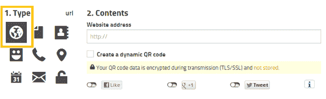
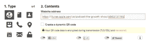

# 为网站制作二维码

> 原文:[https://www.geeksforgeeks.org/making-qr-code-website/](https://www.geeksforgeeks.org/making-qr-code-website/)

**什么是二维码？**
二维码，代表“快速响应”码，是一种黑白小弯弯曲曲的条形码，通常看起来像这样:

它们经常出现在直邮、标牌、广告牌和商业广告中。
这些条形码最初是在日本为汽车行业设计的，营销人员采用条形码是因为它们的存储容量大，能够将创意和/或包装所能传达的信息之外的额外信息传递给消费者。如果消费者在某个地方看到二维码，他们可以拿出移动设备，打开二维码扫描仪，并“扫描”条形码以获取更多信息。

**如何为网站**
创建二维码

1.  **选择一个二维码生成器:**
    网上有很多二维码生成器，但是有几个热门帖子包括 Kaywa、GOQR.me、Visualead 和 QR Stuff。选择二维码生成器时需要注意的一些问题是，您是否可以跟踪和分析性能，它是否允许您设计一个针对您品牌的独特代码，以及它是否与常见的二维码阅读器兼容。
2.  **Design and linking the website with the QR Code:** 
    In this article,http://goqr.me/ is used for generating the QR Code. 

*   选择您希望二维码代表的内容类型—我们将为这篇文章选择一个网址。

*   插入内容网址。

*   查看预览，根据需要进行自定义，然后根据需要下载或嵌入。

*   使用二维码扫描仪应用程序测试二维码。

**二维码 Do:**

1.  把二维码放在容易扫描的地方，消费者有足够的时间实际扫描代码。
2.  移动优化你发送给别人的页面。消费者在扫描二维码时会在手机上，所以应该把他们带到一个有积极移动体验的页面。

**QR 码不 ts:**

1.  Don’t require a special QR code scanner.The QR code should be app-agnostic so that anyone can scan the code with any reader. 

本文由 [**舒布罗迪普·班纳吉**](https://auth.geeksforgeeks.org/profile.php?user=Shubrodeep Banerjee) 供稿。如果你喜欢 GeeksforGeeks 并想投稿，你也可以使用[write.geeksforgeeks.org](https://write.geeksforgeeks.org)写一篇文章或者把你的文章邮寄到 review-team@geeksforgeeks.org。看到你的文章出现在极客博客主页上，帮助其他极客。
如果发现有不正确的地方，或者想分享更多关于上述话题的信息，请写评论。