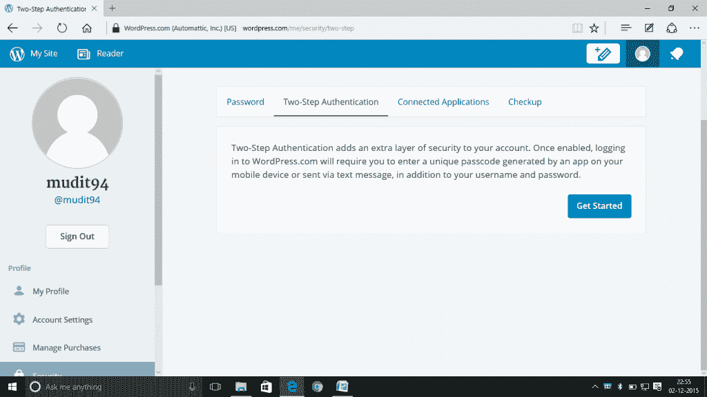
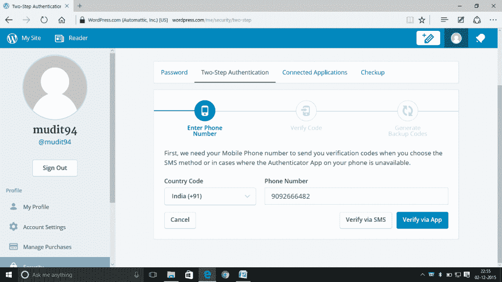
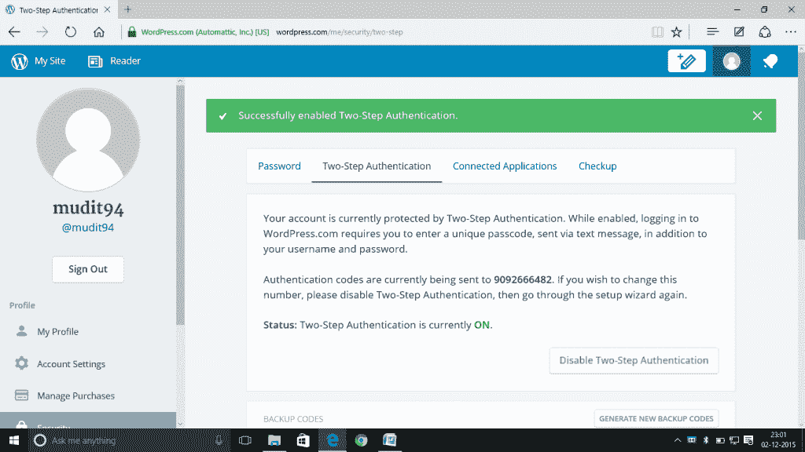
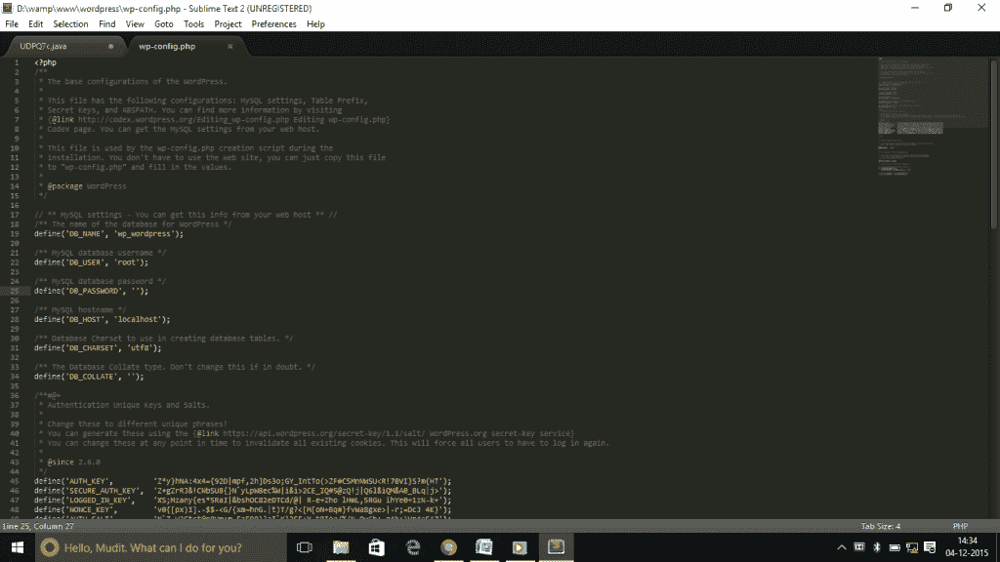
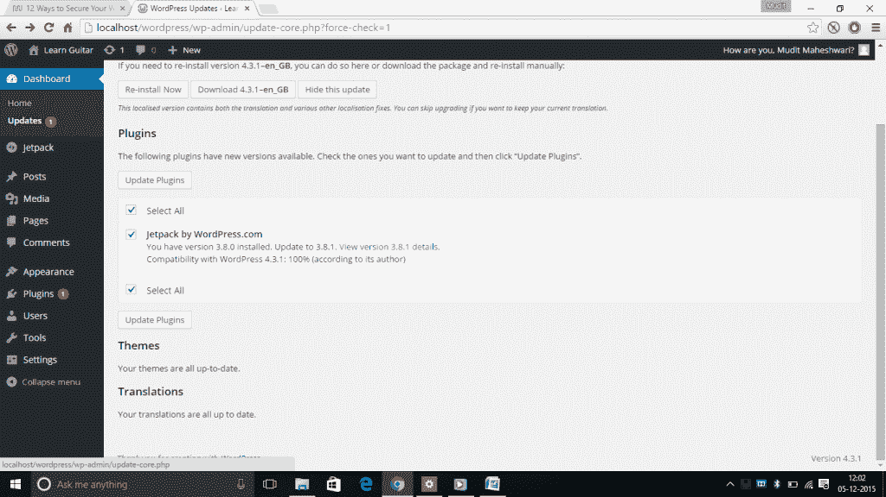
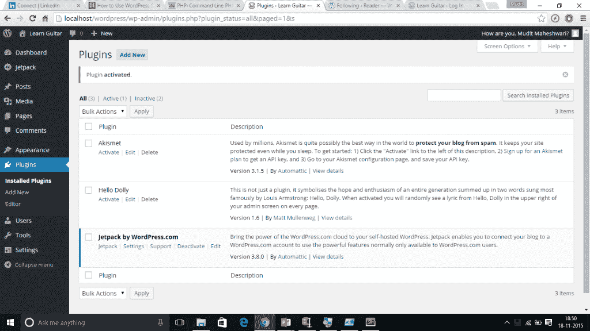

# 让你的 WordPress 网站更安全

> 原文:[https://www . geesforgeks . org/making-WordPress-网站-secure/](https://www.geeksforgeeks.org/making-wordpress-website-secure/)

### **为什么需要安全？**

现在写博客已经成为许多人的爱好，而 WordPress 也是同样的选择最多的平台。默认情况下，wordpress 博客采用最低级别的安全性，并且其文件和/或插件可能经常过时。这些文件是可追踪的，容易被黑客攻击。互联网不是一个安全的工作场所，人们必须充分意识到如何做到安全。

本文讨论了一些简单的技巧和技术，初学者可以使用这些技巧和技术来确保他们的博客和 WordPress 上存储的信息的安全。

### **提示#1 使用唯一、安全的用户名和密码**

*   避免使用默认的*管理*
*   用户还可以创建具有管理员权限的新用户，并删除旧的“管理员”用户名。
*   像[](https://wordpress.org/plugins/username-changer/)**这样的 WordPress 插件也可以用来把用户名改成更安全的。*尽量避免使用像你的名字或“管理员”这样容易猜到的常用用户名。***
*   **选择由字母、数字和字符组成的复杂密码。不要选择与用户名、网站名称相似的密码，也不要选择稍加改动的简单单词。**
*   **建议最好使用随机字符串。**

### ****提示#2 启用两步认证****

1.  **用户需要有一个 WordPress 账号，点击这里的即可创建。如果用户已经有一个 WordPress 帐户，跳过这一步。**

2.  **点击此处启用两步验证。用户被重定向到以下页面。**

****

3.  **点击开始后，出现以下画面**

4.  **选择通过短信验证选项。**
5.  **WordPress 应通过短信发送验证码，要求用户输入验证码来验证号码。**
6.  **正确输入发送到您手机的代码。然后，应提供一堆备份代码，如果手机被盗或丢失，或者在无法访问手机获取代码的情况下，这些代码可以作为访问网站的替代方式。将这些代码保存在文本文件中。**
7.  **您现在已经启用了两步验证。**

### ****提示#2 使用插件****

**为了防止暴力攻击，有两个很好的插件**

*   **一体化 WP 安全和防火墙插件有一个选项，只需更改登录表单的默认网址(/wp-admin/)。这个插件还有助于限制从某个 IP 地址登录的尝试次数。**
*   **另一个是 [BruteProtect](https://bruteprotect.com/) 。这个插件最近被 WordPress 的创建者[自动机](http://automattic.com/)收购。该插件会自动保护用户的登录表单免受 IP 地址的影响，因为 IP 地址可能会进行多次登录尝试**

### ****提示#3** **将 wp-config 上移一个目录并将其锁定****

*   **用户可以移动 thewp-config.php 文件到你的 WordPress 安装上面的目录。这意味着对于一个安装在你的网络空间根目录下的站点，你可以将 wp-config.php 存储在网络根目录下。**
*   **这就是 wp-config 的样子: [](https://media.geeksforgeeks.org/wp-content/cdn-uploads/44.png)**

**如果使用的服务器附带。htaccess，将这段代码添加到文件的顶部，这将拒绝任何人访问它:**

```
<files wp-config.php>

order allow,deny

deny from all

</files>
```

### ****提示#4 保持 WordPress 更新****

**假设用户安装了 Wamp 服务器:**

1.  **启动 wamp 服务器**
2.  **使用本地主机打开 WordPress 网站**
3.  **在仪表板部分点击更新**
4.  **就我而言，我已经更新了我的 WordPress。所以对我来说，这表明‘你已经有了最新版本’。**
5.  **对于那些已经有了最新版本的人，将会有一个更新的选项。点击它。搞定了。！**

### **技巧 5 更改文件权限**

****拥有服务器 shell 访问权限**的用户，可以使用以下命令递归更改文件权限:**

**对于目录:**

**find/path/to/your/WordPress/install/-type d-exec chmod 755 { } \；**

**对于文件:**

**find/path/to/your/WordPress/install/-type f-exec chmod 644 { } \；**

### ****提示#6 安排定期数据备份****

*   **定期备份数据，包括你的 [MySQL](https://www.mysql.com/)**
*   ****数据完整性**对于可信备份非常重要。**
*   **一个好的备份计划可以包括将整个 WordPress 安装的一组定时快照(包括 WordPress 核心文件和数据库)保存在一个受信任的位置。**

****提示 7。删除自述文件和任何不必要的文件。****

*   **WordPress 有一个默认的 readme.html，以及许多插件和主题。**
*   **应该删除，因为它们可以用于指纹识别或一般窥探，并且通常包含版本信息。**
*   **从文件夹中删除所有垃圾文件。**

### ****提示#8 启用 SSL 登录****

**如果站点有 SSL 证书，可以启用 [SSL](https://en.wikipedia.org/wiki/SSL) 登录。**

**要启用 [SSL](https://en.wikipedia.org/wiki/SSL) ，您的站点必须可以通过 https 访问。**

*   **将以下代码添加到 **wp-config** 文件中**

|  | 定义(' FORCE _ SSL _ LOGIN '，true)；//仅用于登录
定义(' FORCE_SSL_ADMIN '，true)；//对于整个管理员 |

### ****提示 9:询问阿帕奇密码保护****

*   **这个插件在安全性方面为用户提供了更多对他们博客的控制**
*   **用户可以通过 401 授权轻松保护您的网站。**

**插件可以从[这里](http://wordpress.org/extend/plugins/askapache-password-protect/)下载。**

**参考文献:**

**[http://wpsecure.net/secure-wordpress/](http://wpsecure.net/secure-wordpress/)**

**[http://www.sitepoint.com/tips-to-secure-wordpress/](http://www.sitepoint.com/tips-to-secure-wordpress/)**

**[http://code . tutplus . com/articles/11-quick-tips-secure-your-WordPress-site-WP-22446](http://code.tutsplus.com/articles/11-quick-tips-securing-your-wordpress-site--wp-22446)**

**文章作者**穆迪特·马赫什瓦里:****

**韦洛是 VIT 大学信息技术专业的三年级学生，对编码有浓厚的兴趣，了解新技术和开发软件。除了热爱编码，他还热爱弹吉他和唱歌。目前住在钦奈。你可以在 mudit94@gmail.com 找到他。**

****如果你也想在这里展示你的博客，请查看 [GBlog](http://geeksquiz.com/gblog/) 在 GeeksforGeeks 上的客座博文。****