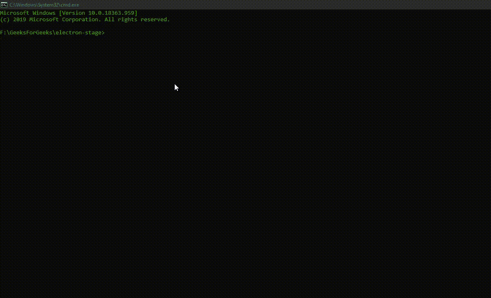
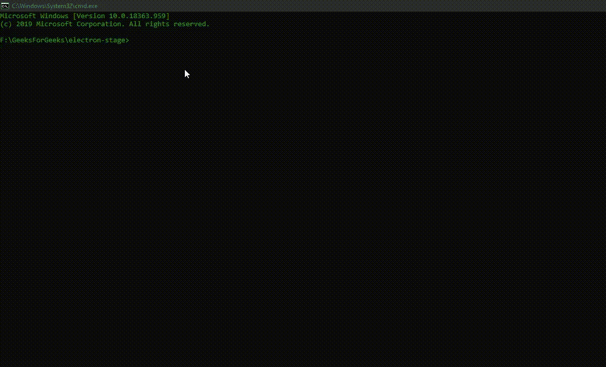

# 管理电子研讨会中的准备环境

> 原文:[https://www . geesforgeks . org/manage-staging-environments-in-electronijs/](https://www.geeksforgeeks.org/manage-staging-environments-in-electronjs/)

[**electronijs**](https://www.geeksforgeeks.org/introduction-to-electronjs/)是一个开源框架，用于使用能够在 Windows、macOS 和 Linux 操作系统上运行的 HTML、CSS 和 JavaScript 等网络技术构建跨平台的本机桌面应用程序。它将铬引擎和[T5 节点 T7】结合成一个单一的运行时。](https://www.geeksforgeeks.org/introduction-to-nodejs/)

在复杂或企业桌面应用程序中，开发人员需要不同的准备环境来测试和部署应用程序。根据应用程序的范围，在最终提供给最终用户之前，将设置多个临时环境来测试和检查应用程序。部署应用程序并向公众开放的最终试运行环境称为**生产**。当应用程序开发完成或向应用程序添加新功能时，通常会将其部署在**开发**阶段环境中。在**开发**环境中，开发人员执行基本的单元测试，并看到应用程序的新特性。根据企业的不同，在应用程序最终到达生产阶段之前，还可以有其他几个阶段环境，如 **QA(质量保证)**、**沙盒**、**预生产**等。每个暂存环境在应用程序生命周期中都有特定的用途。例如，在 **QA** 环境中，应用程序经历集成测试和回归测试。在**预生产**环境中，应用程序会经历性能和负载测试。一旦应用程序通过了所有这些步骤，它就可以最终部署到生产环境中，在那里它可供观众使用。这些阶段环境的另一个优点是，开发人员可以在应用程序中启用有用的实用程序和调试功能，而这些功能在生产阶段是不可见的。这有助于发现错误和评估应用程序的性能。

我们可以通过几种方式在电子应用程序中启用这些登台环境。我们已经知道，Electron 支持全局 NodeJS **流程**对象，它为我们提供了对环境变量的访问，特别是 **NODE_ENV** 。我们可以通过**进程**对象的这个属性来定义登台环境。有关**过程**对象和**节点 _ 环境**的更多详细信息。

*   **参考文章:** [*处理电子中的对象*](https://www.geeksforgeeks.org/process-object-in-electronjs/) *。*
*   **参考文章:** [*热重装在电装*](https://www.geeksforgeeks.org/hot-reload-in-electronjs/) *。*

定义分段环境的另一种方法是使用环境变量，如 **ELECTRON_ENV** 。电子支持多个环境变量，也分为**生产**和**开发**变量。有关环境变量的更多详细信息。

*   **参考文章:** [*电商中的环境变量*](https://www.geeksforgeeks.org/environment-variables-in-electronjs/) *。*

然而，问题是，并非所有操作系统平台都支持其中一些环境变量。因此，需要有一种方法来区分在所有操作系统平台上工作的不同分段环境，并且不复杂或不需要更改配置。这可以通过使用**电子仪器开发**外部 **npm** 包来实现。我们将解释使用这个外部 npm 包的电子应用程序中不同登台环境之间的差异。

我们假设您熟悉上述链接中介绍的先决条件。电子要工作， [**节点**](https://www.geeksforgeeks.org/introduction-to-nodejs/) 和 [**npm**](https://www.geeksforgeeks.org/node-js-npm-node-package-manager/) 需要预装在系统中。

*   **项目结构:**


**示例:**按照 [**中给出的步骤，设置基本的电子应用程序。复制文章中提供的 **main.js** 文件和**index.html**文件的样板代码。我们将继续使用相同的代码库构建我们的应用程序。另外，使用**](https://www.geeksforgeeks.org/dynamic-styling-in-electronjs/) **[npm](https://www.geeksforgeeks.org/node-js-npm-node-package-manager/) 安装**电子仪器开发**包。这个包的主要目的是简单地检测电子应用程序是运行**开发**还是**生产**环境。有关**电子信息开发**的更多信息，请参考链接:**https://www.npmjs.com/package/electron-is-dev**。**

```html
npm install electron-is-dev --save
```

此外，对**包进行必要的更改，以启动电子应用程序。我们将继续使用相同的代码库构建我们的应用程序。设置电子应用程序所需的基本步骤保持不变。
T3**

```html
{
  "name": "electron-stage",
  "version": "1.0.0",
  "description": "Manage Staging Environments in Electron",
  "main": "main.js",
  "scripts": {
    "start": "electron ."
  },
  "keywords": [
    "electron"
  ],
  "author": "Radhesh Khanna",
  "license": "ISC",
  "dependencies": {
    "electron": "^8.3.0",
    "electron-is-dev": "^1.2.0"
  }
}
```

**输出:**

[](https://media.geeksforgeeks.org/wp-content/uploads/20200512225834/Output-1105.png)

**管理电子中的登台环境:**如上所述，这个包只是用来检查电子是否在**开发**环境中运行。这对于添加调试和实用功能(如日志记录、使代码通用等)非常有用。这个包可以直接在应用程序的**主进程**和**渲染器进程**中使用。这个包需要电子 3+才能正常工作。在我们进入代码之前，我们想对应用程序的 **main.js** 文件进行一些更改。
在 **main.js** 文件中，注释掉以下几行:

*   **main.js:**

## java 描述语言

```html
Open the DevTools.
win.webContents.openDevTools()
```

*   **index.js** :只有当应用程序在**开发**模式下运行时，我们才会从渲染器进程，即 **index.js** 文件中激活 **Chrome 开发工具**。

## java 描述语言

```html
const electron = require('electron');
// Importing BrowserWindow using Electron Remote
const BrowserWindow = electron.remote.BrowserWindow;

const isDev = require('electron-is-dev');
let win = BrowserWindow.getFocusedWindow();

if (isDev) {
    console.log('Running in Development Environment');
    win.webContents.openDevTools();
} else {
    console.log('Running in Production Environment');
}
```

**说明:**默认在**开发**分期环境下启动应用。**电子是开发** npm 包返回一个**布尔**值，说明应用程序是在开发模式还是生产模式下运行。默认情况下，返回值为**真**。在上面的代码中，我们只在**开发**模式下使用**浏览器窗口**对象的**网页内容**属性的实例方法 **openDevTools()** 激活了 **Chrome 开发工具**。

**输出:**

[](https://media.geeksforgeeks.org/wp-content/uploads/20200801135237/Output-1-GIF19.gif)

这里出现的问题是，我们应该如何激活电子应用程序中的**生产**暂存环境。**电子信息开发** npm 包应返回**假**或**未定义**，说明应用程序正在生产模式下运行，应用程序启动时不应激活 **Chrome 开发工具**窗口。我们可以使用**环境变量在不同的环境之间切换。将该环境变量设置为 **1** 将切换**开发**模式，将该环境变量设置为任何其他值，如 **0** 将在**生产**模式下启动应用程序。要在**生产**模式下启动应用程序，请对**包. json** 文件**执行以下更改，并启动**脚本。**

**package.json:**

```html
{
  "name": "electron-stage",
  "version": "1.0.0",
  "description": "Manage Staging Environments in Electron",
  "main": "main.js",
  "scripts": {
    "start": "set ELECTRON_IS_DEV=0 && electron ."
  },
  "keywords": [
    "electron"
  ],
  "author": "Radhesh Khanna",
  "license": "ISC",
  "dependencies": {
    "electron": "^8.3.0",
    "electron-is-dev": "^1.2.0"
  }
}
```

**解释:**因为我们在 *Windows* 操作系统上，所以我们不能在同一个命令中设置环境变量和启动应用程序。因此，我们需要首先设置 **ELECTRON_IS_DEV=0** ，然后启动 ELECTRON 应用程序。

**注意:**如果从**窗口控制台**设置，该环境变量将在重新启动系统时重置，如上例所示。

**输出:**

[](https://media.geeksforgeeks.org/wp-content/uploads/20200801135341/Output-2-GIF4.gif)